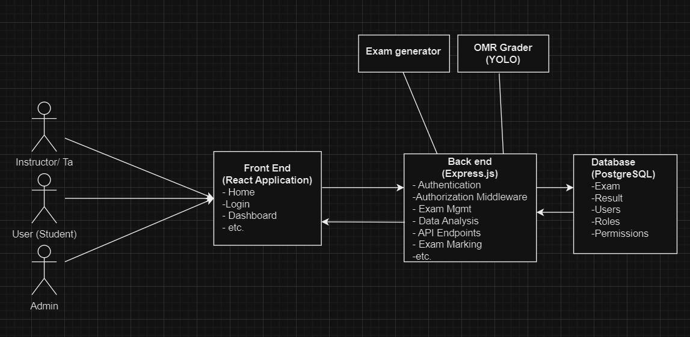
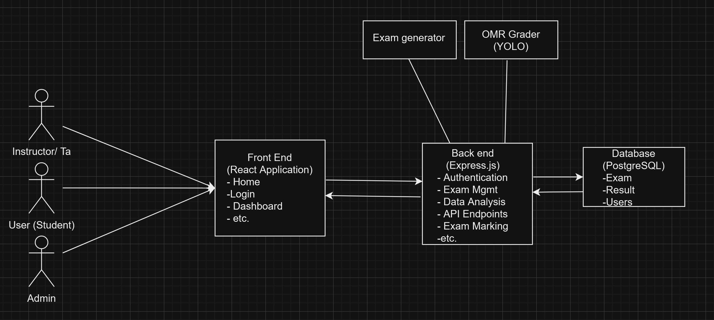
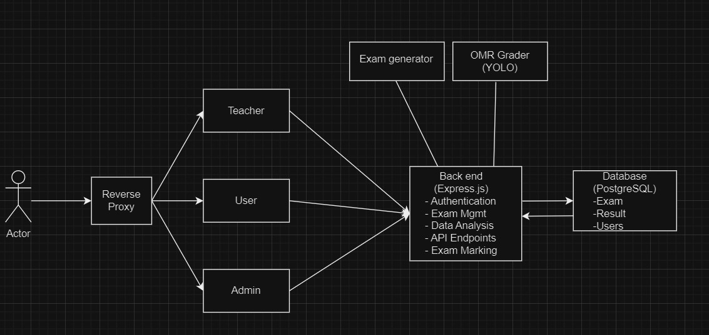
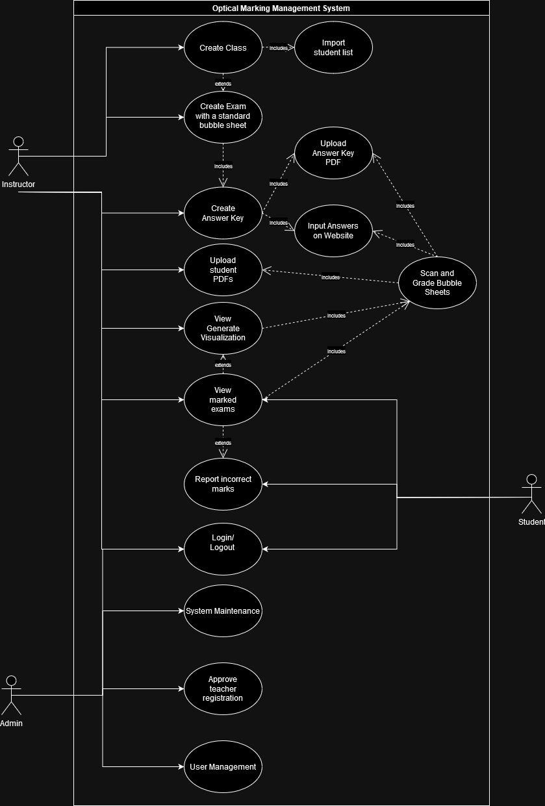
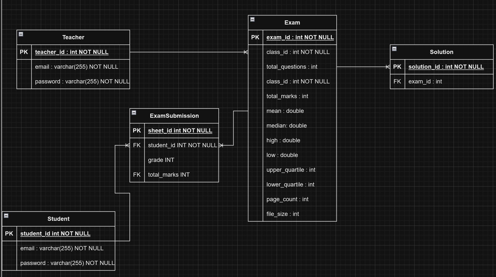

# System Design

## Introduction

Start with a brief introduction of **what** you are building, reminding the reader of the high-level usage scenarios (project purpose).   Complete each section with the required components.  Don't forget that you can include [images in your markdown](https://docs.github.com/en/get-started/writing-on-github/getting-started-with-writing-and-formatting-on-github/basic-writing-and-formatting-syntax#images).  

Start each section with a lead-in, detailing what it is.  Also, do not just have a collection of images.   Each diagram must be explained clearly. **Do not assume that the reader understands the intentions of your designs**.

GradeFalcon is an Optical Mark Recognition System for managing the automatic grading of students' bubble sheets. Teachers will be able to create exams for classes, create the formats for exams, have submitted PDFs accurately marked from the exam's answer key and visualize various class performance metrics. Students will be able to have their submissions returned to them with the correct and incorrect answers highlighted and report if the system has made any error in marking. Administrators will have full privilege over all system data.

## System Architecture Design

Recall the system architecture slides and tell us which architecture pattern you are using and why (it may also be something not in the slides or be a combination). Provide more details about the components you have written, and where these components fit in the overall architecture so we can visualize how you have decomposed your system. Basically, this should all be captured in ONE diagram with the components on them and a few sentences explaining (i) why you chose this architecture and (ii) why the components are where you put them. If you want to just focus on a certain aspect of your system and not show the entire architecture for your system in the diagram, that should be fine as well.

## System Architecture for Optical Marking Management System

### Architecture Pattern: Model-View-Controller (MVC)

#### Reason for Choosing MVC

We chose the MVC architecture for the following reasons:

- **Separation of Concerns:** MVC separates the application into three interconnected components, which allows for efficient division of labor and simplifies maintenance.
- **Testability:** Each component can be tested independently, which improves the overall robustness of the application.
- **Flexibility:** Changes in the user interface can be made without affecting the underlying business logic and data.

### Components and Their Placement

#### Model:

- **Database:** PostgreSQL for relational data storage. Some of our entities: Users, Exams, and Results.

#### View:

- **User Interface:** Developed using HTML, CSS, and JavaScript (React). Provides a responsive and interactive UI for users.
- **Visualization Tools:** Implements charts and graphs for displaying statistical analysis of exam results.

#### Controller:

- **Business Logic:** Developed using Node.js, handling user requests, processing data, and returning the appropriate responses.
- **Authentication and Authorization:** Manages user authentication using JWT and uses authorization middleware for access.
- **Error Detection:** Includes logic for detecting wrongly scanned sheets and duplicate/non-present student IDs.

- **OMR Tools Integration:** Incorporates a YOLO-based computer vision model for bubble sheet parsing and grading.

### System Architecture Diagram with RBAC

### Why Components Are Placed as Shown

- **Model (Database):** Centralized data handling and ensure that all business logic related to data management and error detection is confined to one place, making the system more modular.
- **View (Frontend):** By separating the user interface from the backend, we ensure that any changes to the UI do not affect the underlying business logic. This separation also allows for better scalability and responsiveness.
- **Controller (Backend):** Acts as a bridge between the Model and the View, handling all incoming requests, applying necessary business logic, and returning appropriate responses. The controller manages the flow of data and the communication between the frontend and backend.
- **RBAC Integration:** Implementing RBAC directly in the backend enables authentication and authorization based on user roles, simplifying role management.

### Here are alternative System Architectures that were considered:

## Use Case Models

Extending from your requirements, the team will need to develop a set of usage scenarios for each user group documented as properly dressed use cases  (including diagrams following the UML syntax and descriptions as presented in class). You may also want to include journey lines with some use cases.

### Use Case Scenarios

**Instructor User Group:**

1. **Create Class**
   - **Primary Actor:** Instructor
   - **Goal:** To create a class in the system.
   - **Preconditions:** Instructor is logged in.
   - **Main Success Scenario:**
     1. Instructor navigates to the "Create Class" page.
     2. Instructor enters the class details.
     3. Instructor imports student data via CSV (if available).
     4. Instructor saves the class.
   - **Extensions:**
     - If the CSV format is incorrect, the system prompts the instructor to correct it.

2. **Create Exam with a Standard Bubble Sheet**
   - **Primary Actor:** Instructor
   - **Goal:** To create an exam with a standard bubble sheet.
   - **Preconditions:** Instructor has a class created.
   - **Main Success Scenario:**
     1. Instructor navigates to the "Create Exam" page.
     2. Instructor selects the class.
     3. Instructor configures the standard bubble sheet rules.
     4. Instructor saves the exam configuration.
   - **Extensions:**
     - If configuration is invalid, the system prompts the instructor to correct it.

3. **Create Custom Bubble Sheet**
   - **Primary Actor:** Instructor
   - **Goal:** To create a custom bubble sheet.
   - **Preconditions:** Instructor has a class created.
   - **Main Success Scenario:**
     1. Instructor navigates to the "Create Custom Bubble Sheet" page.
     2. Instructor designs the custom bubble sheet layout.
     3. Instructor generates a PDF of the custom bubble sheet.
     4. System saves the custom bubble sheet template.
   - **Extensions:**
     - If the layout is invalid, the system prompts the instructor to correct it.

4. **Create Answer Key**
   - **Primary Actor:** Instructor
   - **Goal:** To create an answer key for the exam.
   - **Preconditions:** Instructor has created an exam.
   - **Main Success Scenario:**
     1. Instructor chooses to upload an answer key PDF or input answers on the website.
     2. Instructor uploads the answer key PDF or inputs the answers.
     3. System saves the answer key.
   - **Extensions:**
     - If the uploaded PDF is invalid, the system prompts the instructor to re-upload.

5. **Upload Student PDFs**
   - **Primary Actor:** Instructor
   - **Goal:** To upload PDFs containing student responses.
   - **Preconditions:** Instructor has created an exam and answer key.
   - **Main Success Scenario:**
     1. Instructor navigates to the "Upload Student PDFs" page.
     2. Instructor selects the class and exam.
     3. Instructor uploads the student PDFs.
     4. System validates and processes the PDFs.
   - **Extensions:**
     - If any PDF is invalid, the system prompts the instructor to correct it.

6. **Scan and Grade Bubble Sheets**
   - **Primary Actor:** Instructor
   - **Goal:** To scan and grade the uploaded bubble sheets.
   - **Preconditions:** Instructor has uploaded student PDFs.
   - **Main Success Scenario:**
     1. System scans the uploaded PDFs.
     2. System compares the responses with the answer key.
     3. System generates scores for each student.
   - **Extensions:**
     - If there are errors in scanning, the system alerts the instructor.

7. **Generate Visualization**
   - **Primary Actor:** Instructor
   - **Goal:** To generate visualizations of the exam results.
   - **Preconditions:** Bubble sheets are graded.
   - **Main Success Scenario:**
     1. Instructor navigates to the "Generate Visualization" page.
     2. Instructor selects the class and exam.
     3. System generates visualizations (e.g., bar charts, average scores).
   - **Extensions:**
     - If data is incomplete, the system prompts the instructor.

8. **View Marked Exams**
   - **Primary Actor:** Instructor
   - **Goal:** To view the marked exams.
   - **Preconditions:** Bubble sheets are graded.
   - **Main Success Scenario:**
     1. Instructor navigates to the "View Marked Exams" page.
     2. Instructor selects the class and exam.
     3. Instructor reviews the marked exams.
   - **Extensions:**
     - If any discrepancy is found, the instructor can report incorrect marks.

9. **Report Incorrect Marks**
   - **Primary Actor:** Instructor
   - **Goal:** To report and correct any marking errors.
   - **Preconditions:** Instructor is viewing marked exams.
   - **Main Success Scenario:**
     1. Instructor identifies an incorrect mark.
     2. Instructor submits a report detailing the issue.
     3. System logs the report and alerts the admin for correction.
   - **Extensions:**
     - If the issue is resolved, the system updates the mark.

**Student User Group:**

1. **Login/Logout**
   - **Primary Actor:** Student
   - **Goal:** To log in or out of the system.
   - **Preconditions:** Student has valid login credentials.
   - **Main Success Scenario:**
     1. Student navigates to the login page.
     2. Student enters credentials and logs in.
     3. System grants access.
     4. Student can log out from any page.
   - **Extensions:**
     - If credentials are invalid, the system prompts the student to retry.

2. **View Marked Exams**
   - **Primary Actor:** Student
   - **Goal:** To view their marked exams.
   - **Preconditions:** Exams are graded and the student is logged in.
   - **Main Success Scenario:**
     1. Student navigates to the "View Marked Exams" page.
     2. Student selects the class and exam.
     3. System displays the student's marked exam.
   - **Extensions:**
     - If there is an issue, the student can report it to the instructor.

3. **Report Incorrect Marks**
   - **Primary Actor:** Student
   - **Goal:** To report any incorrect marks.
   - **Preconditions:** Student is viewing a marked exam.
   - **Main Success Scenario:**
     1. Student identifies an incorrect mark.
     2. Student submits a report detailing the issue.
     3. System logs the report and alerts the instructor.
   - **Extensions:**
     - If the issue is resolved, the system updates the mark.

**Admin User Group:**

1. **System Maintenance**
   - **Primary Actor:** Admin
   - **Goal:** To perform system maintenance tasks.
   - **Preconditions:** Admin is logged in.
   - **Main Success Scenario:**
     1. Admin navigates to the "System Maintenance" page.
     2. Admin performs necessary maintenance tasks (e.g., data backup, system updates).
   - **Extensions:**
     - If an error occurs, the system logs it and alerts the admin.

2. **Approve Instructor Registration**
   - **Primary Actor:** Admin
   - **Goal:** To approve instructor registration requests.
   - **Preconditions:** Admin is logged in.
   - **Main Success Scenario:**
     1. Admin navigates to the "Approve Instructor Registration" page.
     2. Admin reviews pending requests.
     3. Admin approves or rejects the requests.
     4. System updates the instructor's status.
   - **Extensions:**
     - If additional information is needed, the system prompts the admin to request it.

3. **User Management**
   - **Primary Actor:** Admin
   - **Goal:** To manage user accounts.
   - **Preconditions:** Admin is logged in.
   - **Main Success Scenario:**
     1. Admin navigates to the "User Management" page.
     2. Admin views the list of users.
     3. Admin adds, edits, or deletes user accounts as necessary.
     4. System saves the changes.
   - **Extensions:**
     - If a user account cannot be updated, the system alerts the admin.

### Journey Lines

**Instructor Journey Line:**

1. **Login**
   - Instructor logs into the system.
2. **Create Class**
   - Instructor creates a new class.
3. **Create Exam with Standard Bubble Sheet**
   - Instructor creates an exam for the class.
4. **Create Custom Bubble Sheet**
   - Instructor creates a custom bubble sheet.
5. **Create Answer Key**
   - Instructor uploads or inputs the answer key.
6. **Upload Student PDFs**
   - Instructor uploads the PDFs of student responses.
7. **Scan and Grade Bubble Sheets**
   - System scans and grades the bubble sheets.
8. **Generate Visualization**
   - Instructor generates visualizations for the exam results.
9. **View Marked Exams**
   - Instructor views and reviews the marked exams.
10. **Report Incorrect Marks**
    - Instructor reports any marking errors.
11. **Logout**
    - Instructor logs out of the system.

**Student Journey Line:**

1. **Login**
   - Student logs into the system.
2. **View Marked Exams**
   - Student views their marked exams.
3. **Report Incorrect Marks**
   - Student reports any incorrect marks.
4. **Logout**
   - Student logs out of the system.

**Admin Journey Line:**

1. **Login**
   - Admin logs into the system.
2. **System Maintenance**
   - Admin performs system maintenance tasks.
3. **Approve Instructor Registration**
   - Admin approves or rejects instructor registration requests.
4. **User Management**
   - Admin manages user accounts.
5. **Logout**
   - Admin logs out of the system.

## Database Design 

Provide an ER diagram of the entities and relationships you anticipate having in your system (this will most likely change, but you need a starting point).  In a few sentences, explain why the data is modelled this way and what is the purpose of each table/attribute.  For this part, you only need to have ONE diagram and an explanation.

### Summary

This database is designed to efficiently manage and store all data associated with creating, marking, and reviewing bubble sheet exams. It not only handles exam-related data but also manages user records and essential information required for the key functionalities of our system.

### How Users Interact with the Database

**Teachers**
- **Create Exams**: Teachers create exams (bubble sheets) and provide the solutions. This data is stored in the `Exam` and `Solution` tables.
- **Upload Submissions**: Teachers upload scanned student submissions, which are saved in the `ScannedExam` table.
- **Mark Exams**: The system automatically marks the exams by comparing student submissions to the provided solutions. The results are stored in the `StudentResults` table.
- **Review and Analyze**: Teachers review the automatically marked exams and view results, generating visualizations of exam performance using data from the `Exam` table.

**Students**
- **View Results**: Students log in to view their marked exams, with the relevant data fetched from the `StudentResults` table.
- **Provide Feedback**: Students can report any perceived errors in their results, which are recorded for further review.

**Admins**
- **Manage Users**: Admins handle user registrations and permissions, with information stored and managed in the `Teacher`, `Student`, and `Admin` tables.

## Data Flow Diagram (Level 0/Level 1)

The team is required to create comprehensive Level 0 and Level 1 Data Flow Diagrams (DFDs) to visually represent the system’s data flow, including key processes, data stores, and data movements.  The deliverables will include a high-level context diagram, a detailed Level 1 DFD, and supporting documentation to facilitate the understanding of data movement within the system.   Remember that within a L1 DFD, the same general level of abstraction should apply to all processes (review 310 notes for guidance)

## User Interface (UI) Design

The team is required to put forward a series of UI mock-ups that will be used as starting points for the design of the system   They can be minimal but the team will need to  have at least made some choices about the interaction flow of the application.  You should consider the different major aspects of user interactions and develop UI mockups for those (think about the different features/use cases and what pages are needed; you will have a number most likely).  Additionally, create a diagram to explain the navigation flow for the MVP  prototype (and any alternate flows).  When considering your UI, think about usability, accessibility, desktop and mobile uses.  As a team, you will need to discuss design choices for the system.

https://www.figma.com/team_invite/redeem/B4KfW7NnvG8pZzrV4FU2gr
https://www.figma.com/design/oPhFFyWLfBNY1Pznj5FayD/GradeFalcon_UI-MOCK_V1.0?node-id=0-1&t=NKX5rpCgiJPrEtaA-0
