# **GradeFalcon Admin User Guide**

**Version:** 1.0  
**Date:** August 2024  
**Developed by:** [GradeFalcon]

---

## **Table of Contents**

1. Introduction
2. System Requirements
3. Getting Started
   - Accessing pgAdmin
   - Accessing the Auth0 Dashboard
4. Managing Users and Roles with Auth0
   - Creating Instructors
   - Editing User Details
   - Removing a User
   - Checking Activity Logs
5. Managing Custom APIs with Auth0
   - Creating a Custom API
   - Managing Permissions for APIs
6. Managing the Database with pgAdmin
   - General Database Access
7. Troubleshooting and FAQs

---

## **1. Introduction**

GradeFalcon is a comprehensive online platform designed to enhance the efficiency of exam management and grading for educational institutions. This guide provides instructions for administrators on managing users, roles, and APIs using Auth0, as well as handling courses and exams using pgAdmin.

---

## **2. System Requirements**

- **Web Browser:** Chrome, Firefox, Edge (latest versions)
- **Internet Connection:** Required for all features
- **Software:** pgAdmin for database management
- **Auth0 Account:** Required for managing users and roles

---

## **3. Getting Started**

### **Accessing pgAdmin**

1. **Setting Up pgAdmin:**
   - Install pgAdmin on your system if it’s not already installed.
   - Connect to the GradeFalcon database using the provided connection details.
   - 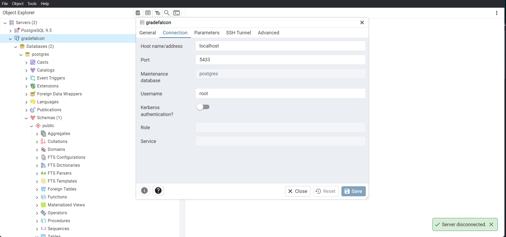

2. **Navigating pgAdmin:**
   - Once connected, you can view and manage the database structure, tables, and data.

### **Accessing the Auth0 Dashboard**

1. **Logging In:**
   - Visit the Auth0 dashboard login page.
   - Sign in using your Auth0 administrator credentials.
   - 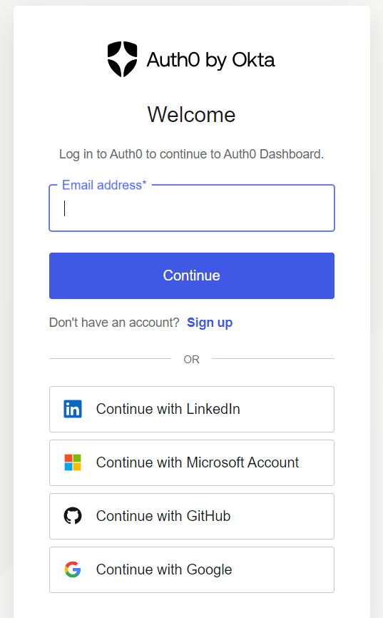

2. **Navigating the Dashboard:**
   - Use the dashboard to manage applications, users, roles, custom APIs, and access logs.
   - 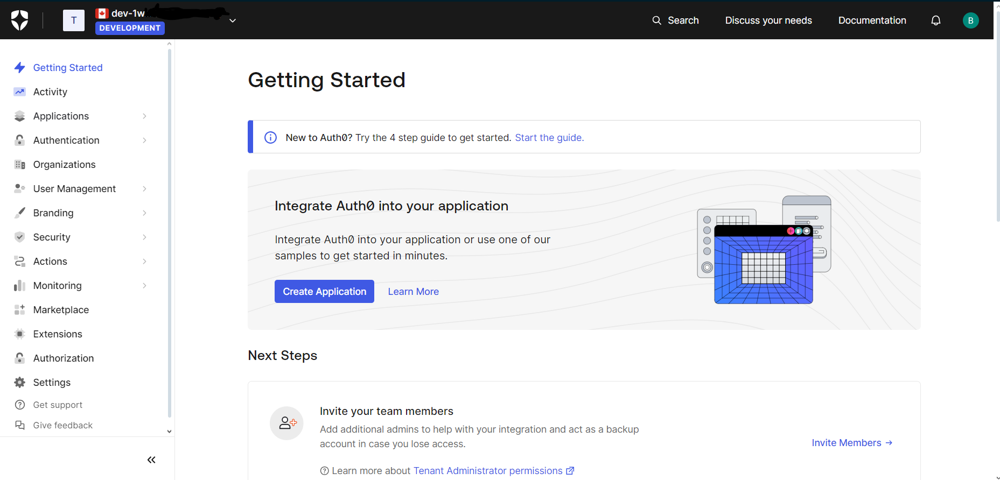

   For more detailed guidance on using the Auth0 dashboard, refer to the [Auth0 Documentation](https://auth0.com/docs/dashboard).

---

## **4. Managing Users and Roles with Auth0**

### **Creating Instructors**

1. **Navigating to Users:**
   - In the Auth0 dashboard, go to the "Users" section.
   - 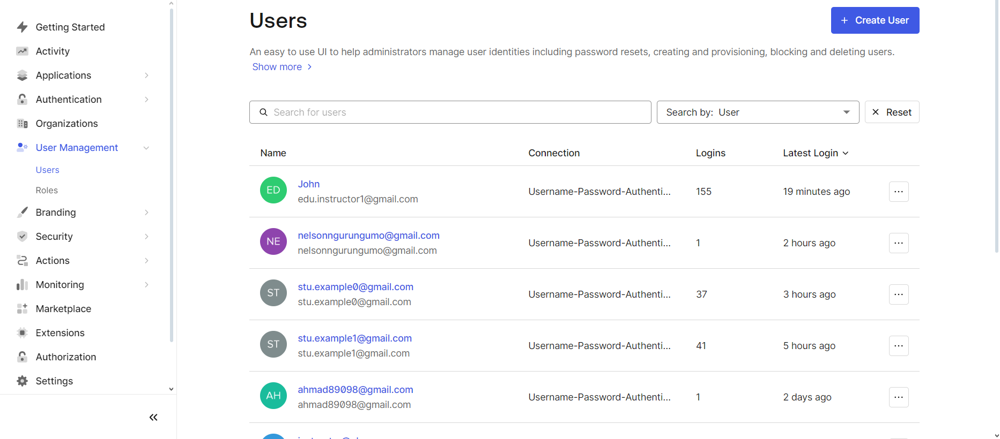

2. **Creating a New User:**
   - Click on "Create User" (in most instances will be to add a new instructor.)
   - Fill in the email and password fields for the instructor account.
   - Click "Create" to save the new user.
   - Assign the role of "Instructor" to the user and any associated permissions get automatically given to the user.
   - 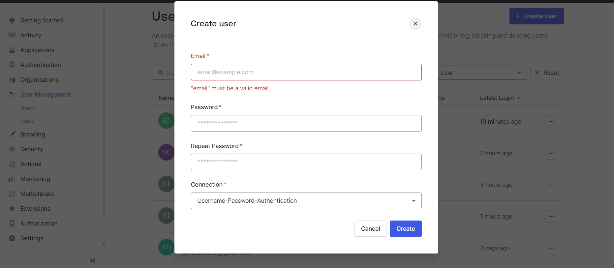
   - 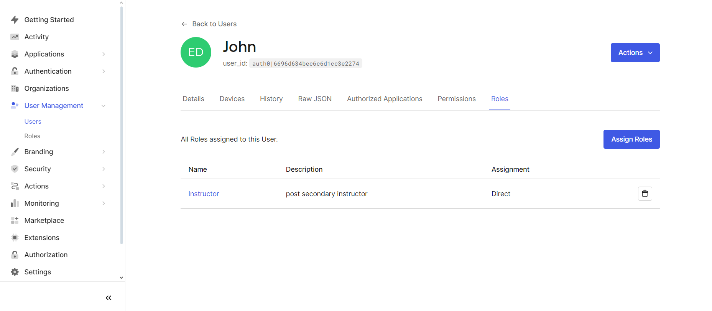

### **Editing User Details**

1. **Selecting a User:**
   - In the "Users" section, search for the user whose details you want to edit.
   - Click on the user's name to open their profile.

2. **Updating User Information:**
   - Edit fields such as email or metadata as needed.
   - An admin cannot edit another users password, but can send said user a password change email.
   - Assign or change roles using the "Roles" tab.
   - Click "Save" to apply the changes.
   - 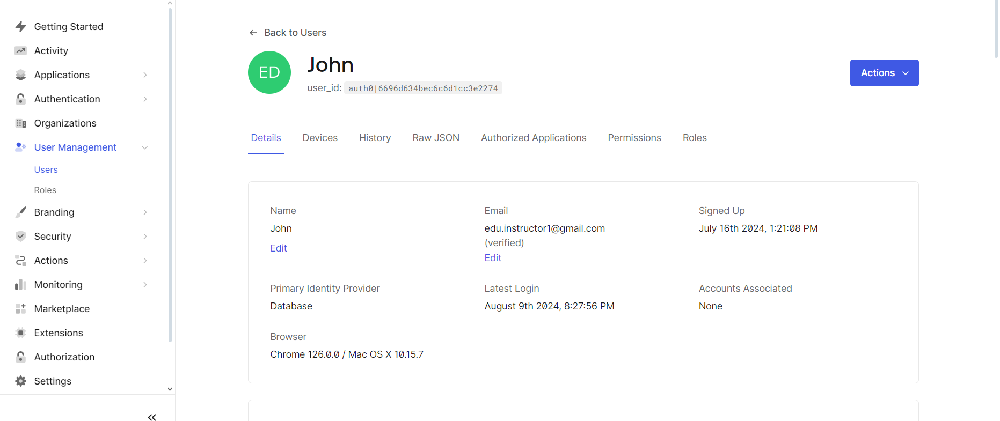   
   - 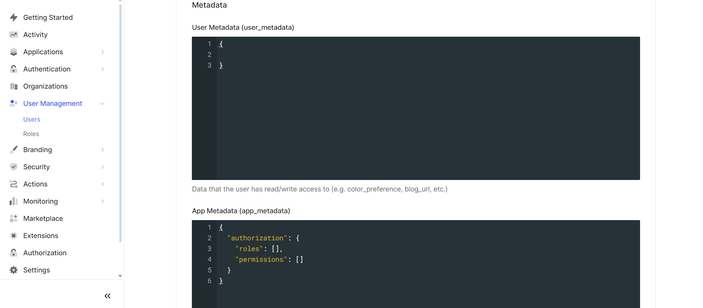

### **Removing a User**

1. **Finding the User:**
   - In the "Users" section, search for the user you wish to remove.

2. **Deleting the User:**
   - Click on the user's name to view their profile.
   - Click the "Delete" button and confirm the action to remove the user from the system.
   - 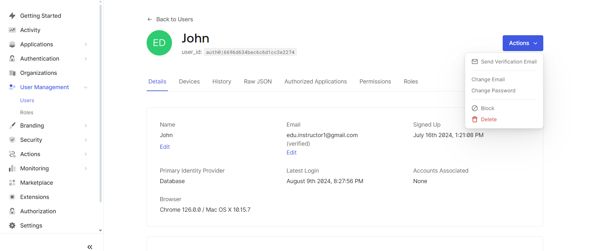

### **Checking Activity Logs**

1. **Accessing Logs:**
   - Navigate to the "Logs" section in the Auth0 dashboard.

2. **Reviewing Activity:**
   - Use filters to search for specific events or user activities.
   - Analyze logs to monitor user logins, role changes, and security-related events.
   - 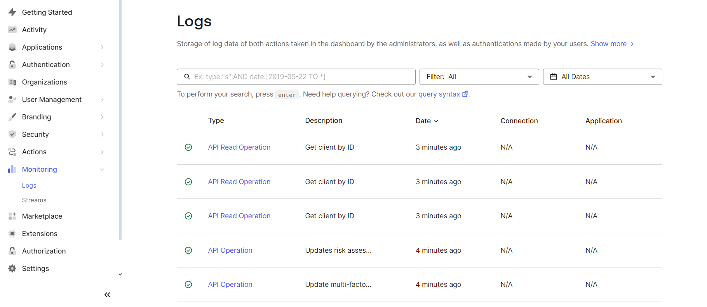

   For more information on monitoring and logs, refer to the [Auth0 Monitoring and Logs Guide](https://auth0.com/docs/logs).

---

## **5. Managing Custom APIs with Auth0**

### **Creating a Custom API**

1. **Navigating to APIs:**
   - In the Auth0 dashboard, go to the "APIs" section.
   - 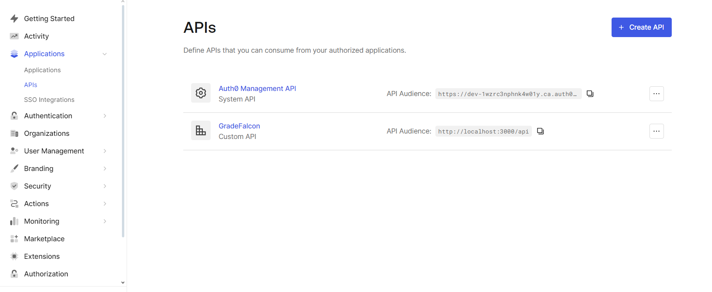

2. **Creating a New API:**
   - Click on "Create API."
   - Enter the API name, identifier, and other settings.
   - Define scopes and permissions for the API.
   - Click "Create" to save the new API.
   - 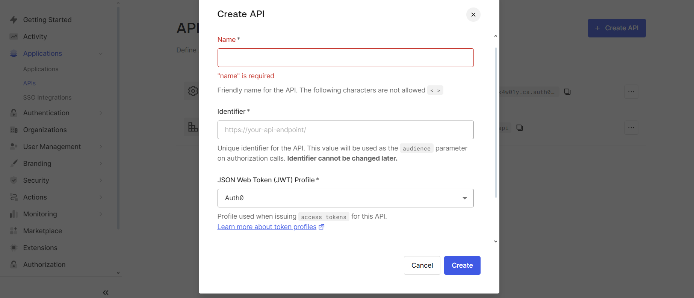

### **Managing Permissions for APIs**

1. **Viewing API Permissions:**
   - Select the API you want to manage permissions for.
   - 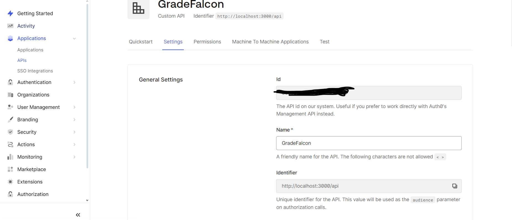

2. **Editing Permissions:**
   - Add or modify permissions to align with the API endpoints.
   - Assign these permissions to roles as necessary in the roles section under "user management"
   - 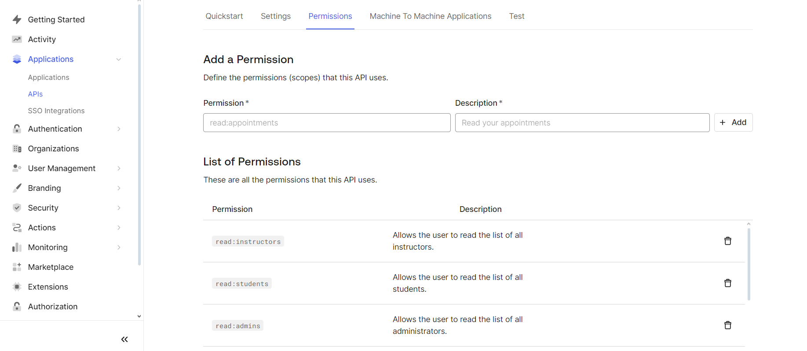

   For detailed guidance, check the [Auth0 API Documentation](https://auth0.com/docs/api).

---

## **6. Managing the Database with pgAdmin**

### **General Database Access**

As an administrator, you have full access to the GradeFalcon database via pgAdmin. This allows you to view, edit, and manage all tables related to courses, students, instructors, and more.

### **Managing Database Tables**

1. **Accessing the Database:**
   - Open pgAdmin and connect to the GradeFalcon database.
   - Navigate through the schema to find tables related to your management tasks.

2. **Viewing and Editing Records:**
   - To view records, open the desired table and click "View/Edit Data."
   - Right-click on any row to edit the data directly.
   - Make sure to adhere to data integrity rules while making changes.
   - 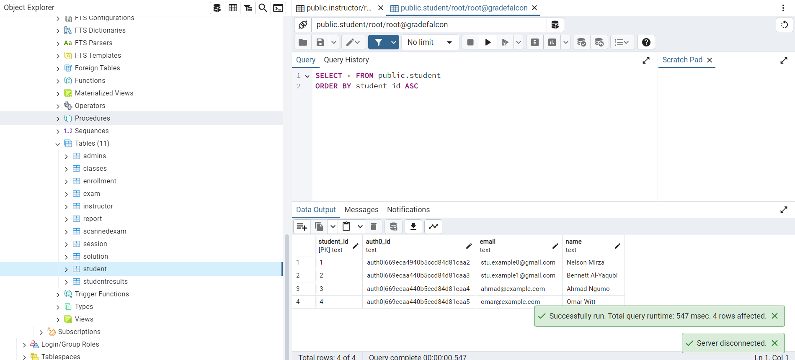

3. **Inserting New Records:**
   - Right-click on the table where you want to add data and select "Insert Data."
   - Fill in all required fields and ensure correct foreign key relationships.
   - Save the changes to update the database.
## **7. Troubleshooting**

### **Common Issues**

- **Issue:** Unable to connect to the database in pgAdmin.
  - **Solution:** Verify connection details and check network settings.

- **Issue:** User cannot log in through Auth0.
  - **Solution:** Check the user's account status in the Auth0 dashboard and reset their password if necessary.

---

**Thank you for managing GradeFalcon!**