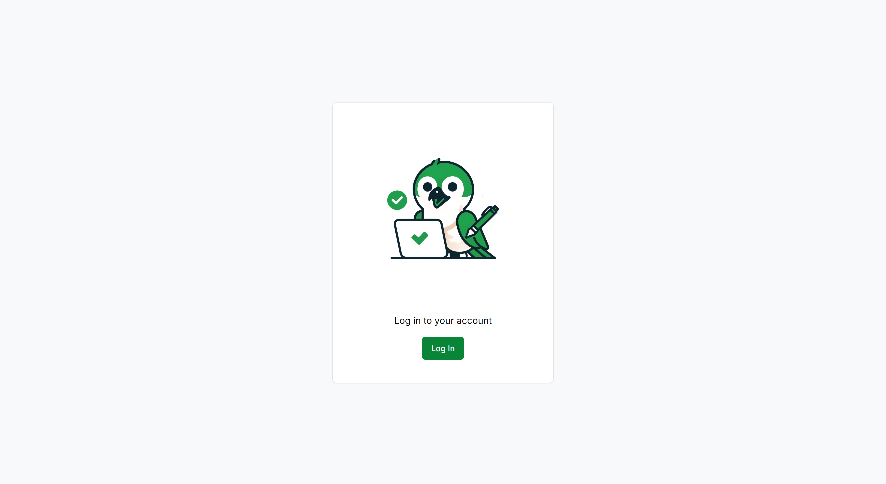
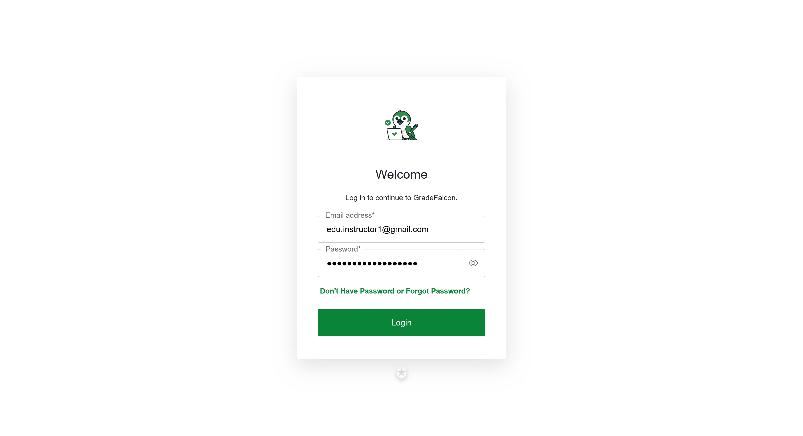
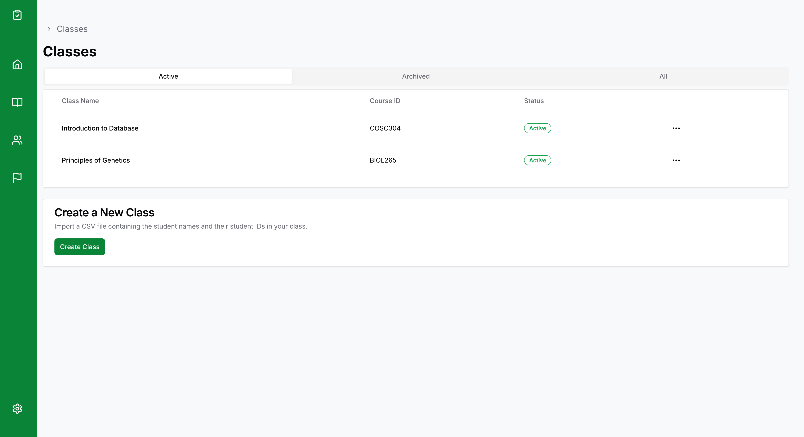
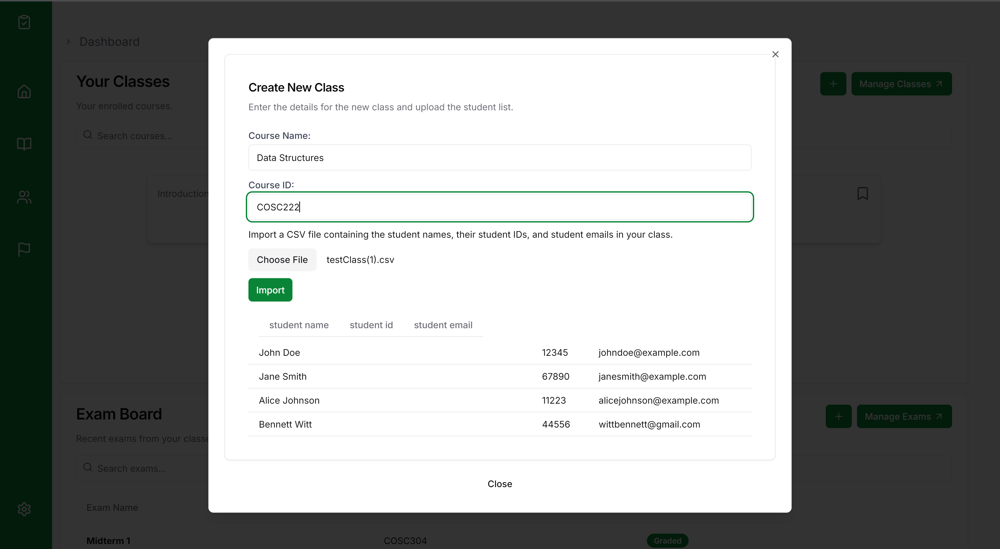
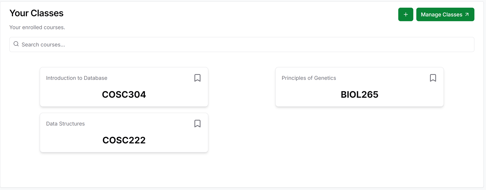
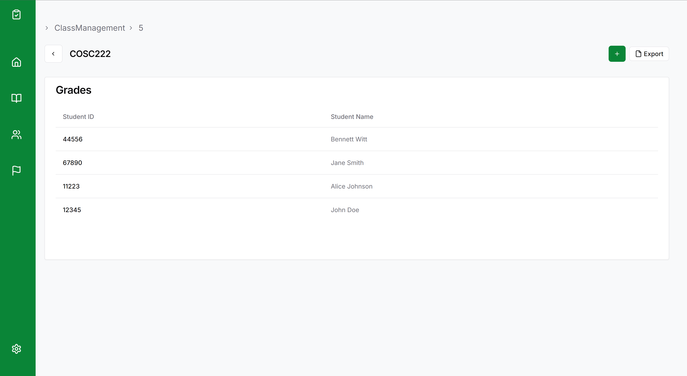
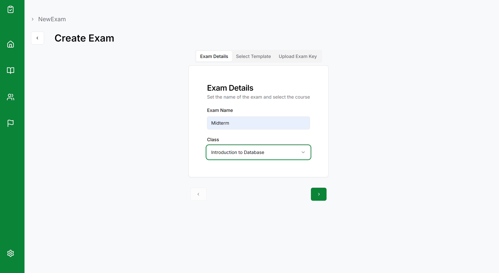
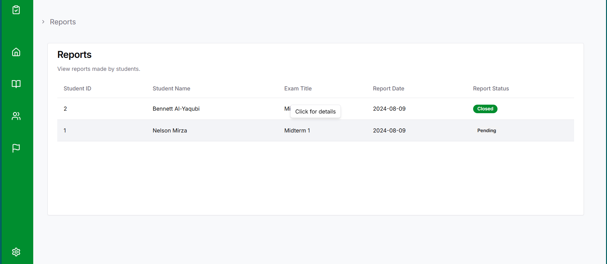
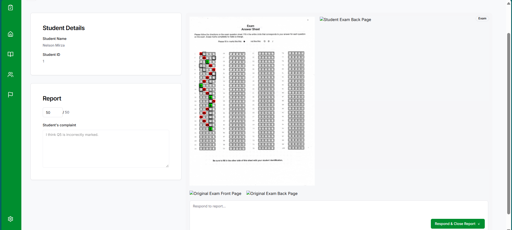
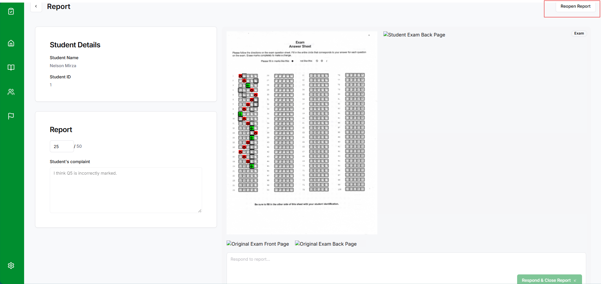

# **GradeFalcon User Guide**

**Version:** 1.0  
**Date:** August 2024  
**Developed by:** Team 1

---

## **Table of Contents**

1. [Introduction](#1-introduction)
2. [System Requirements](#2-system-requirements)
3. [Getting Started](#3-getting-started)
   - [Logging In](#logging-in)
   - [Dashboard Overview](#dashboard-overview)
4. [Classes](#4-classes)
   - [Creating a New Class](#creating-a-new-class)
   - [Inviting Students](#inviting-students)
   - [Viewing and Editing Classes](#viewing-and-editing-classes)
5. [Creating and Managing Exams](#5-creating-and-managing-exams)
   - [Creating an Exam](#creating-an-exam)
     - [Default Templates](#default-templates)
     - [Custom Templates](#custom-templates)
   - [Uploading Exam Keys](#uploading-exam-keys)
   - [Grading Exams](#grading-exams)
   - [Viewing Exam Statistics](#viewing-exam-statistics)
6. [Student Interface](#6-student-interface)
   - [Viewing Exam Results](#viewing-exam-results)
   - [Contesting Grades](#contesting-grades)
7. [Reports and Notifications](#7-reports-and-notifications)
   - [Managing Student Reports](#managing-student-reports)
   - [Responding to Reports](#responding-to-reports)
8. [Managing Roles and Permissions](#8-managing-roles-and-permissions)
   - [Instructor Roles](#instructor-roles)
   - [Admin Roles](#admin-roles)
9. [Exporting Data](#9-exporting-data)
   - [Exporting Grades to CSV](#exporting-grades-to-csv)
   - [Integrating with Canvas](#integrating-with-canvas)
10. [Visual Analytics](#10-visual-analytics)
    - [Viewing and Interpreting Charts](#viewing-and-interpreting-charts)
11. [Advanced Features](#11-advanced-features)
    - [Custom Marking Schemes](#custom-marking-schemes)
    - [Visual Output of Graded Exams](#visual-output-of-graded-exams)
12. [Troubleshooting and FAQs](#12-troubleshooting-and-faqs)
13. [Contact Support](#13-contact-support)

---

## **1. Introduction**

GradeFalcon is a web-based Optical Mark Recognition (OMR) system designed to streamline the grading process for instructors. It offers a fast, reliable, and flexible solution for managing classes, creating exams, grading, and providing insights through visual analytics.

---

## **2. System Requirements**

- **Web Browser:** Chrome, Firefox, Edge (latest versions)
- **Internet Connection:** Required for all features
- **Hardware:** No special requirements

---

## **3. Getting Started**

### **Logging In**

To access GradeFalcon, visit the login page and sign in with your credentials. 

Upon logging in, you’ll be directed to the dashboard. The dashboard provides a quick overview of your courses, exams, and key actions such as creating new classes exams or viewing exam results.

---

## **4. Classes**

### **Creating a New Class**

1. Click on either the plus sign at the top right of the classes card on the dashboard OR navigate to the bottom of the “Classes” section from the navbar on the left.
   

2. Click on the “Create Class” button.
3. Fill in the necessary details, such as the course name and course code.
4. Click on the 'Choose File' button to import a list of students. If a student is already registered for GradeFalcon, they will be automatically added. Otherwise, they will be sent an invite link with which they can register.
   

1. The new class is now displayed on the exam board

1. You can click on the course and view it's details. The class list can be exported by clicking the export button on the top right.

## 5. Exams

### **Creating a New Exam**

1. Click on the plus button on the top right of the exam card or navigate to the exam board and click the button there

2. You will be redirected to the new exam page. Here you can enter the name of the exam and choose the course you'd like to create it for.

3.  

Here's a section of the instructor user guide covering the report feature, including placeholders for where to insert images:

---

## **Managing Student Reports**

As an instructor, you can access and manage student reports through the Report Dashboard. This section will guide you through the steps for handling reports.

### **Accessing the Report Dashboard**

1. Navigate to the Report Dashboard from the sidebar.
2. The Report Dashboard displays all submitted reports along with their submission dates.

### **Handling a Report**

1. **Viewing a Report:**
   - Click on any report in the dashboard to view its details. You will see the student's comments, the exam grade, and any additional information provided.

2. **Regrading an Exam:**
   - If a regrade is required, you can adjust the grade directly from the report interface.
   - After making the necessary changes, submit your updated grade.

3. **Replying to a Report:**
   - You can reply to the student's report with any comments or explanations.
   - Once you've addressed the report, mark it as closed. This will update the report's status to "Closed."

### **Reopening and Editing a Closed Report**

1. **Reopening a Report:**
   - If necessary, you can reopen a closed report to make further edits or adjustments.
   - Once reopened, you can modify the grade, update your reply, and re-close the report.

2. **Editing a Report:**
   - After reopening, you have the ability to make any additional changes needed, ensuring all concerns are addressed.

### **Report Status**

- **Open:** The report is active and requires attention.
- **Closed:** The report has been addressed, and no further action is required.
- **Reopened:** The report was closed but has been reopened for further action.

By effectively managing student reports, you can ensure that all grading concerns are handled promptly and fairly.
