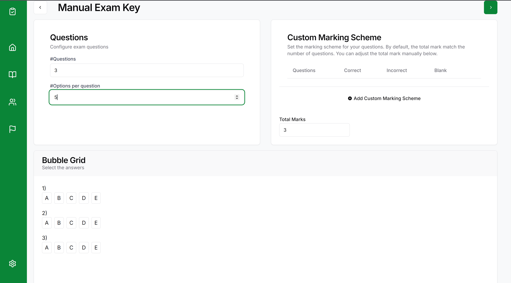

# **GradeFalcon User Guide**

**Version:** 1.0  
**Date:** August 2024  
**Developed by:** Team 1

---

## **Table of Contents**

1. [Introduction](#1-introduction)
2. [System Requirements](#2-system-requirements)
3. [Getting Started](#3-getting-started)
   - [Logging In](#logging-in)
   - [Dashboard Overview](#dashboard-overview)
4. [Classes](#4-classes)
   - [Creating a New Class](#creating-a-new-class)
5. [Exams](#5-exams)
   - [Creating a New Exam](#creating-a-new-exam)
   - [Uploading the solution key](#uploading-the-solution-key)
   - [Creating a custom exam sheet](#creating-a-custom-exam-sheet)
   - [Grading Exams](#grading-exams)
   - [Viewing Exam Statistics](#viewing-exam-statistics)
6. [Student Interface](#6-student-interface)
   - [Viewing Exam Results](#viewing-exam-results)
   - [Contesting Grades](#contesting-grades)
7. [Reports and Notifications](#7-reports-and-notifications)
   - [Managing Student Reports](#managing-student-reports)
   - [Responding to Reports](#responding-to-reports)
8. [Managing Roles and Permissions](#8-managing-roles-and-permissions)
   - [Instructor Roles](#instructor-roles)
   - [Admin Roles](#admin-roles)
9. [Exporting Data](#9-exporting-data)
   - [Exporting Grades to CSV](#exporting-grades-to-csv)
   - [Integrating with Canvas](#integrating-with-canvas)
10. [Visual Analytics](#10-visual-analytics)
    - [Viewing and Interpreting Charts](#viewing-and-interpreting-charts)
11. [Advanced Features](#11-advanced-features)
    - [Custom Marking Schemes](#custom-marking-schemes)
    - [Visual Output of Graded Exams](#visual-output-of-graded-exams)
12. [Troubleshooting and FAQs](#12-troubleshooting-and-faqs)
13. [Contact Support](#13-contact-support)

---

## **1. Introduction**

GradeFalcon is a web-based Optical Mark Recognition (OMR) system designed to streamline the grading process for instructors. It offers a fast, reliable, and flexible solution for managing classes, creating exams, grading, and providing insights through visual analytics.

---

## **2. System Requirements**

- **Web Browser:** Chrome, Firefox, Edge (latest versions)
- **Internet Connection:** Required for all features
- **Hardware:** No special requirements

---

## **3. Getting Started**

### **Logging In**

To access GradeFalcon, visit the login page and sign in with your credentials. 

Upon logging in, you’ll be directed to the dashboard. The dashboard provides a quick overview of your courses, exams, and key actions such as creating new classes exams or viewing exam results.

---

## **4. Classes**

### **Creating a New Class**

1. Click on either the plus sign at the top right of the classes card on the dashboard OR navigate to the bottom of the “Classes” section from the navbar on the left.
   

2. Click on the “Create Class” button.
3. Fill in the necessary details, such as the course name and course code.
4. Click on the 'Choose File' button to import a list of students. If a student is already registered for GradeFalcon, they will be automatically added. Otherwise, they will be sent an invite link with which they can register.
   

1. The new class is now displayed on the exam board

1. You can click on the course and view it's details. The class list can be exported by clicking the export button on the top right.

## 5. Exams

### **Creating a New Exam**

1. Click on the plus button on the top right of the exam card or navigate to the exam board and click the button there

2. You will be redirected to the new exam page. Here you can enter the name of the exam and choose the course you'd like to create it for.

1. Next you must choose the template for your exam. You can choose either the 100MCQ or 200MCQ template or create a custom one. Let's choose the existing 100MCQ sheet. 
  

1. On the upload exam key page, you can choose to either create the exam key from an existing filled out PDF sheet or manually select the answers. Let's manually select the answers.

1. You can set the number of questions for your exam and select the right answers.

1. GradeFalcon supports a custom marking scheme, which means you can increase the weight of certain questions, as well as penalize students for getting a question wrong.

1. After clicking next, you can choose to let the student see their submitted and/or the solution to the exam. Click on 'Confirm' to save and create the exam.

The exam will then appear in the exam board.

### **Uploading the solution key**

1. To create an exam by scanning an already filled in bubble sheet, click on 'Upload Exam Key' when creating an exam key.

2. Click on the 'Browse files' button and upload the appropriate PDF file to create an answer key from the given file. Click on the 'Import' button to let the OMR scan it. 

3. The OMR will begin scanning the key. Once it finishes, it will automatically fill in the bubble grid according to what was on the sheet.

You can now proceed with setting the viewing options and saving the exam.

### **Creating a custom exam sheet**

1. To create a custom exam sheet, select the 'Custom' option from template selection menu. A menu will pop up allowing you to set the number of questions and number of options per question. GradeFalcon supports up to 255 questions and 2-5 options per question.

2. After clicking on the generate PDF button, a PDF file will automatically be downloaded with the specified parameters. The course code and exam name is displayed at the top.

This can then be uploaded and used in the upload exam key page.

### **Grading Exams**

1. To grade the exams for a course, we