Here's an updated **Student User Guide** for GradeFalcon based on the new details:

---

# **GradeFalcon Student User Guide**

**Version:** 1.0  
**Date:** August 2024  
**Developed by:** [GradeFalcon]

---

## **Table of Contents**

1. Introduction
2. System Requirements
3. Getting Started
   - Signing Up and Logging In
4. Navigating the Dashboard
5. Viewing and Filtering Exams
6. Accessing and Reviewing Exam Results
7. Contesting a Grade
8. Managing Your Profile
9. Troubleshooting and FAQs
10. Contact Support

---

## **1. Introduction**

GradeFalcon is an online platform designed to help students view their graded exams, contest grades, and manage their profile. This guide will help you navigate the platform and make the most of its features.

---

## **2. System Requirements**

- **Web Browser:** Chrome, Firefox, Edge (latest versions)
- **Internet Connection:** Required for all features
- **Hardware:** No special requirements

---

## **3. Getting Started**

### **Signing Up and Logging In**

1. **Receiving an Invitation:**
   - If your instructor has enrolled you in a course, you will receive an email invitation.
   - 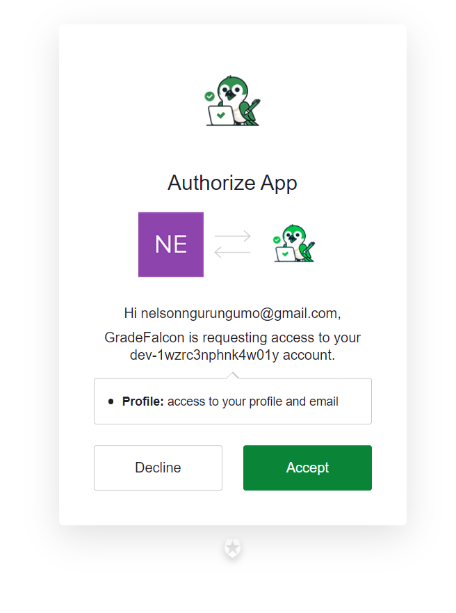
   - Follow the link in the email to verify your account.
   - 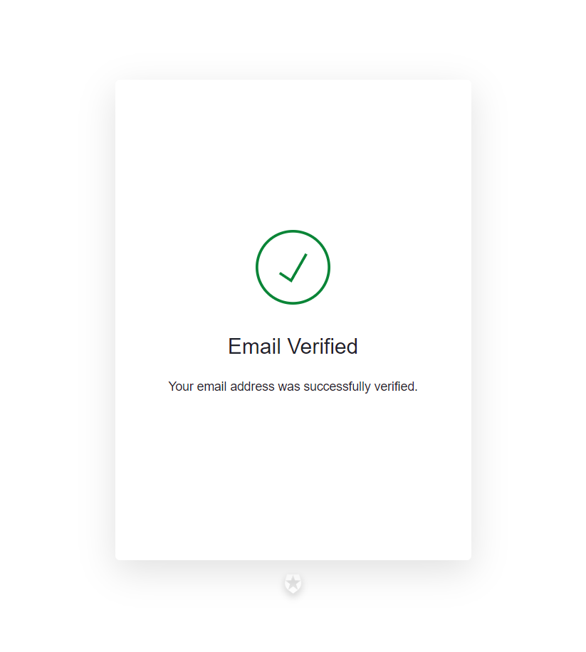
   - Once your account has been verified navigate back to the gradefalcon webpage.
   - 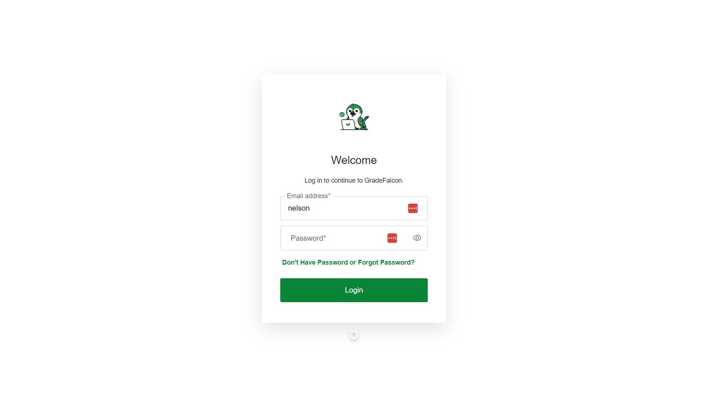
   - You will notice that it asks for your email and password but because it is your first time logging in you MUST CLICK ON DON'T HAVE A PASSWORD/FORGOT PASSWORD BUTTON where you will recieve an email prompting you to change your password
   - 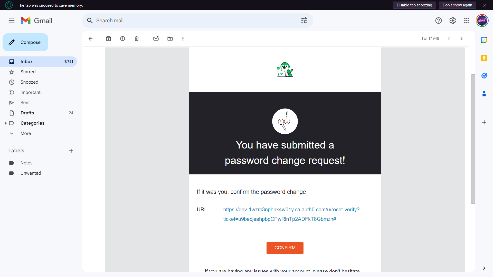
   - Press on the link where you will be directed to the new password page
   - 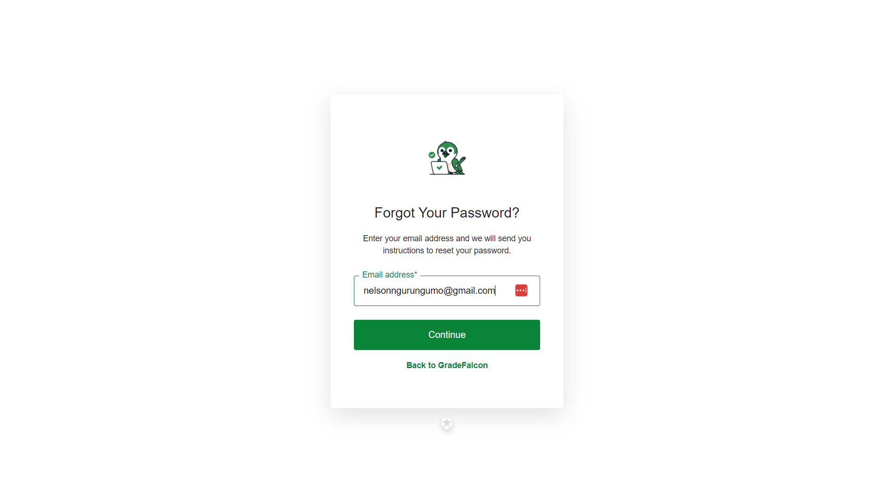
   - Set a new password and confirm it after this you will be directed to a password verified page
   - 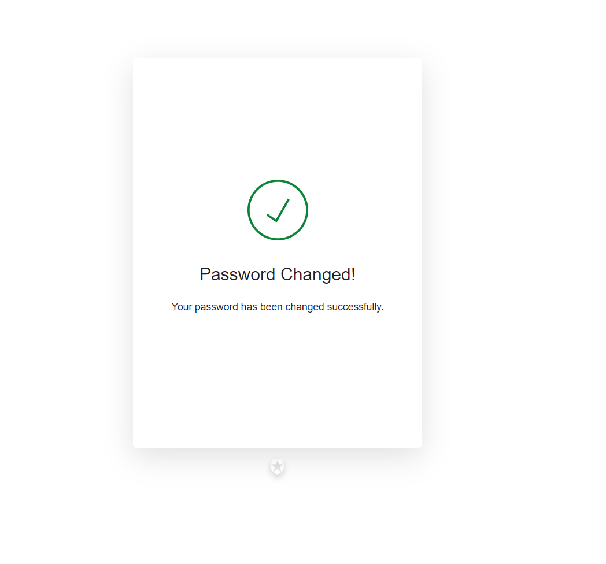
   - From here navigate back to the Gradefalcon login page and enter your credentials
   - 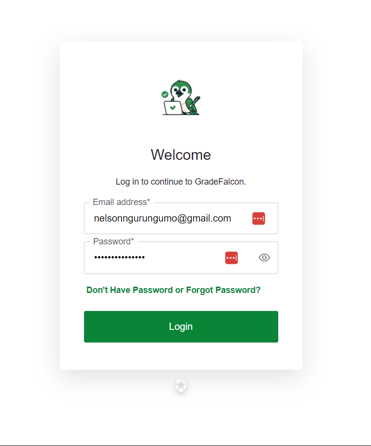
   - After logging in for the first time auth0 will ask you kindly for permission to use your information.
   - 
  
   
   - From here you will be directed to the main dashboard
   - If you already have an account you will be asked to login with your credentials and then directed to the dashboard page where you will automatically be added to the course the instructor registered you for. 

2. **Logging In:**
   - Visit the GradeFalcon login page and sign in with your credentials.
   - 
   - If you forget your password, click the “Forgot Password” link to reset it.

---

## **4. Navigating the Dashboard**

### **ExamBoard Overview**

After logging in, you will be taken to your dashboard, which consists of an ExamBoard. The ExamBoard allows you to filter exams by courses and easily access your exam results.

- **Filtering Exams:** Use the filter options to select the course whose exams you want to view.
- **Exam List:** View a list of exams associated with the selected course.

- 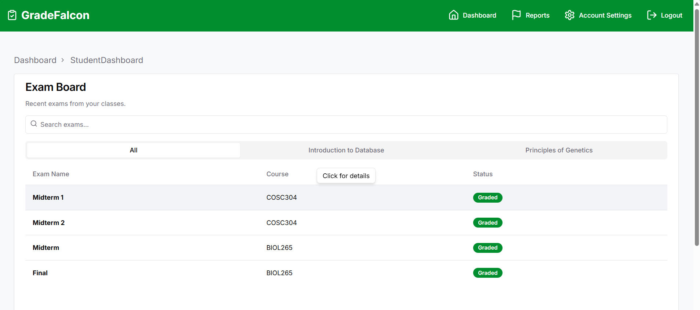

---

## **5. Viewing and Filtering Exams**

### **Accessing Your Exams**

1. **Selecting a Course:**
   - On the ExamBoard, choose the course you want to view exams for.

2. **Viewing Exam Results:**
   - Click on the exam title to view your graded exam. You can also view your original copy if your instructor has enabled this option.
   - If the instructor has enabled it, you can also view the answer key.

### **Details Available:**
- **Graded Exam Paper:** Shows your answers with correct or incorrect marks.
- **Original Exam Copy:** Displays your original submission.
- **Answer Key:** (If enabled) Shows the correct answers for the exam.

- 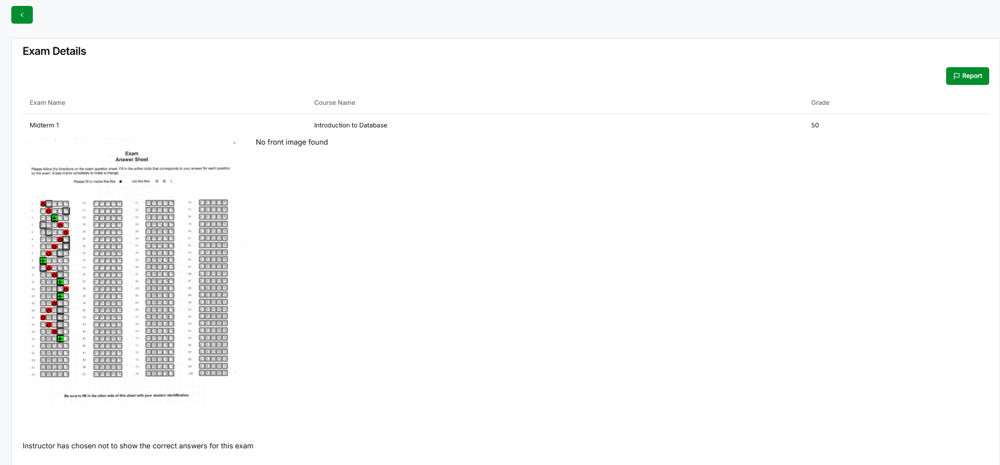

---

## **6. Accessing and Reviewing Exam Results**

Once you’ve selected an exam, you’ll have access to:

- **Graded Exam:** View your exam with annotations showing which answers were correct or incorrect.
- **Original Exam:** Compare your original submission to the graded version (if allowed by the instructor).
- **Answer Key:** Check the correct answers for each question (if allowed by the instructor).

---

## **7. Contesting a Grade**

### **Making a Report**

If you believe there was an error in your grading, you can contest it through two methods:

1. **From the Exam Details Page:**
   - Click on the “Report” button to start the process.

2. **Using the Report Dashboard:**
   - Click on the “Report” button in the menu bar to access the Report Dashboard.
   - From here, click the “Create Report” button.

### **Creating a Report**

1. **Select a Course:**
   - Start by choosing the course related to the exam you’re contesting.

2. **View Exam Grade:**
   - The system will display your exam grade for reference.

3. **Submit a Comment:**
   - Enter your comments explaining why you believe a grade change is necessary.

4. **Submit Report:**
   - Click “Submit” to send your report to the instructor.

### **Report Limitations**

- **Pending Reports:** If a report has already been submitted and is pending, you cannot create a new report for the same exam or edit the existing report.

- 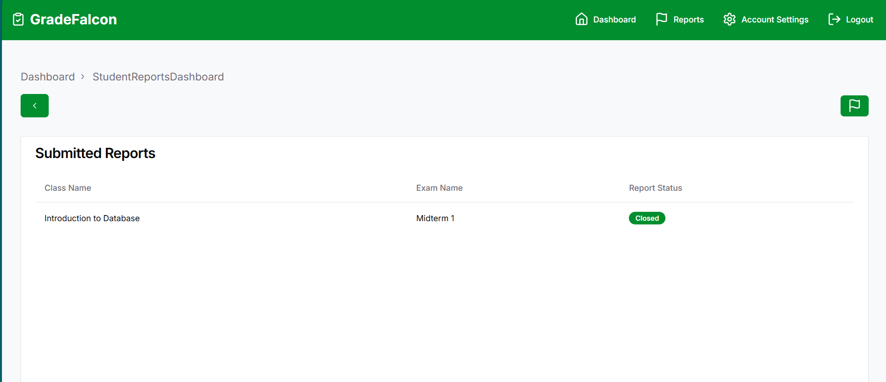
- 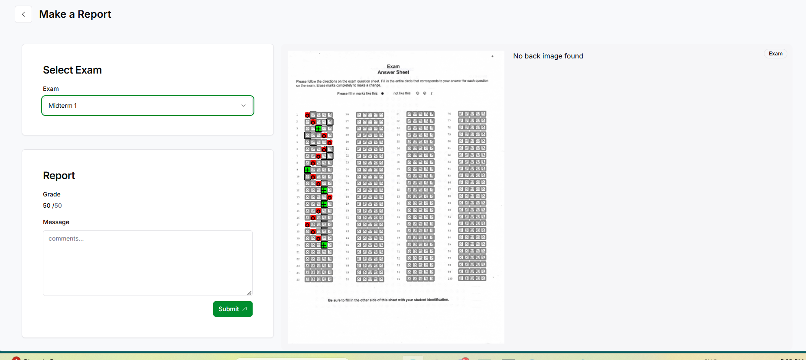
---

## **8. Managing Your Profile**

### **Updating Your Information**

1. Navigate to your profile by clicking on your name or profile picture in the top right corner.
2. Here you can update your personal information, change your password, and manage your account settings.

### **Notifications**

- **Email Notifications:** Ensure your email is correct to receive updates and notifications about your exams and grades.

---

## **9. Troubleshooting and FAQs**

### **Common Issues**

- **Issue:** I can't log in.
  - **Solution:** Check your email and password. If you’ve forgotten your password, use the “Forgot Password” link.

- **Issue:** I didn’t receive an invitation email.
  - **Solution:** Ensure your instructor has the correct email address and check your spam/junk folder.

- **Issue:** I can’t see my exam results.
  - **Solution:** Make sure the exam has been graded. If it has, but you still can’t see your results, contact your instructor.

### **Frequently Asked Questions**

- **Question:** Can I change my email address in the system?
  - **Answer:** Yes, you can update your email address in the profile settings.

- **Question:** What should I do if I disagree with my grade?
  - **Answer:** Use the “Create Report” feature from the Exam Details page or the Report Dashboard to submit a report to your instructor.

---

**Thank you for using GradeFalcon!**

---

This guide should help students navigate and utilize GradeFalcon effectively. You can place this guide in the `docs/` folder of your repository or create a `student_guide.md` file at the root level. Make sure it's easily accessible to students.
