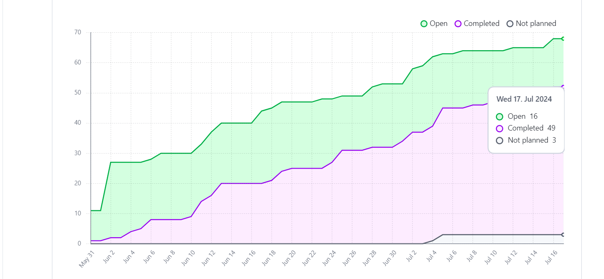
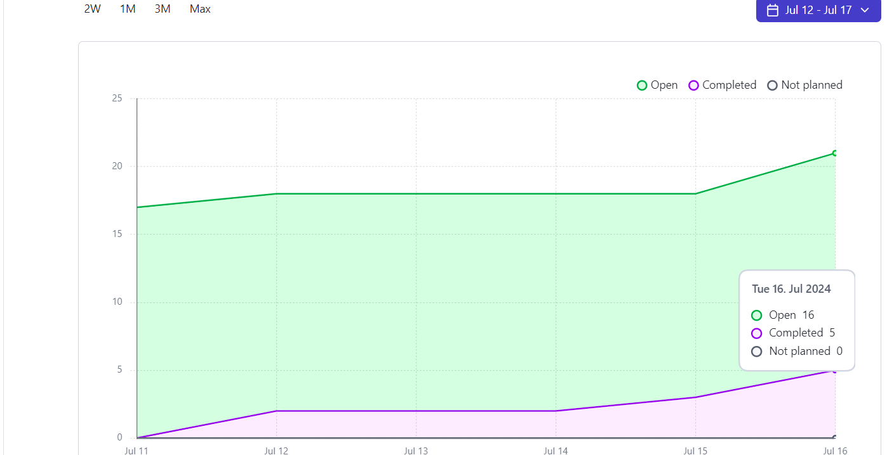
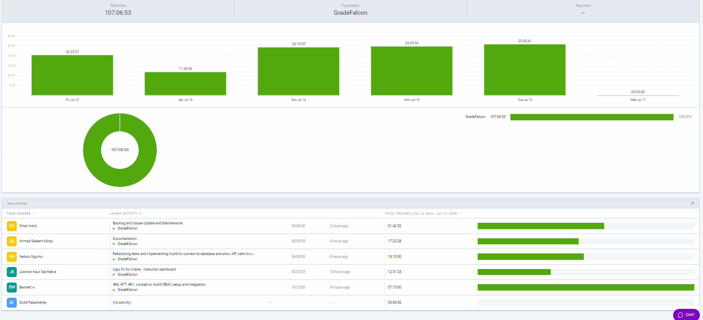
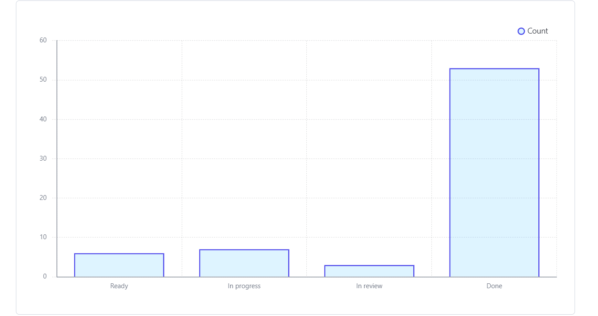

# Dashboard

## Burn-up Chart (Velocity):
- 

## Weekly Burn-up Chart (Velocity):
- 

- 

### Task Status

- 

## Test Report / Testing Status:

- ![docs/weekly logs/Tests/[Tests]](../../Tests/BackendTestJul17.jpg)
- ![docs/weekly logs/Tests/[Tests]](../../Tests/FrontendTestJul17.jpg)

## Associated Tasks from Project Board:

| Task ID | Description                                       | Feature                                           | Assigned To | Status     |
| ------- | ------------------------------------------------- | ------------------------------------------------- | ----------- | ---------- |
| #181    | Display Graded Exams for Instructors and Review grades | Display Graded Exams for Instructors and Review grades | Ahmad       | To Do      |
| #17     | Custom Bubble Sheet Support                       | Custom Bubble Sheet Support                       | Omar        | To Do      |
| #77     | Revamp Sign-In and Sign-Up to Use Auth0           | Revamp Sign-In and Sign-Up, Logout to Use Auth0   | Omar, Bennett | In Progress|
| #188    | Implement Refactored Code and Implement Color-Coded Grading | Implement Refactored Code and Implement Color-Coded Grading | Omar        | In Review  |
| #4      | Implement Role-Based Access Control (RBAC) Using Auth0 | Implement Role-Based Access Control (RBAC) Using Auth0 | Bennett, Nelson | In Progress|
| #5      | Protect API Calls to Backend Using Auth0 JWT Tokens | Protect API Calls to Backend Using Auth0 JWT Tokens | Bennett, Nelson | In Progress|
| #6      | Store Exam Files in AWS and Send Files from Backend to AWS | AWS File Upload Integration                       | Nelson      | In Review  |
| #7      | Student Grade Report                              | Student Grade Report with Testing                 | Jusnoor     | Done       |
| #8      | Parameters For Solution Upload                    | Student Grade Report with Testing                 | Ahmad       | Done       |
| #9      | Upload and Parse Bubble Sheets                    | Upload and Parse Bubble Sheets                    | Omar, Bennett | In Progress|
