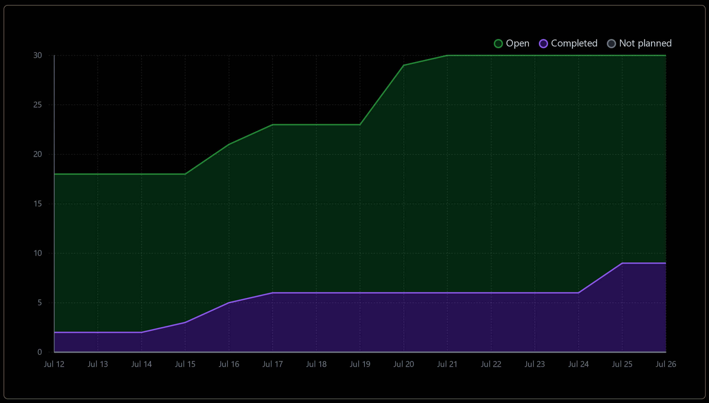
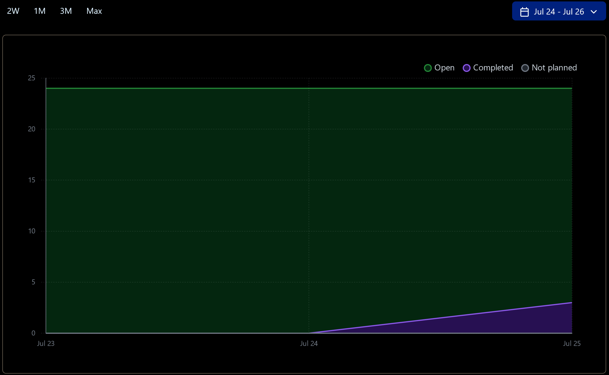
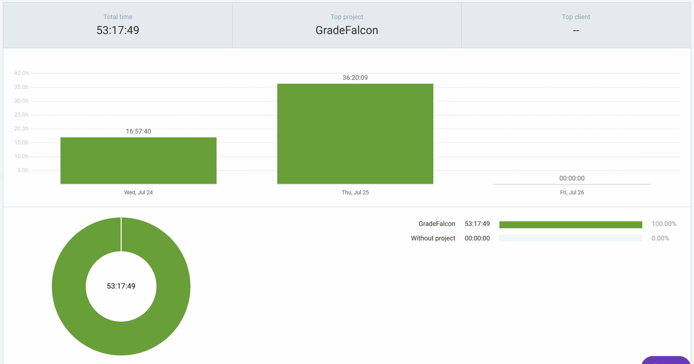
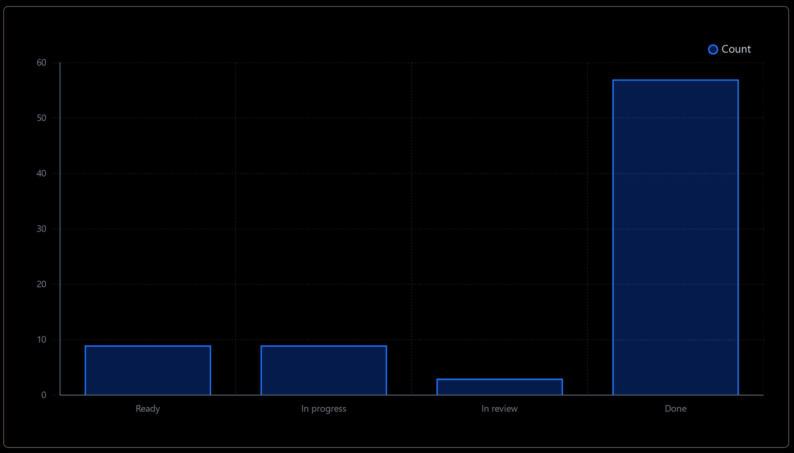

# Dashboard

## Burn-up Chart (Velocity):
- 

## Weekly Burn-up Chart (Velocity):
- 

- 

### Task Status

- 

## Test Report / Testing Status:

- ![docs/weekly logs/Tests/[Tests]](../../Tests/BackendTestJul17.jpg)
- ![docs/weekly logs/Tests/[Tests]](../../Tests/FrontendTestJul17.jpg)

## Associated Tasks from Project Board:

| Task ID | Description        | Feature   | Assigned To | Status   |
| ------- | ------------------ | --------- | ----------- | -------- |
| #190    | Display Graded Exams for Instructors and Review grades | Display Graded Exams for Instructors and Review grades | Ahmad       | In Review      |
| #181    | Grading Exams and Displaying Results on Frontend | Grading Exams and Displaying Results on Frontend | Omar       | Completed      |
| #188    | Implement Refactored Code and Implement Color-Coded Grading | Implement Refactored Code and Implement Color-Coded Grading | Omar        | Completed  |
| #195    | Configure Evaluation Settings | Configure Evaluation Settings | Omar       | Completed      |
| #17     | Custom Bubble Sheet Support                       | Custom Bubble Sheet Support                       | Omar        | In progress      |
|  #80     | Refactor UI Using shadcn UI Components                          | Refactor UI Using shadcn UI Components               | Jusnoor, Omar     | In Review|
| #61      | Implement Role-Based Access Control (RBAC) Using Auth0 | Implement Role-Based Access Control (RBAC) Using Auth0 | Bennett, Nelson | In Progress|
| #86      | Protect API Calls to Backend Using Auth0 JWT Tokens | Protect API Calls to Backend Using Auth0 JWT Tokens | Bennett, Nelson | In Progress|
| #25      | Manage Bulk Upload of Scanned PDFs and Organize by Student ID | Manage Bulk Upload of Scanned PDFs and Organize  | Ahmad | In Progress|
| #206      | Improve dashboard functionality | Improve dashboard functionality  | Jusnoor | In Progress|
