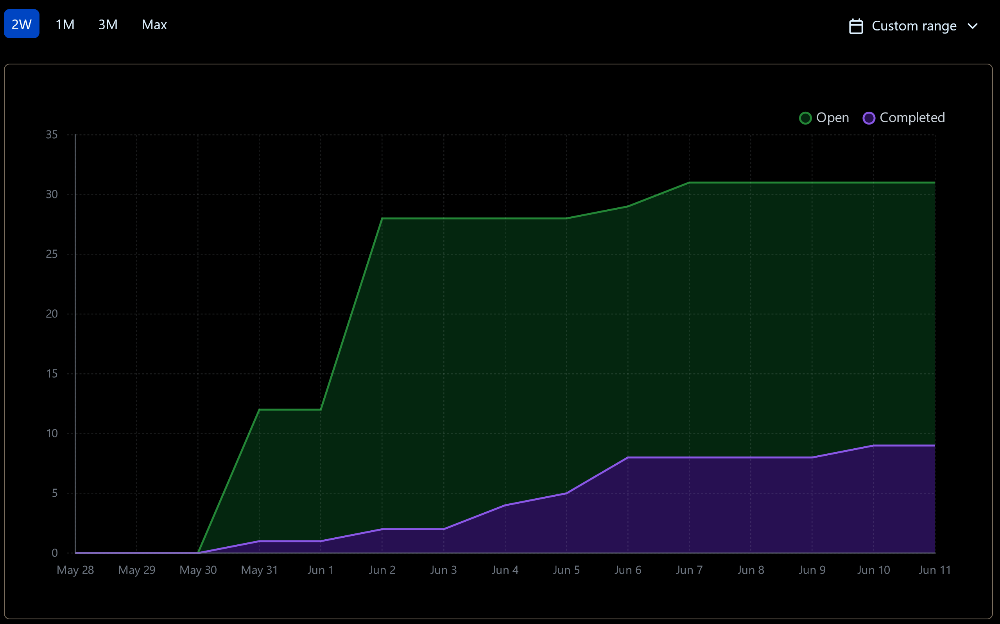
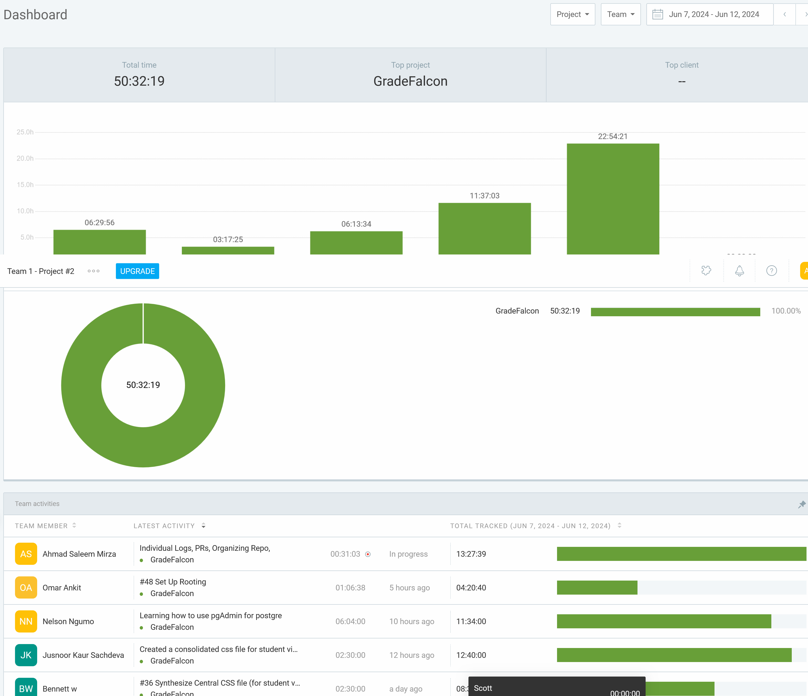
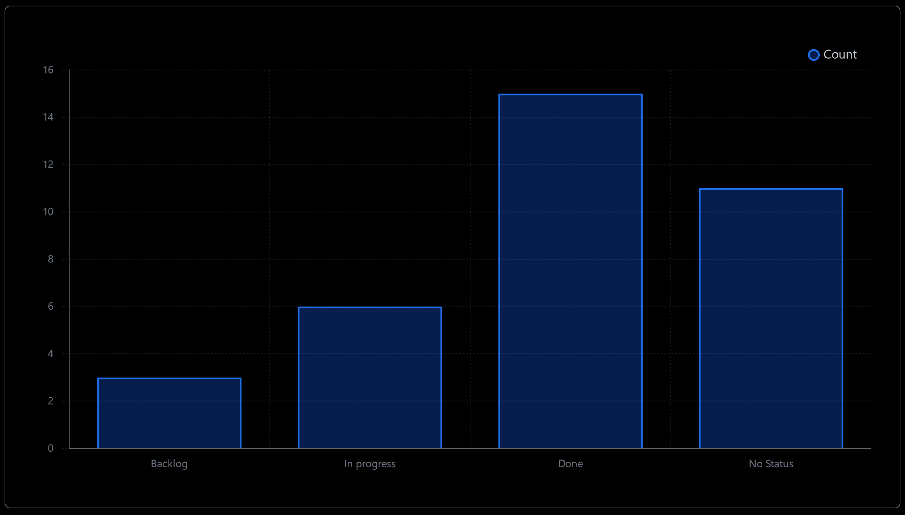

# Dashboard

## Burn-up Chart (Velocity):
- 

- 

### Task Status

- 

## Associated Tasks from Project Board:
| Task ID | Description | Feature | Assigned To | Status |
|---------|-------------|---------|-------------|--------|
| #2 | System Design: User Interface | System Design | Omar, Bennett | Completed |
| #4 | System Design: System Architecture | System Design | Omar, Ahmad, Nelson | Completed |
| #5 | System Design: DFD | System Design | Jusnoor | Completed |
| #6 | System Design: Database Design | System Design | Ahmad, Nelson | Completed |
| #7 | System Design: Use Cases | System Design | Omar, Ahmad | Completed |
| #8 | Automate Dashboard Creation | Automation | Omar | Completed |
| #9 | Populate Kanban | Project Planning | Omar | Completed |
| #28 | Docker Setup | Docker Setup | Omar | Completed |
| #29 | Database Setup | Database Setup | Ahmad | Completed |
| #29 | Dockerize database | Database Setup | Ahmad | Completed |
| #30 | React Development Environment Setup | UI and UX Design | Omar | Completed |
| #31 | System Design: Video and Presentation | System Design | Team | Completed |
| #32 | Transform Figma Mockups into Code | UI and UX Design | Bennett | Completed |
| #27 | CI/CD Setup | Project Planning | Omar | In Progress |
| #10 | Develop Computer Vision Model | OMR System | Omar | In Progress |
| #12 | Instructor Login and Authentication | Login and Authentication | Nelson | In Progress |
| #15 | Instructor Interface Development | Interface Development | Omar, Bennett | In Progress |
| #37 | Student Interface Development | Interface Development | Omar, Jusnoor | In Progress |
