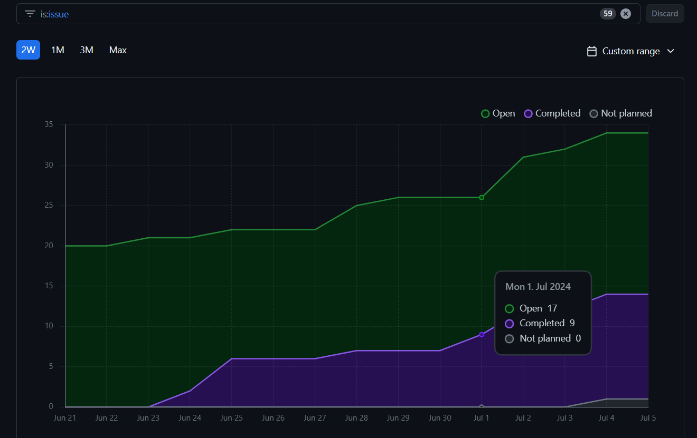
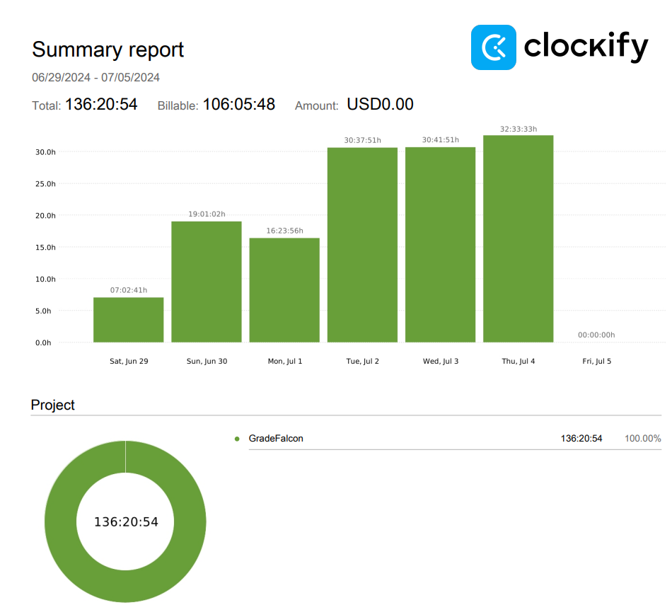
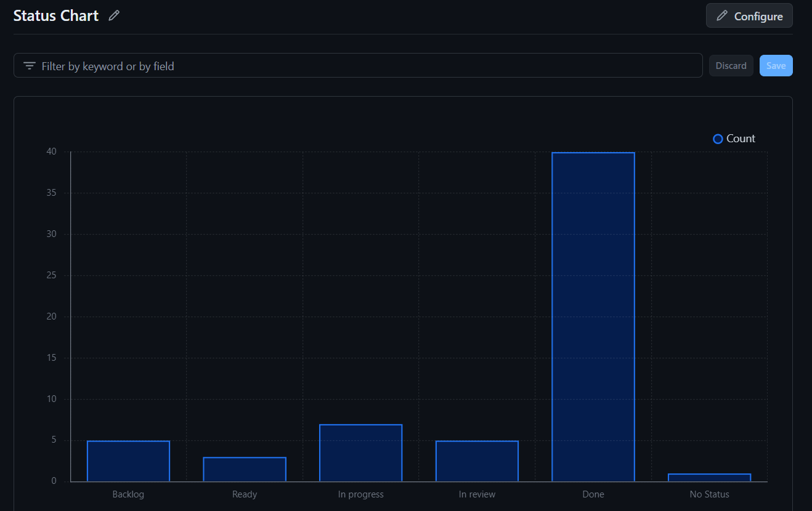

# Dashboard

## Burn-up Chart (Velocity):
- 

- 

### Task Status

- 

## Associated Tasks from Project Board:
| Task ID | Description | Feature | Assigned To | Status |
|--------------|-------|----------|-----------|--------|
| #2 | System Design: User Interface | System Design | Omar, Bennett | Complete |
| #4 | System Design: System Architecture | System Design | Omar, Ahmad, Nelson | Complete |
| #5 | System Design: DFD | System Design | Jusnoor | Complete |
| #6 | System Design: Database Design | System Design | Ahmad, Nelson | Complete |
| #7 | System Design: Use Cases | System Design | Omar, Ahmad | Complete |
| #8 | Automate Dashboard Creation | Automation | Omar | Complete |
| #9 | Populate Kanban | Project Planning | Omar | Complete |
| #28 | Docker Setup | Docker Setup | Omar | Complete |
| #29 | Database Setup | Database Setup | Ahmad | Complete |
| #30 | React Development Environment Setup | UI and UX Design | Omar | Complete |
| #31 | System Design: Video and Presentation | System Design | Team | Complete |
| #32 | Transform Figma Mockups into Code | UI and UX Design | Bennett, Jusnoor | Complete |
| #12 | Instructor Login and Authentication | Login and Authentication | Nelson | Complete |
| #15 | Instructor Interface Development | Interface Development | Omar, Bennett, Jusnoor | Complete |
| #56 | Express PostgreSQL Integration | Backend | Ahmad, Omar | Complete |
| #37 | Student Interface Development | Interface Development | Omar, Jusnoor | Complete |
| #44 | HTML Student View Complete and Central CSS File for Shared Elements Between Student and Instructor Views Completed | Enhancement | Bennett | Complete |
| #57 | Style Fix: Navigation Bar Standardization | Interface Development | Bennett | Complete |
| #107 | Display Exams on Examboard | Enhancement | Omar, Bennett | Complete |
| #22 | User Story: Create and Manage Exams | Enhancement | Ahmad, Nelson | Complete |
| #109 | Fix Frontend Testing | Testing | Bennett | Complete |
| #98 | Refactor Frontend Structure for Improved Maintainability | Enhancement | Bennett, Jusnoor | Complete |
| #97 | Refactor Backend Structure for Improved Maintainability | Enhancement | Ahmad, Nelson | Complete |
| #21 | User Story: Create and Manage Classes | Enhancement | Omar | Complete |
| #82 | Implement Class Creation Functionality (which would include adding the Instructor ID and Class ID to the Database) | Enhancement | Omar, Nelson | Complete |
| #54 | User Story: Import Class as a CSV file | Enhancement | Ahmad | Complete |
| #14 | User Story: Exam Results Export to Canvas | Enhancement | Omar | Complete |
| #55 | Implement Session Management and Creation | Enhancement | Ahmad | Complete |
| #71 | Display User Data on the Frontend | Enhancement | Bennett | Complete |
| #48 | Set Up Routing | Enhancement | Ahmad | Complete |
| #36 | Synthesize Central CSS file | Enhancement | Bennett | Complete |
| #49 | Configure the Backend to Include our Postgres DB | Backend | Ahmad | Complete |
| #45 | Reorganize Folder Structure | Enhancement | Ahmad, Omar | Complete |
| #23 | User Story: Upload and Parse Bubble Sheets | Enhancement | Ahmad | Complete |
| #80 | Refactor UI Using Shadcn UI Components | Enhancement | Jusnoor | Complete |
| #108 | User Story: Create and Manage Exams | Enhancement | Ahmad | Complete |
| #19 | User Story: Student Result Viewing Options | Enhancement | Ahmad, Omar | Complete |
| #125 | Instructor Dashboard: Display Classes | Enhancement | Ahmad, Nelson | Complete |
| #124 | Instructor Dashboard: Display Exams | Enhancement | Bennett | Complete |
| #64 | Instructor View Frontend Testing | Testing | Bennett | Complete |
| #126 | Create a Docker Container for the OMR | Docker Setup | Omar, Ahmad | Complete |
| #135 | Convert PDF to Images | Enhancement | Ahmad | Complete |
| #132 | Add Borders to Image Preprocessing | Enhancement | Ahmad | Complete |
| #149 | Develop Script to Run OMR Container when File has been Uploaded | Automation | Omar, Ahmad | Complete |
| #143 | Parse and Confirm CSV from OMR | Enhancement | Nelson | Complete |
| #133 | Save File to OMR Folder | Backend | Nelson | Complete |
| #147 | Download File into OMR from AWS | Backend | Ahmad | Complete |
| #127 | Instructor View Backend Testing | Testing | Ahmad | Complete |
| #130 | Develop Templates for 100mcq and 200mcq Sheets | Enhancement | Ahmad | Complete |
| #131 | Modify Database to Include Student Attempts | Database Setup | Ahmad | Complete |
| #61 | Create User Roles and Permissions, Auth0 | Enhancement | Ahmad, Omar | In Progress |
| #27 | CI/CD Setup | Project Planning | Nelson | In Progress |
| #86 | User Story: Student Sign-Up Verification | Enhancement | Bennett | In Progress |
| #77 | User Story: Protect Information on Sign Up and Sign In Pages | Enhancement | Nelson | In Progress |
| #76 | User Story: Encrypt Cookies for Secure Session Management | Enhancement | Ahmad | In Progress |
| #16 | User Story: Data Visualization | Enhancement | Jusnoor | In Progress |
| #13 | User Story: Develop Standard Bubble Sheet | Enhancement | Jusnoor | In Progress |
| #17 | User Story: Custom Bubble Sheet Support | Enhancement | Bennett | In Progress |
| #18 | User Story: Parsing and Result Download | Enhancement | Bennett, Jusnoor | In Progress |
| #20 | User Story: QR Code Implementation on Bubble Sheets | Enhancement | Omar, Bennett | In Progress |
| #26 | Implement Bubble Sheet Parsing Logic Using YOLO | Enhancement | Ahmad | In Progress |
| #25 | Handle Bulk Upload of Scanned PDFs | Enhancement | Omar | In Progress |
| #24 | Set Up File Upload Functionality | Enhancement | Ahmad, Omar | In Progress |
| #10 | Develop Computer Vision Model | OMR System | Omar, Ahmad, Nelson | In Progress |
| #50 | Setup AWS Storage for PDF Uploads | Backend | Nelson | In Progress |
| #51 | Write Code for PDF Upload Page | Backend | Nelson | In Progress |
