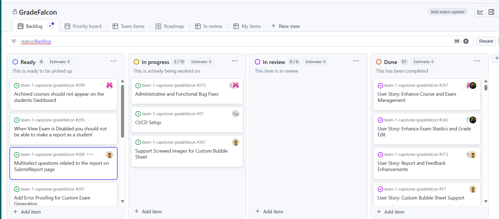
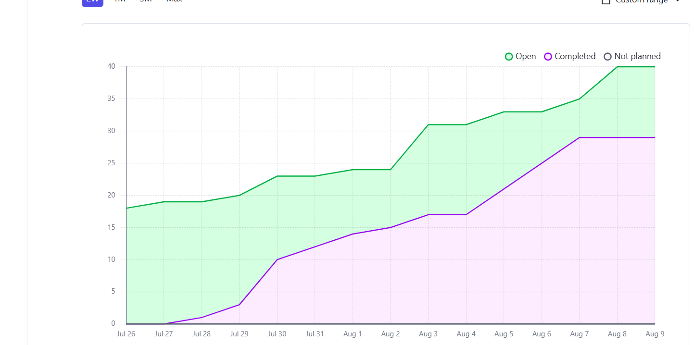
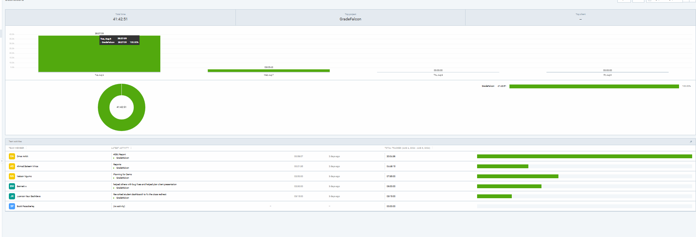
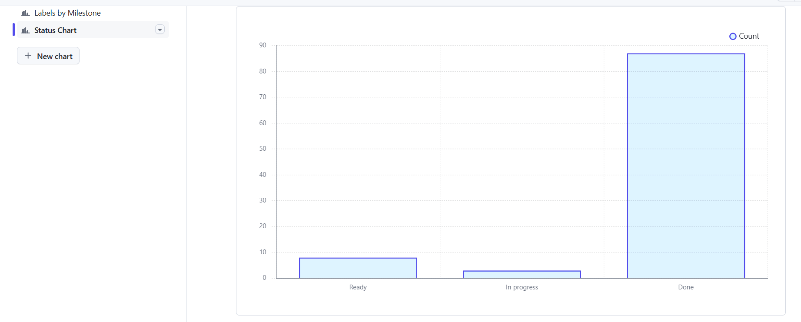

# Weekly Team Log

## Date Range:

- August 7nd - August 9th

## Features in the Project Plan Cycle:

- Grade Report Feature
- Final Presentation
- Individual Report
- Bug fixes

## Associated Tasks from Project Board:

### Alternatively, include image of the project board with tasks and status:

## Backlog

### Alternatively, include image of the project board with tasks and status:

## Burn Up Chart

## Times for Team/Individual:

| Team Member | Logged Hours |
| ----------- | ------------ |
| Omar Ankit      | 20     |
| Jusnoor Kaur      | 3    |
| Ahmad Mirza      | 5    |
| Nelson Ngumo      | 7    |
| Bennett Witt     | 6    |

## Time

## Status Chart

## Test Report / Testing Status:

- ![docs/weekly logs/Tests/[Tests]](../Tests/BackendTestJul17.jpg)
- ![docs/weekly logs/Tests/[Tests]](../Tests/FrontendTestJul17.jpg)

### Cycle Goal Review (Reflection: what went well, what was done, what didn't; Retrospective: how is the process going and why?)

### Summary
We msotly completed development we are currently owrking on indivual reports and documentation.
