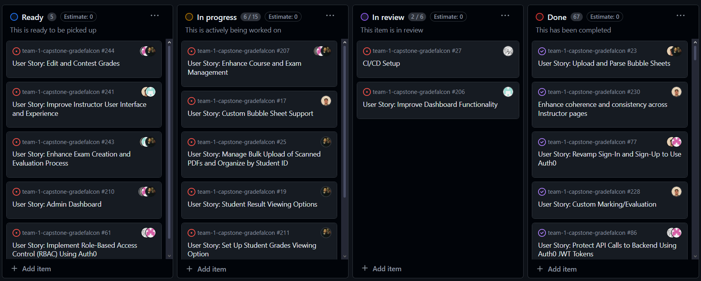

# Weekly Team Log

## Date Range:

- July 24 - July 26

## Features in the Project Plan Cycle:

- Display Graded Exams for Instructors and Review grades
- Revamp Sign-In and Sign-Up, Logout to Use Auth0
- Enhance Front End UI Using ShadCN UI Components
- Account settings feature
- Custom bubble sheet feature

## Associated Tasks from Project Board:

| Task ID | Description        | Feature   | Assigned To | Status   |
| ------- | ------------------ | --------- | ----------- | -------- |
| #190    | Display Graded Exams for Instructors and Review grades | Display Graded Exams for Instructors and Review grades | Ahmad       | In Review      |
| #181    | Grading Exams and Displaying Results on Frontend | Grading Exams and Displaying Results on Frontend | Omar       | Completed      |
| #188    | Implement Refactored Code and Implement Color-Coded Grading | Implement Refactored Code and Implement Color-Coded Grading | Omar        | Completed  |
| #195    | Configure Evaluation Settings | Configure Evaluation Settings | Omar       | Completed      |
| #17     | Custom Bubble Sheet Support                       | Custom Bubble Sheet Support                       | Omar        | In progress      |
|  #80     | Refactor UI Using shadcn UI Components                          | Refactor UI Using shadcn UI Components               | Jusnoor, Omar     | In Review|
| #61      | Implement Role-Based Access Control (RBAC) Using Auth0 | Implement Role-Based Access Control (RBAC) Using Auth0 | Bennett, Nelson | In Progress|
| #86      | Protect API Calls to Backend Using Auth0 JWT Tokens | Protect API Calls to Backend Using Auth0 JWT Tokens | Bennett, Nelson | In Progress|
| #25      | Manage Bulk Upload of Scanned PDFs and Organize by Student ID | Manage Bulk Upload of Scanned PDFs and Organize  | Ahmad | In Progress|
| #206      | Improve dashboard functionality | Improve dashboard functionality  | Jusnoor | In Progress|

### Alternatively, include image of the project board with tasks and status:

- 

## Tasks for Next Cycle:

| Task ID | Description                                             | Assigned To         |
| ------- | ------------------------------------------------------- | ------------------- |
| N/A     | User Story: Enhance Course and Exam Management          | oankit, jusnoorkaur, BennettWitt, ahmadsm1 |
| N/A     | User Story: Custom Bubble Sheet Support                 | oankit              |
| N/A     | User Story: Manage Bulk Upload of Scanned PDFs and Organize by Student ID | ahmadsm1           |
| N/A     | User Story: Student Result Viewing Options              | jusnoorkaur, ahmadsm1 |
| N/A     | User Story: Download Results                            | jusnoorkaur, ahmadsm1 |

### Alternatively, include image of the project board with tasks and status:

## Burn-up Chart (Velocity):

- ![docs/weekly logs/Burn Up Charts/[Burn Up Chart Image]](../BurnUpCharts/BurnUpChart18.png)

## Times for Team/Individual:

| Team Member | Logged Hours |
| ----------- | ------------ |
| Omar Ankit      | 28,34      |
| Jusnoor Kaur      | 19:45     |
| Ahmad Mirza      | 30:48      |
| Nelson Ngumo      | 29.05      |
| Bennett Witt     | 47.45      |

- ![docs/weekly logs/Clockify/[Time Tracking Image]](../Clockify/Time18.png)

## Completed Tasks:

| Task ID | Description        | Completed By |
| ------- | ------------------ | ------------ |
| #181    | Grading Exams and Displaying Results on Frontend | Omar & Ahmad |
| N/A    | Implemented Auth0 | Bennet & Nelson|
| #195    | Configure Evaluation Settings  | Omar  |
|         | Redesigned UI for the instructor view | Jusnoor |
| #61      | Implement Role-Based Access Control (RBAC) Using Auth0 | 8 | Bennett, Nelson |
| #190    | Display Graded Exams for Instructors and Review grades | 10 | Ahmad |

## In Progress Tasks/ To do:

| Task ID | Description                                             | Assigned To                   |
| ------- | ------------------------------------------------------- | ----------------------------- |
| N/A     | Account settings with testing                           | YRG-StrawHat, BennettWitt     |
| #17     | Custom Bubble Sheet Support                             | ahmadsm1, BennettWitt, oankit, YRG-StrawHat |
| N/A     | Integrating grade exam pipeline with review grades feature | ahmadsm1                 |
| N/A     | Student dashboard                                        | jusnoorkaur, oankit           |
| N/A     | User Story: Edit and Contest Grades                     | YRG-StrawHat, BennettWitt, ahmadsm1 |
| N/A     | User Story: Improve Instructor User Interface and Experience | jusnoorkaur, oankit, ahmadsm1 |
| N/A     | User Story: Enhance Exam Creation and Evaluation Process   | YRG-StrawHat, oankit, BennettWitt, ahmadsm1 |
| N/A     | User Story: Admin Dashboard                             | YRG-StrawHat, BennettWitt     |

## Test Report / Testing Status:

- ![docs/weekly logs/Tests/[Tests]](../Tests/BackendTestJul17.jpg)
- ![docs/weekly logs/Tests/[Tests]](../Tests/FrontendTestJul17.jpg)

### Cycle Goal Review (Reflection: what went well, what was done, what didn't; Retrospective: how is the process going and why?)

### Summary
This cycle saw significant progress across the team despite personal and academic challenges. Jusnoor completed the enhancement of the front end UI using ShadCN, optimized the user interface and usability, enhanced navigation and consistency, and improved dashboard functionality. Jusnoor also made strides in revamping the student dashboard and working on the five-point summary analysis for instructors. Bennett and Nelson successfully integrated Auth0 with the backend, refactoring API calls to ensure proper user authorization and permission checks. They also worked on storing user metadata on tokens and reading these tokens securely. Omar focused on refactoring the instructor pages using ShadCN, improving UI coherence and consistency, and completing the custom marking/evaluation feature. Ahmad added support for both 100 and 200 MCQ templates, integrated changes with the new UI, and ensured the bulk upload of files, while continuing to work on displaying results on the student view. The collective efforts have significantly strengthened the project’s foundation, with improved UI components, enhanced security through Auth0, and new functionalities being implemented and tested. Moving forward, the team aims to complete the remaining tasks, improve communication and collaboration, and ensure comprehensive test coverage.
