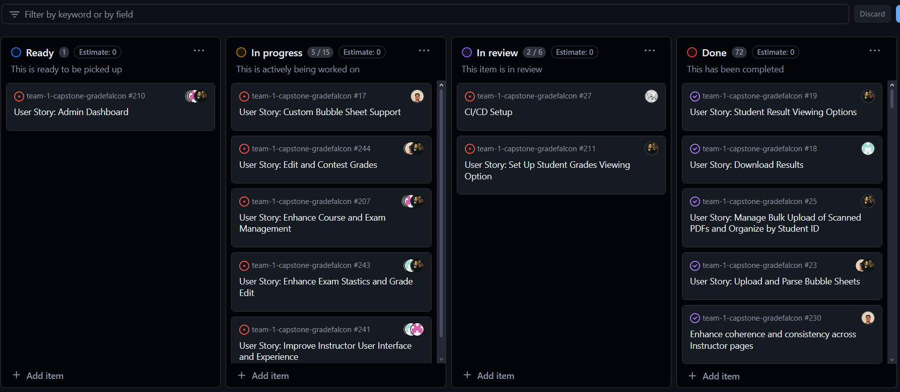

# Weekly Team Log

## Date Range:

- July 31 - August 2

## Features in the Project Plan Cycle:

- Account settings feature
- Custom bubble sheet feature
- Enhance Front End UI Using ShadCN UI Components
- Implement Role-Based Access Control (RBAC) Using Auth0
- Protect API Calls to Backend Using Auth0 JWT Tokens

## Associated Tasks from Project Board:

| Task ID | Description                                             | Feature                                | Assigned To         | Status      |
| ------- | ------------------------------------------------------- | -------------------------------------- | ------------------- | ----------- |
| #190    | Display Graded Exams for Instructors and Review grades  | Display Graded Exams for Instructors   | Ahmad               | In Review   |
| #181    | Grading Exams and Displaying Results on Frontend        | Grading Exams and Displaying Results   | Omar                | Completed   |
| #188    | Implement Refactored Code and Implement Color-Coded Grading | Implement Refactored Code and Grading  | Omar                | Completed   |
| #195    | Configure Evaluation Settings                           | Configure Evaluation Settings          | Omar                | Completed   |
| #17     | Custom Bubble Sheet Support                             | Custom Bubble Sheet Support            | Omar                | In Progress |
| #80     | Refactor UI Using ShadCN UI Components                  | Refactor UI Using ShadCN UI Components | Jusnoor, Omar       | In Review   |
| #61     | Implement Role-Based Access Control (RBAC) Using Auth0  | Implement RBAC Using Auth0             | Bennett, Nelson     | In Progress |
| #86     | Protect API Calls to Backend Using Auth0 JWT Tokens     | Protect API Calls Using Auth0 Tokens   | Bennett, Nelson     | Complete |
| #25     | Manage Bulk Upload of Scanned PDFs and Organize by Student ID | Manage Bulk Upload and Organize  | Ahmad               | In Progress |
| #206    | Improve dashboard functionality                         | Improve Dashboard Functionality        | Jusnoor             | In Progress |
| #NA    | Student Make Report on Exam and Instructors Change grade or reply | Improve Dashboard Functionality |Nelson             | In Progress |

### Alternatively, include image of the project board with tasks and status:

- 

## Tasks for Next Cycle:

| Task ID | Description                                             | Assigned To         |
| ------- | ------------------------------------------------------- | ------------------- |
| N/A     | User Story: Enhance Course and Exam Management          | oankit, jusnoorkaur, BennettWitt, ahmadsm1 |
| N/A     | User Story: Custom Bubble Sheet Support                 | oankit              |
| N/A     | User Story: Manage Bulk Upload of Scanned PDFs and Organize by Student ID | ahmadsm1           |
| N/A     | User Story: Student Result Viewing Options              | jusnoorkaur, ahmadsm1 |
| N/A     | User Story: Download Results                            | jusnoorkaur, ahmadsm1 |

### Alternatively, include image of the project board with tasks and status:

## Burn-up Chart (Velocity):

- ![docs/weekly logs/Burn Up Charts/[Burn Up Chart Image]](../BurnUpCharts/BurnUpCharts19.png)

## Times for Team/Individual:

| Team Member    | Logged Hours |
| -------------- | ------------ |
| Omar Ankit     | 51:05:53      |
| Jusnoor Kaur   | 32:40:00       |
| Ahmad Mirza    | 48:30:59      |
| Nelson Ngumo   | 47:05:00   |
| Bennett Witt   | 65:15:00     |

- ![docs/weekly logs/Clockify/[Time Tracking Image]](../Clockify/Time18.png)

## Completed Tasks:

| Task ID | Description                                 | Completed By   |
| ------- | ------------------------------------------- | -------------- |
| #181    | Grading Exams and Displaying Results        | Omar & Ahmad   |
| N/A     | Implemented Auth0                           | Bennett & Nelson|
| #195    | Configure Evaluation Settings               | Omar           |
|         | Redesigned UI for the instructor view       | Jusnoor        |
| #61     | Implement Role-Based Access Control (RBAC)  | Bennett, Nelson|
| #190    | Display Graded Exams for Instructors        | Ahmad          |
| NA      | Account Settings                              | Nelson         |

## In Progress Tasks/ To do:

| Task ID | Description                                   | Assigned To                   |
| ------- | --------------------------------------------- | ----------------------------- |
| N/A     | Account settings with testing                 | YRG-StrawHat, BennettWitt     |
| #17     | Custom Bubble Sheet Support                   | ahmadsm1, BennettWitt, oankit, YRG-StrawHat |
| N/A     | Integrating grade exam pipeline with review grades feature | ahmadsm1                 |
| N/A     | Student dashboard                            | jusnoorkaur, oankit           |
| N/A     | User Story: Edit and Contest Grades           | YRG-StrawHat, BennettWitt, ahmadsm1 |
| N/A     | User Story: Improve Instructor User Interface | jusnoorkaur, oankit, ahmadsm1 |
| N/A     | User Story: Enhance Exam Creation and Evaluation Process | YRG-StrawHat, oankit, BennettWitt, ahmadsm1 |
| N/A     | User Story: Admin Dashboard                   | YRG-StrawHat, BennettWitt     |

## Test Report / Testing Status:

- ![docs/weekly logs/Tests/[Tests]](../Tests/BackendTestJul17.jpg)
- ![docs/weekly logs/Tests/[Tests]](../Tests/FrontendTestJul17.jpg)

### Cycle Goal Review (Reflection: what went well, what was done, what didn't; Retrospective: how is the process going and why?)

### Summary
This cycle saw significant progress across the team despite personal and academic challenges.

#### Ahmad:
- **Tasks Completed**:
  - Ensuring bulk upload of files
  - Setting up viewing options for instructors
  - Displaying results on student view

- **Reflection**:
  - Successfully managed the bulk upload of exams, ensuring they are stored locally and are easily retrievable. Faced a challenge with a bug related to file copying but resolved it. Focused on fixing merge conflicts and improving PRs.

- **Next Cycle Goals**:
  - Displaying and changing results as an instructor after they've been saved and maintaining a changelog of what result was changed and why.

#### Bennett:
- **Tasks Completed**:
  - Archive and delete courses and exams
  - Restricting access to pages based on user roles (In Progress)

- **Reflection**:
  - Completed and merged the archive/delete courses and exams feature. Now focusing on restricting access to pages based on roles to enhance security.

- **Next Cycle Goals**:
  - Finish restricting access to pages based on roles, address any bugs or changes based on feedback from the upcoming testing presentation, and review feature testing.

#### Jusnoor:
- **Tasks Completed**:
  - Download results
  - Improve dashboard functionality
  - Revamp student dashboard UI
  - 5-point summary analysis for the instructor

- **Reflection**:
  - Completed several key tasks, including improving the instructor dashboard and adding the ability to download results as a CSV file. The revamped student view offers a consistent look and better displays courses and exams for students.

- **Next Cycle Goals**:
  - Continue enhancing course and exam management, exam statistics and grade editing, and instructor UI improvements.

#### Omar:
- **Tasks Completed**:
  - Refactor NewExam page to support custom bubble sheets
  - Implement custom templates in the exam creation pipeline
  - UI improvements for Report pages

- **Reflection**:
  - Made significant improvements to the frontend, particularly with the integration of custom bubble sheets and the new Report pages. Faced challenges with backend logic but made good progress.

- **Next Cycle Goals**:
  - Finalize custom bubble sheets integration, implement detailed question statistics, and continue refining the frontend for usability.

#### Nelson:
- **Tasks Completed**:
  - Writing account settings
  - Storing user metadata on token and reading token
  - Students make report on Exam, Instructor Reviews Report (In Progress)
  - CheckRole from token using Protected Route for increased RBAC (In Progress)

- **Reflection**:
  - Focused on completing the account settings feature, integrating student reporting, and enhancing RBAC using Auth0. Despite being extremely busy and sleep-deprived, progress was made in securing and streamlining the user experience.

- **Next Cycle Goals**:
  - Merge and refine RBAC implementations, enhance test coverage, and implement logging for grade changes, including displaying instructor comments on the student side.

Moving forward, the team aims to complete the remaining tasks, improve communication and collaboration, and ensure comprehensive test coverage.
