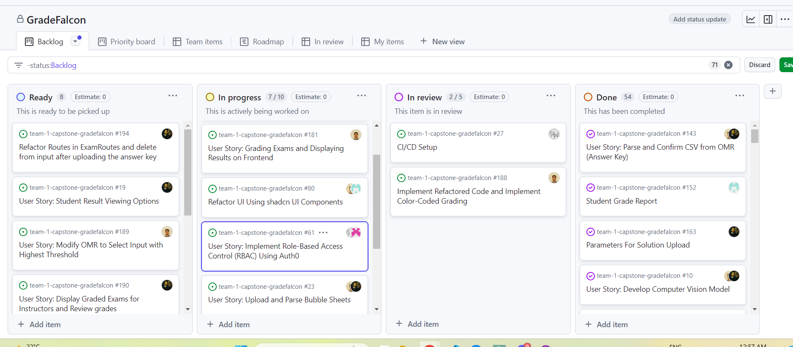
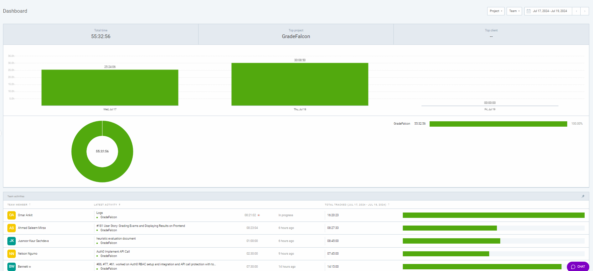

# Weekly Team Log

# Add new logs here

## Date Range:

- July 17 - July 19

## Features in the Project Plan Cycle:

- Implement Refactored Code and Implement Color-Coded Grading
- Revamp Sign-In and Sign-Up, Logout to Use Auth0
- Enhance Front End UI Using Shadcn UI Components
- Student Grade Report with Testing
- AWS File Upload Integration

## Associated Tasks from Project Board:

| Task ID | Description                                       | Feature                                           | Assigned To | Status     |
| ------- | ------------------------------------------------- | ------------------------------------------------- | ----------- | ---------- |
| #181    | Display Graded Exams for Instructors and Review grades | Display Graded Exams for Instructors and Review grades | Ahmad       | In Progress      |
| #17     | Custom Bubble Sheet Support                       | Custom Bubble Sheet Support                       | Omar        | To Do      |
| #77     | Revamp Sign-In and Sign-Up to Use Auth0           | Revamp Sign-In and Sign-Up, Logout to Use Auth0   | Omar, Bennett | In Progress|
| #188    | Implement Refactored Code and Implement Color-Coded Grading | Implement Refactored Code and Implement Color-Coded Grading | Omar        | In Review  |
| #4      | Implement Role-Based Access Control (RBAC) Using Auth0 | Implement Role-Based Access Control (RBAC) Using Auth0 | Bennett, Nelson | In Progress|
| #5      | Protect API Calls to Backend Using Auth0 JWT Tokens | Protect API Calls to Backend Using Auth0 JWT Tokens | Bennett, Nelson | In Progress|
| #6      | Store Exam Files in AWS and Send Files from Backend to AWS | AWS File Upload Integration                       | Nelson      | Done  |
|  #80     | Refactor UI Using shadcn UI Components                          | Refactor UI Using shadcn UI Components               | Jusnoor, Omar     | In Progress|
| #7      | Student Grade Report                              | Student Grade Report with Testing                 | Jusnoor     | Done       |
| #8      | Parameters For Solution Upload                    | Parameters For Solution Upload               | Ahmad       | Done       |
| #9      | Upload and Parse Bubble Sheets                    | Upload and Parse Bubble Sheets                    | Omar, Bennett | In Progress|
|  #197     | Debugging graphs logic - Instructor Dashboard                            | Display Graphs on Dashboard               | Jusnoor     | Done|

### Alternatively, include image of the project board with tasks and status:

- 

## Tasks for Next Cycle:

| Task ID | Description                                       | Estimated Time (hrs) | Assigned To |
| ------- | ------------------------------------------------- | -------------------- | ----------- |
| #181    | Finalize: Grading Exams and Displaying Results on Frontend | 3                    | Omar        |
| #189    | Custom Bubble Sheet Support | 20                   | Omar        |
| #80     | Refactor additional pages using shadcn UI Components | 15                    | Omar, Jusnoor        |
| #4      |  Auth0 RBAC integration for all API calls | 18                   | Bennett, Nelson     |
| #5      | Implement proper directory naming convention for AWS file upload | 15                     | Ahmad       |

### Alternatively, include image of the project board with tasks and status:

## Burn-up Chart (Velocity):

- ![docs/weekly logs/Burn Up Charts/[Burn Up Chart Image]](../BurnUpCharts/BurnUpCharts15.png)

## Times for Team/Individual:

- Clockify report

## Completed Tasks:

| Task ID | Description                                       | Completed By |
| ------- | ------------------------------------------------- | ------------ |
| #143    | Parse and Confirm CSV from OMR                    | Omar, Ahmed     
| #143    | Parse and Confirm CSV from OMR                    | Omar, Ahmed         |
| #161    | Integrate Flask Service to Trigger OMR Processing on File Upload | Omar, Ahmed         |
| #1      | Using OMR to scan uploaded solution key           | Ahmad        |
| #2      | Allowing the teacher to confirm the solution      | Ahmad        |
| #3      | Saving answers to database                        | Ahmad        |
| #6      | More implementation of AWS File Upload plus tests | Nelson       |
| #7      | Integrating Ahmad's Flask/OMR code to AWS code    | Nelson       |
| #8      | Student Grade Report                              | Jusnoor      |

## In Progress Tasks/ To do:

| Task ID | Description                                       | Assigned To |
| ------- | ------------------------------------------------- | ----------- |
|  #197    | Debugging Graph Logic                            | Jusnoor      |
| #80     | Refactor UI Using shadcn UI Components            | Omar        |
| #17     | Custom Bubble Sheet Support                       | Omar        |
| #77     | Revamp Sign-In and Sign-Up to Use Auth0           | Omar, Bennett |
| #188    | Implement Refactored Code and Implement Color-Coded Grading | Omar        |
| #4      | Implementing Auth0 to connect to DB and API calls | Nelson      |
| #5      | Writing Account settings plus test                | Nelson      |
| #8      | Completing the front end UI using Shadcn          | Jusnoor     |
| #9      | Upload and Parse Bubble Sheets                    | Omar, Bennett |
| #10     | Protect API Calls to Backend Using Auth0 JWT Tokens | Bennett, Nelson |

## Test Report / Testing Status:

- ![docs/weekly logs/Tests/[Tests]](../Tests/BackendTestJul17.jpg)
- ![docs/weekly logs/Tests/[Tests]](../Tests/FrontendTestJul17.jpg)

## Overview:

The team focused on integrating key features and enhancing the user interface. Ahmad worked on integrating changes into the development branch and grading exams with the OMR. Bennett and Nelson concentrated on implementing and refining RBAC with Auth0,. Jusnoor and Omar focused on enhancing the front-end UI and improving data visualization and grading logic. The Kanban Board has been populated with user stories and tasks and the dashboard visuals creation has been completed. The next cycle will focus on finalizing grading exams and displaying results, implementing custom bubble sheet support, further refactoring UI using shadcn components, completing Auth0 RBAC integration, and sotring images to matching students folder in AWS.