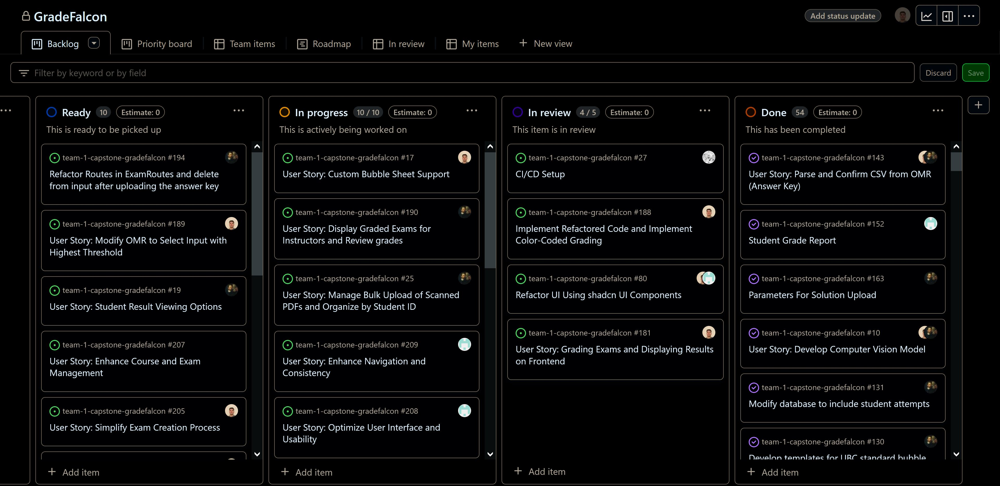

# Weekly Team Log

## Date Range:

- July 19 - July 24

## Features in the Project Plan Cycle:

- Display Graded Exams for Instructors and Review grades
- Revamp Sign-In and Sign-Up, Logout to Use Auth0
- Enhance Front End UI Using ShadCN UI Components
- Account settings feature

## Associated Tasks from Project Board:

| Task ID | Description        | Feature   | Assigned To | Status   |
| ------- | ------------------ | --------- | ----------- | -------- |
| #190    | Display Graded Exams for Instructors and Review grades | Display Graded Exams for Instructors and Review grades | Ahmad       | In Review      |
| #181    | Grading Exams and Displaying Results on Frontend | Grading Exams and Displaying Results on Frontend | Omar       | In Review      |
| #188    | Implement Refactored Code and Implement Color-Coded Grading | Implement Refactored Code and Implement Color-Coded Grading | Omar        | Completed  |
| #17     | Custom Bubble Sheet Support                       | Custom Bubble Sheet Support                       | Omar        | In progress      |
|  #80     | Refactor UI Using shadcn UI Components                          | Refactor UI Using shadcn UI Components               | Jusnoor, Omar     | In Review|
| #61      | Implement Role-Based Access Control (RBAC) Using Auth0 | Implement Role-Based Access Control (RBAC) Using Auth0 | Bennett, Nelson | In Progress|
| #86      | Protect API Calls to Backend Using Auth0 JWT Tokens | Protect API Calls to Backend Using Auth0 JWT Tokens | Bennett, Nelson | In Progress|
| #25      | Manage Bulk Upload of Scanned PDFs and Organize by Student ID | Manage Bulk Upload of Scanned PDFs and Organize  | Ahmad | In Progress|
| #194      | Refactor Routes in ExamRoutes and delete from input after uploading the answer key | Refactor Routes in ExamRoutes  | Ahmad | In Progress|

### Alternatively, include image of the project board with tasks and status:

- 

## Tasks for Next Cycle:

| Task ID | Description        | Estimated Time (hrs) | Assigned To |
| ------- | ------------------ | -------------------- | ----------- |
|  #80     | Refactor UI Using shadcn UI Components                          | 20               | Jusnoor, Omar     | In Review|
| #17     | Custom Bubble Sheet Support                       | 25                      | Omar        | In progress      |
| #181    | Grading Exams and Displaying Results on Frontend | Grading Exams and Displaying Results on Frontend | Omar       
| #61      | Implement Role-Based Access Control (RBAC) Using Auth0 | Implement Role-Based Access Control (RBAC) Using Auth0 | Bennett, Nelson

### Alternatively, include image of the project board with tasks and status:

## Burn-up Chart (Velocity):

- ![docs/weekly logs/Burn Up Charts/[Burn Up Chart Image]](../BurnUpCharts/BurnUpChart16.png)

## Times for Team/Individual:

| Team Member | Logged Hours |
| ----------- | ------------ |
| Omar Ankit      | 12      |
| Jusnoor Kaur      | 17:37      |
| Ahmad Mirza      | 13:30     |
| Nelson Ngumo      | 12:30      |
| Bennett Witt     | 24:45      |

- ![docs/weekly logs/Clockify/[Time Tracking Image]](../Clockify/Time16.png)

## Completed Tasks:

| Task ID | Description        | Completed By |
| ------- | ------------------ | ------------ |
| #181    | Display Graded Exams for Instructors and Review grades | Ahmad 
| #188    | Implement Refactored Code and Implement Color-Coded Grading | Omar |
| N/A    | Creating Admin users for group members | Nelson |

## In Progress Tasks/ To do:

| Task ID | Description        | Assigned To |
| ------- | ------------------ | ----------- |
| #211   | User Story: Set Up Student Grades Viewing Option | Jusnoor  |
| #209   | User Story: Enhance Navigation and Consistency  | Jusnoor  |
| #206   | User Story: Improve Dashboard Functionality   | Jusnoor  |
| N/A   | Implementing Auth0 to connect to DB and API calls   | Nelson  |
| N/A   | Account settings with testing   | Nelson  |
| #181    | Grading Exams and Displaying Results on Frontend |  Omar      |
| #61      | Implement Role-Based Access Control (RBAC) Using Auth0 | Bennett, Nelson 
| #25      | Manage Bulk Upload of Scanned PDFs and Organize by Student ID | Ahmad
| N/A      | Integrating grade exam pipeline with review grades feature | Ahmad

## Test Report / Testing Status:

- ![docs/weekly logs/Tests/[Tests]](../Tests/BackendTestJul17.jpg)
- ![docs/weekly logs/Tests/[Tests]](../Tests/FrontendTestJul17.jpg)

## Overview:

The team focused on the grading process with the OMR, redesigning the website with shadCN to make it the frontend more appealing and implementing role based authentication with Auth0.

For the OMR, once it marks the exams, the results can be viewed in a table where the instructor can edit them. The instructor can also click on to view a specific exam, which shows how it was graded. Our OMR successfully color grading the correct and incorrect answers on the students exam, and this is visible on the image displayed.

For RBAC and Auth0, there is now a custom api linking the frontend and backend, and will soon be working for all api calls. We have also been redesigning some part of our UI after the comments received from the peer testing seminar. This also includes rewriting tests, as shadCN is structured a bit differently.

The Kanban Board has been populated with user stories and tasks, milestones have been added, and the dashboard visuals creation has been completed. The next cycle will focus on continuing to refactor our frontend components, ensuring all api calls function with Auth0, and verifying that the grade exam process is functioning correctly so that the student can view their grades on the student view.
