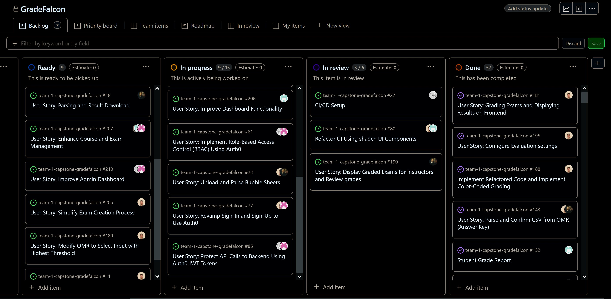

# Weekly Team Log

## Date Range:

- July 24 - July 26

## Features in the Project Plan Cycle:

- Display Graded Exams for Instructors and Review grades
- Revamp Sign-In and Sign-Up, Logout to Use Auth0
- Enhance Front End UI Using ShadCN UI Components
- Account settings feature
- Custom bubble sheet feature

## Associated Tasks from Project Board:

| Task ID | Description        | Feature   | Assigned To | Status   |
| ------- | ------------------ | --------- | ----------- | -------- |
| #190    | Display Graded Exams for Instructors and Review grades | Display Graded Exams for Instructors and Review grades | Ahmad       | In Review      |
| #181    | Grading Exams and Displaying Results on Frontend | Grading Exams and Displaying Results on Frontend | Omar       | Completed      |
| #188    | Implement Refactored Code and Implement Color-Coded Grading | Implement Refactored Code and Implement Color-Coded Grading | Omar        | Completed  |
| #195    | Configure Evaluation Settings | Configure Evaluation Settings | Omar       | Completed      |
| #17     | Custom Bubble Sheet Support                       | Custom Bubble Sheet Support                       | Omar        | In progress      |
|  #80     | Refactor UI Using shadcn UI Components                          | Refactor UI Using shadcn UI Components               | Jusnoor, Omar     | In Review|
| #61      | Implement Role-Based Access Control (RBAC) Using Auth0 | Implement Role-Based Access Control (RBAC) Using Auth0 | Bennett, Nelson | In Progress|
| #86      | Protect API Calls to Backend Using Auth0 JWT Tokens | Protect API Calls to Backend Using Auth0 JWT Tokens | Bennett, Nelson | In Progress|
| #25      | Manage Bulk Upload of Scanned PDFs and Organize by Student ID | Manage Bulk Upload of Scanned PDFs and Organize  | Ahmad | In Progress|
| #206      | Improve dashboard functionality | Improve dashboard functionality  | Jusnoor | In Progress|

### Alternatively, include image of the project board with tasks and status:

- 

## Tasks for Next Cycle:

| Task ID | Description        | Estimated Time (hrs) | Assigned To |
| ------- | ------------------ | -------------------- | ----------- |
|  #80     | Refactor UI Using shadcn UI Components                          | 15               | Jusnoor, Omar     | In Review|
| #171     | Custom Bubble Sheet Support                       | 20                      | Omar        | In progress      |
| #190    | Display Graded Exams for Instructors and Review grades | 10 | Ahmad       
| #61      | Implement Role-Based Access Control (RBAC) Using Auth0 | 8 | Bennett, Nelson

### Alternatively, include image of the project board with tasks and status:

## Burn-up Chart (Velocity):

- ![docs/weekly logs/Burn Up Charts/[Burn Up Chart Image]](../BurnUpCharts/BurnUpChart17.png)

## Times for Team/Individual:

| Team Member | Logged Hours |
| ----------- | ------------ |
| Omar Ankit      | 10:46      |
| Jusnoor Kaur      | 9:15      |
| Ahmad Mirza      | 12:24     |
| Nelson Ngumo      | 8:15      |
| Bennett Witt     | 11:45      |

- ![docs/weekly logs/Clockify/[Time Tracking Image]](../Clockify/Time17.png)

## Completed Tasks:

| Task ID | Description        | Completed By |
| ------- | ------------------ | ------------ |
| #181    | Grading Exams and Displaying Results on Frontend | Omar       |
| N/A    | Creating Admin users for group members | Nelson |
| #195    | Configure Evaluation Settings  | Omar       |

## In Progress Tasks/ To do:

| Task ID | Description        | Assigned To |
| ------- | ------------------ | ----------- |
| #211   | User Story: Set Up Student Grades Viewing Option | Jusnoor  |
| #209   | User Story: Enhance Navigation and Consistency  | Jusnoor  |
| #206   | User Story: Improve Dashboard Functionality   | Jusnoor  |
| N/A   | Implementing Auth0 to connect to DB and API calls   | Nelson  |
| N/A   | Account settings with testing   | Nelson  |
| #17     | Custom Bubble Sheet Support                       |  Omar        |
| #61      | Implement Role-Based Access Control (RBAC) Using Auth0 | Bennett, Nelson 
| #25      | Manage Bulk Upload of Scanned PDFs and Organize by Student ID | Ahmad
| N/A      | Integrating grade exam pipeline with review grades feature | Ahmad
| N/A      | Student dashboard | Jusnoor

## Test Report / Testing Status:

- ![docs/weekly logs/Tests/[Tests]](../Tests/BackendTestJul17.jpg)
- ![docs/weekly logs/Tests/[Tests]](../Tests/FrontendTestJul17.jpg)

## Overview:

The team focused on the grading process with the OMR, redesigning the website with shadCN to make it the frontend more appealing and implementing role based authentication with Auth0.

For the grading portion the OMR, we have managed to resolve all merge conflicts across different branches to effectively complete the entire exam grading process. However, as per the email from Dr. Fazackerley, we realized there were requirements that we were missing, such as having support for the existing UBC 100 and 200 MCQ templates. Therefore, we have begun and almost finished adding support for that. The only thing pending in this regard is that there are 2 pages (one for id and the other for questions) per each student's exam, therefore we need to make sure we properly keep track of each pair.  

As far as redesigning our UI goes, most of the pages for the instructor are completed and we also beautified other intermediary pages, such as  the 'loading' page. Alongside this, we continue to amend our previous tests to work with the ShadCN and Tailwind framework.

For RBAC and Auth0, we have verified user permissions to enable/restrict access to pages and are continuing to ensure all api calls are functioning as intended. 

The Kanban Board has been populated with user stories and tasks, milestones have been added, and the dashboard visuals creation has been completed. The next cycle will focus on continuing to refactor our frontend components, ensuring all api calls function with Auth0, finishing the bulk upload of exams, creating custom bubble sheet support, marking error reporting system and displaying exams to their respective students.
