# Personal Log
Ahmad Saleem Mirza

## Wednesday (July 26 - 31)

### Timesheet
Clockify report
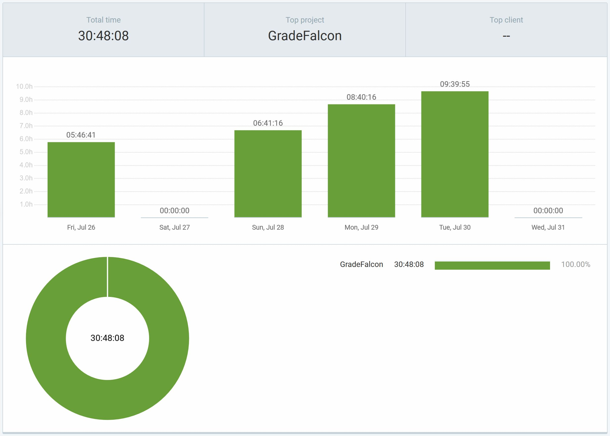

### Current Tasks (Provide sufficient detail)
  * #1: Adding support for both 100 and 200mcq template
  * #2: Integrating changes with new UI
  * #3: Ensuring bulk upload of files
  * #4: Displaying results on student view

### Progress Update
<table>
    <tr>
        <td><strong>TASK/ISSUE #</strong>
        </td>
        <td><strong>STATUS</strong>
        </td>
    </tr>
    <tr>
        <!-- Task/Issue # -->
        <td>Adding support for both 100 and 200mcq template
        </td>
        <!-- Status -->
        <td>Completed
        </td>
    </tr>
    <tr>
        <!-- Task/Issue # -->
        <td>Integrating changes with new UI
        </td>
        <!-- Status -->
        <td>Completed
        </td>
    </tr>  
    <tr>
        <!-- Task/Issue # -->
        <td>Ensuring bulk upload of files
        </td>
        <!-- Status -->
        <td>In progress
        </td>
    </tr>  
    <tr>
        <!-- Task/Issue # -->
        <td>Displaying results on student view
        </td>
        <!-- Status -->
        <td>In progress
        </td>
    </tr>  
</table>

### Cycle Goal Review (Reflection: what went well, what was done, what didn't; Retrospective: how is the process going and why?)

I have successfully finished the uploading and grading of exam files for 100mcq and 200mcq templates. The challenge was ensuring that whilst this major feature was completed, it did not impact the older code I had written. In several files I had to go back and change what I previously wrote to make it work with the newer changes. As for the feature itself, I had to ensure that I was following convention and storing the files in the Docker container in a proper manner and then accessing them appropriately. As our OMR scanner is ran multiple times, I also had to make sure it was cleared out before each run so the results of the previous run didn't interfere with newer ones. 

The main difficulty was resolving the different merge conflicts my code was having with everyone elses, particularly with the new UI we have now implemented. I had to painstakingly review intricate details in several files to debug feature breaking issues. However, I am glad I got it resolved.

Overall, I am feeling confident that we can meet all the main requirements, as well as some bonus ones, before our meeting with Dr. Lawrence.

### Next Cycle Goals (What are you going to accomplish during the next cycle)
  * Storing exams locally following the previously agreed upon storage mechanism and then retrieving the results to display them on the student's view 

## Friday (July 24 - 26)

### Timesheet
Clockify report
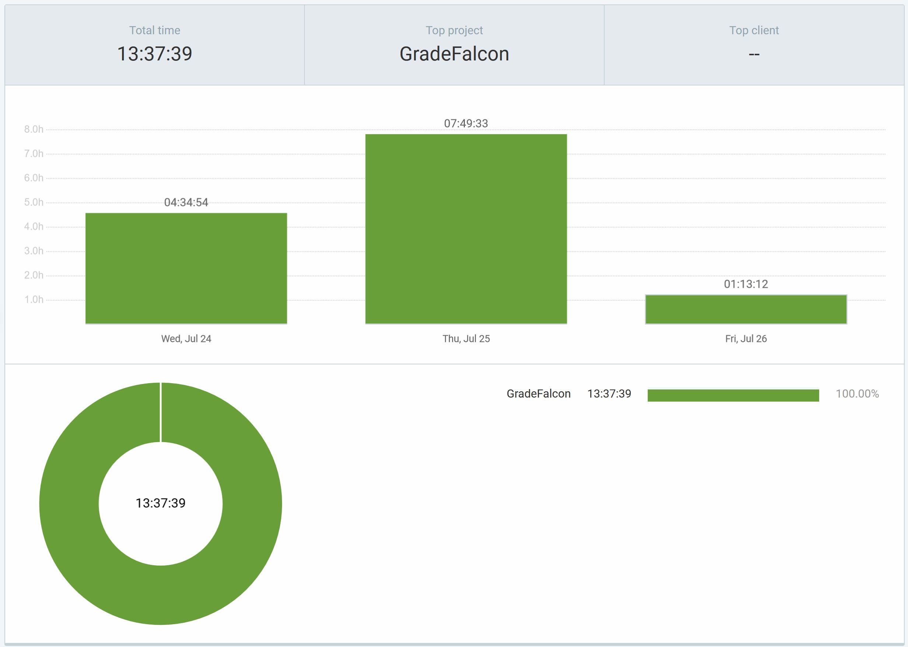

### Current Tasks (Provide sufficient detail)
  * #1: Integrating grade exam process changes
  * #2: Adding support for both 100 and 200mcq template
  * #3: Ensuring bulk upload of files

### Progress Update
<table>
    <tr>
        <td><strong>TASK/ISSUE #</strong>
        </td>
        <td><strong>STATUS</strong>
        </td>
    </tr>
    <tr>
        <!-- Task/Issue # -->
        <td>Integrating grade exam process changes
        </td>
        <!-- Status -->
        <td>Completed
        </td>
    </tr>
    <tr>
        <!-- Task/Issue # -->
        <td>Adding support for both 100 and 200mcq template
        </td>
        <!-- Status -->
        <td>In progress
        </td>
    </tr>  
    <tr>
        <!-- Task/Issue # -->
        <td>Ensuring bulk upload of files
        </td>
        <!-- Status -->
        <td>In progress
        </td>
    </tr>    
</table>

### Cycle Goal Review (Reflection: what went well, what was done, what didn't; Retrospective: how is the process going and why?)

The exam grading process is now integrated across my branch and Omar's and all conflicts are resolved. I am now working on adding support for UBC's 100mcq and 200mcq sheets and handling the bulk upload of files. What initially seemed most challenging was deciding how to split files, since the front page and back page of a single had to be scanned in a different way. However, I have now found a way to accomplish (separating the pdfs and then figuring out which front page is linked to which back page).

### Next Cycle Goals (What are you going to accomplish during the next cycle)
  * Grading the bulk of exams and then allowing students to see their result.

## Wednesday (July 19 - 24)

### Timesheet
Clockify report
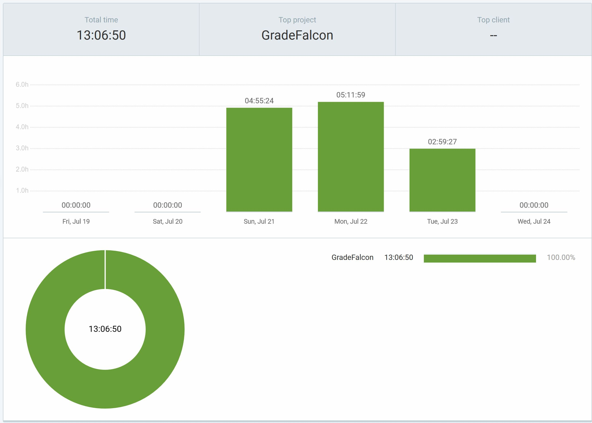

### Current Tasks (Provide sufficient detail)
  * #1: Grading and displaying results from the OMR
  * #2: Integrating grade exam process changes

### Progress Update
<table>
    <tr>
        <td><strong>TASK/ISSUE #</strong>
        </td>
        <td><strong>STATUS</strong>
        </td>
    </tr>
    <tr>
        <!-- Task/Issue # -->
        <td>Grading and displaying results from the OMR
        </td>
        <!-- Status -->
        <td>Completed
        </td>
    </tr>
    <tr>
        <!-- Task/Issue # -->
        <td>Integrating grade exam process changes
        </td>
        <!-- Status -->
        <td>In progress
        </td>
    </tr>   
</table>

### Cycle Goal Review (Reflection: what went well, what was done, what didn't; Retrospective: how is the process going and why?)

Whilst other members of the team were resolving backend api fetch call issues with the OMR, I didn't want to wait on them, so I focused on creating the review exams page that displays the scores of the students in a table, allows the instructor to search for and edit records and view the scanned pages. I did this on a sample results file in the same format that the OMR would generate, so the next step is integrate this with with the actual OMR to ensure the grade exam process is working seamlessly . I also spent a significant chunk of time toward resolving a recurring internal server error but to no avail (this has now been fixed by Omar).

### Next Cycle Goals (What are you going to accomplish during the next cycle)
  * Saving graded exam images and then enabling students to view their own exams.

## Friday (July 17 - 19)

### Timesheet
Clockify report
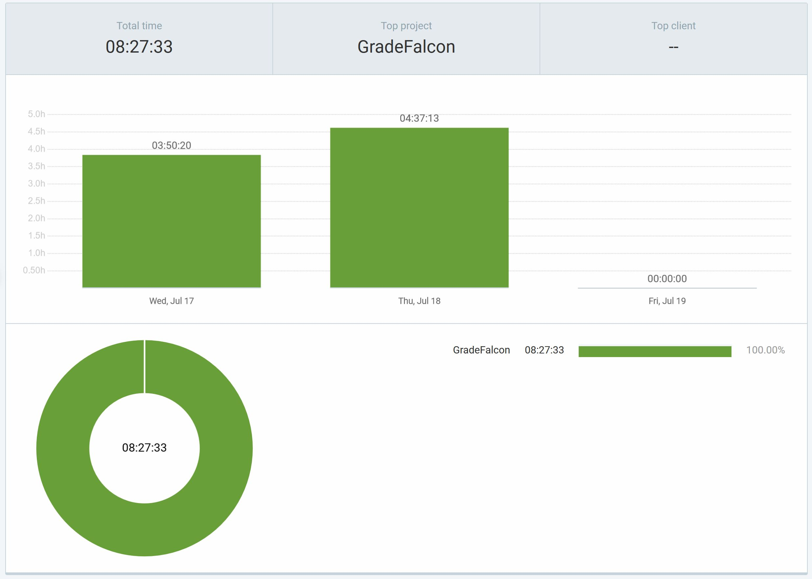

### Current Tasks (Provide sufficient detail)
  * #1: Integrating changes into dev branch
  * #2: Grading and displaying results from the OMR

### Progress Update
<table>
    <tr>
        <td><strong>TASK/ISSUE #</strong>
        </td>
        <td><strong>STATUS</strong>
        </td>
    </tr>
    <tr>
        <!-- Task/Issue # -->
        <td>Integrating changes into dev branch
        </td>
        <!-- Status -->
        <td>Completed
        </td>
    </tr>
    <tr>
        <!-- Task/Issue # -->
        <td>Grading and displaying results from the OMR
        </td>
        <!-- Status -->
        <td>In progress
        </td>
    </tr>   
</table>

### Cycle Goal Review (Reflection: what went well, what was done, what didn't; Retrospective: how is the process going and why?)

I spent quite some time integrating my functional OMR into our development branch to thoroughly ensure that it passed all tests and was working as intended. As I suspected, the concepts and code I developed here are now being re-used when we are going to grade the actual student exams themselves. Functions to upload the file to the proper storage location in AWS are already working, so currently I have switched gears to helping out with the technical intricacies of helping the backend pass data between the flask OMR. 

### Next Cycle Goals (What are you going to accomplish during the next cycle)
  * Continuing to work on the grading the assignment and then moving onto to more heavier and performance intensive files to better demonstrate real world applicability.

## Wednesday (July 12 - 17)

### Timesheet
Clockify report
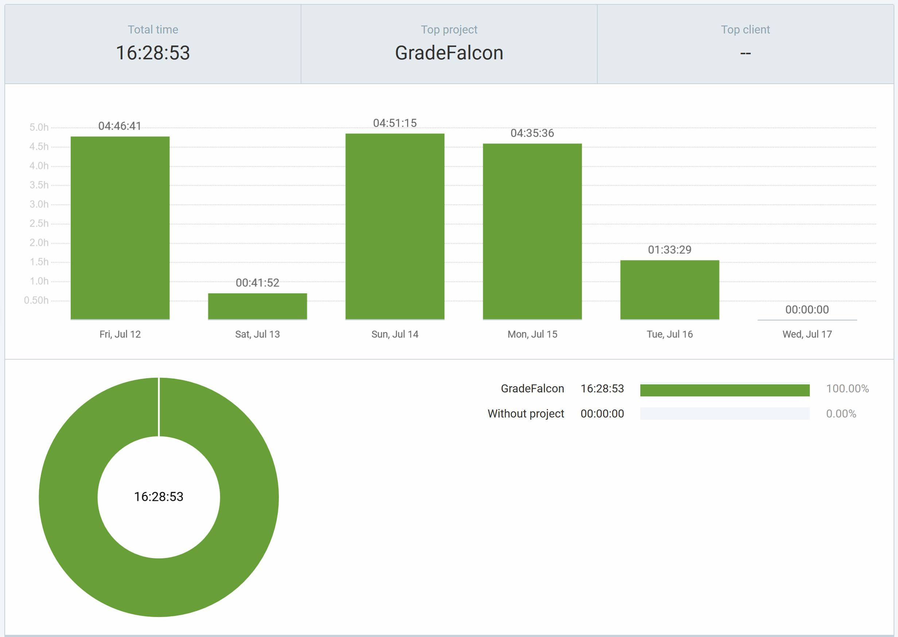

### Current Tasks (Provide sufficient detail)
  * #1: Using OMR to scan uploaded solution key
  * #2: Allowing the teacher to confirm the solution
  * #3: Saving answers to database

### Progress Update
<table>
    <tr>
        <td><strong>TASK/ISSUE #</strong>
        </td>
        <td><strong>STATUS</strong>
        </td>
    </tr>
    <tr>
        <!-- Task/Issue # -->
        <td>Calling OMR to scan uploaded solution key
        </td>
        <!-- Status -->
        <td>Completed
        </td>
    </tr>
    <tr>
        <!-- Task/Issue # -->
        <td>Testing for the OMR
        </td>
        <!-- Status -->
        <td>Completed
        </td>
    </tr>   
</table>

### Cycle Goal Review (Reflection: what went well, what was done, what didn't; Retrospective: how is the process going and why?)
I have completed testing for the entire process of teachers uploading the exam solution key and saving the selected answers to the database. The OMR itself has also already been thoroughly tested. Though last cycle I managed to solve the issue of making too many calls to the backend by making an intermediary processing page whilst the OMR scans the page, I encountered the same error, which I eventually resolved using an interrupt statement that now gives an unnoticeable gap between the different API calls. 

The concepts and code used here are similar to what we will be using later on when scanning and marking the students' answer sheets. So the remaining couple of features should be both quicker and easier to implement.
### Next Cycle Goals (What are you going to accomplish during the next cycle)
  * Implementing a proper directory naming convention for the bulk upload of files on the already existing AWS server. This will ensure that the backend knows where to store and retrieve various files to display depending on the user that is accessing them. So a student will only be able to view their own exams and not that of others, etc.

## Friday (July 10 - 12)

### Timesheet
Clockify report
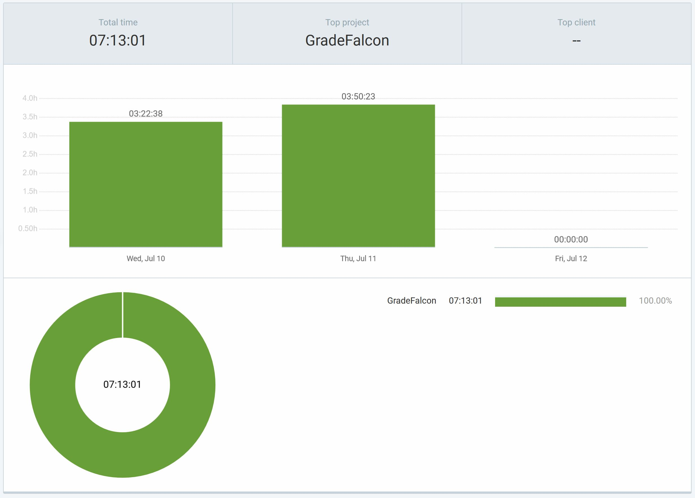

### Current Tasks (Provide sufficient detail)
  * #1: Using OMR to scan uploaded solution key
  * #2: Allowing the teacher to confirm the solution
  * #3: Saving answers to database

### Progress Update
<table>
    <tr>
        <td><strong>TASK/ISSUE #</strong>
        </td>
        <td><strong>STATUS</strong>
        </td>
    </tr>
    <tr>
        <!-- Task/Issue # -->
        <td>Calling OMR to scan uploaded solution key
        </td>
        <!-- Status -->
        <td>In progress
        </td>
    </tr>
    <tr>
        <!-- Task/Issue # -->
        <td>Allowing the teacher to confirm the solution
        </td>
        <!-- Status -->
        <td>Completed
        </td>
    </tr>   
</table>

### Cycle Goal Review (Reflection: what went well, what was done, what didn't; Retrospective: how is the process going and why?)
Instructors can now see their what options they've selected on the confirm exam key page. I spent most of my today trying to debug why calling the OMR always resulted in an Internal 500 Server Error. Many attempts at debugging revealed that it had to do with the copyfile function in NodeJS that we were calling to send the template. The solution I have reached with regards to this is to call the OMR on a separate page, since the copy file function works, but no calls made after it work. Resolving this will then allow me to begin testing of this entire process.

### Next Cycle Goals (What are you going to accomplish during the next cycle)
  * Calling the OMR to scan the uploaded key and testing the entire upload exam solution key cycle

## Wednesday (July 5 - 10)

### Timesheet
Clockify report
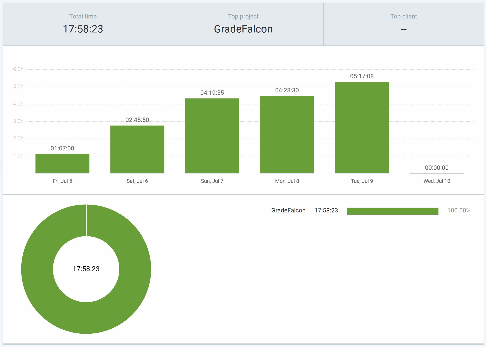

### Current Tasks (Provide sufficient detail)
  * #1: Using OMR to scan uploaded solution key
  * #2: Allowing the teacher to confirm the solution
  * #3: Saving answers to database

### Progress Update
<table>
    <tr>
        <td><strong>TASK/ISSUE #</strong>
        </td>
        <td><strong>STATUS</strong>
        </td>
    </tr>
    <tr>
        <!-- Task/Issue # -->
        <td>Calling OMR to scan uploaded solution key
        </td>
        <!-- Status -->
        <td>In progress
        </td>
    </tr>
    <tr>
        <!-- Task/Issue # -->
        <td>Allowing the teacher to confirm the solution
        </td>
        <!-- Status -->
        <td>In progress
        </td>
    </tr>
    <tr>
        <!-- Task/Issue # -->
        <td>Saving answers to database
        </td>
        <!-- Status -->
        <td>Completed
        </td>
    </tr>
    <tr>     
</table>

### Cycle Goal Review (Reflection: what went well, what was done, what didn't; Retrospective: how is the process going and why?)
Our OMR successfully scans the page and returns a csv file as a result that contains all the selected MCQ options. However, there is a still a bug causing an Internal Server Error 500 with our proxy server. Both myself and Omar have tried getting this to work but to no avail, and to that end will be consulting either Dr. Fazackerley or a TA about it. In the meanwhile, I began and have nearly finished the next part of the solution uploading pipeline. I have created a fully functional setup for reading the csv result file and using that to automatically determine both the number of questions and which answers have been selected. We then use these parameters to fill in a bubble grid which serves as visual verification for the instructor to check whether the answers are correct. The answers are subsequently saved to the database. The only thing left in this process is automatically grabbing the scanned csv file, which I am halfway through.

### Next Cycle Goals (What are you going to accomplish during the next cycle)
  * Calling the OMR to scan the uploaded key and then automatically grabbing the generated solution key csv file

## Friday (July 3 - July 5)

### Timesheet
Clockify report
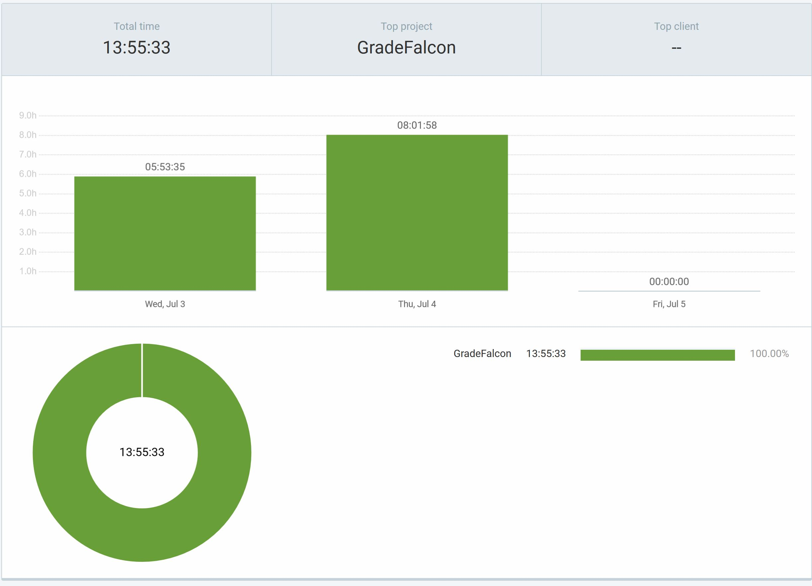

### Current Tasks (Provide sufficient detail)
  * #1: Save file in shared folder so that OMR can access it
  * #2: Start OMR when called

### Progress Update
<table>
    <tr>
        <td><strong>TASK/ISSUE #</strong>
        </td>
        <td><strong>STATUS</strong>
        </td>
    </tr>
    <tr>
        <!-- Task/Issue # -->
        <td>Save file in shared folder so that OMR can access it
        </td>
        <!-- Status -->
        <td>In progress
        </td>
    </tr>
    <tr>
        <!-- Task/Issue # -->
        <td>Start OMR when called
        </td>
        <!-- Status -->
        <td>In progress
        </td>
    </tr>
    <tr>     
</table>

### Cycle Goal Review (Reflection: what went well, what was done, what didn't; Retrospective: how is the process going and why?)
Since last cycle I have managed to save the uploaded PDF to a specific directory so it can then be used by the OMR. However, due to everything beng in Docker containers and having their own isolated file structures, though the file is accessible by both the frontend and the backend it is not accessible from the OMR container. Howver, Omar has successfully gotten the OMR to convert files from pdfs to images so the OMR does work, but it's just a matter of having it detect that the file is in fact present.

### Next Cycle Goals (What are you going to accomplish during the next cycle)
  * Save file in shared folder so that OMR can access it

## Wednesday (June 28 - July 3)

### Timesheet
Clockify report
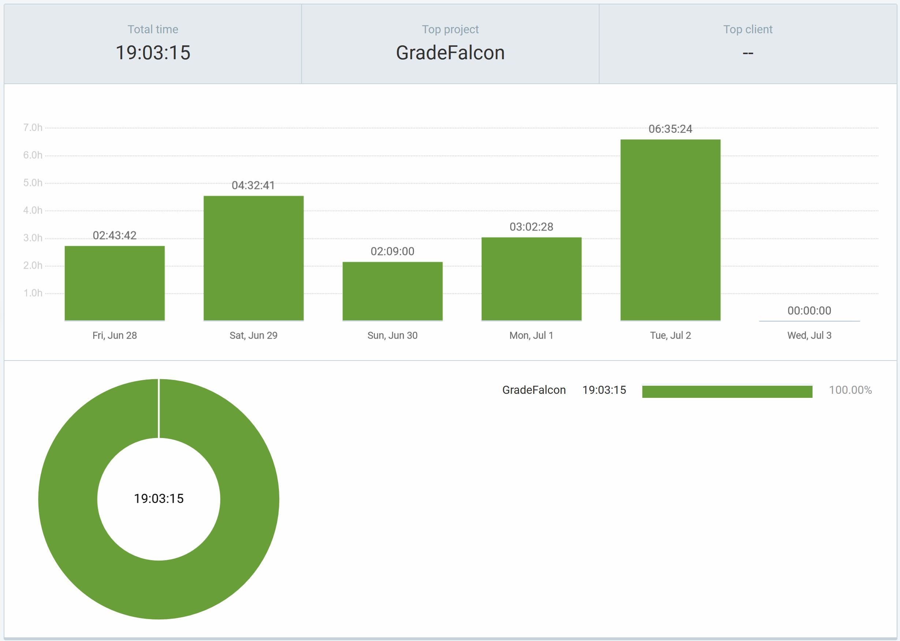

### Current Tasks (Provide sufficient detail)
  * #1: Configure OMR to scan existing templates
  * #2: Amend database to store student attempts
  * #3: Store solution key in OMR folder
  * #4: Start OMR container once file written 

### Progress Update
<table>
    <tr>
        <td><strong>TASK/ISSUE #</strong>
        </td>
        <td><strong>STATUS</strong>
        </td>
    </tr>
    <tr>
        <!-- Task/Issue # -->
        <td>Configure OMR to scan existing templates
        </td>
        <!-- Status -->
        <td>Completed
        </td>
    </tr>
    <tr>
        <!-- Task/Issue # -->
        <td>Amend database to store student attempts
        </td>
        <!-- Status -->
        <td>Completed
        </td>
    </tr>
    <tr>
        <!-- Task/Issue # -->
        <td>Store solution key in OMR folder
        </td>
        <!-- Status -->
        <td>In progress
        </td>
    </tr> 
    <tr>
        <!-- Task/Issue # -->
        <td>Start OMR container once file written 
        </td>
        <!-- Status -->
        <td>In progress
        </td>
    </tr>      
</table>

### Cycle Goal Review (Reflection: what went well, what was done, what didn't; Retrospective: how is the process going and why?)
Afetr the previous cycle, I was able to utilize Roboflow and YOLO to derive the necessary parameters to scan and parse bubble sheets. However, at this point in the project we realized it may not be needed at all: since the client requested that the feature to mark existing templates be implemented first.

To that end, I manually calculated the necessary parameters for scanning to work and made the OMR be able to scan the existing 100 and 200 MCQ sheets that are used currently in UBC. These results are formatted in a csv, which can then be easily written to the database. A challenge I am currently facing is getting the uploaded pdf file to be saved to a specific directory in the project file structure, after which it will then be scanned by the OMR. This is because of technicalities in how Express and React process files. I should have this resolved quickly and then easily be able to automatically run the OMR container and retrieve the results and write them to the database.  

### Next Cycle Goals (What are you going to accomplish during the next cycle)
  * Create solution key from filled in bubble sheet

## Friday (June 26 - 28)

### Timesheet
Clockify report
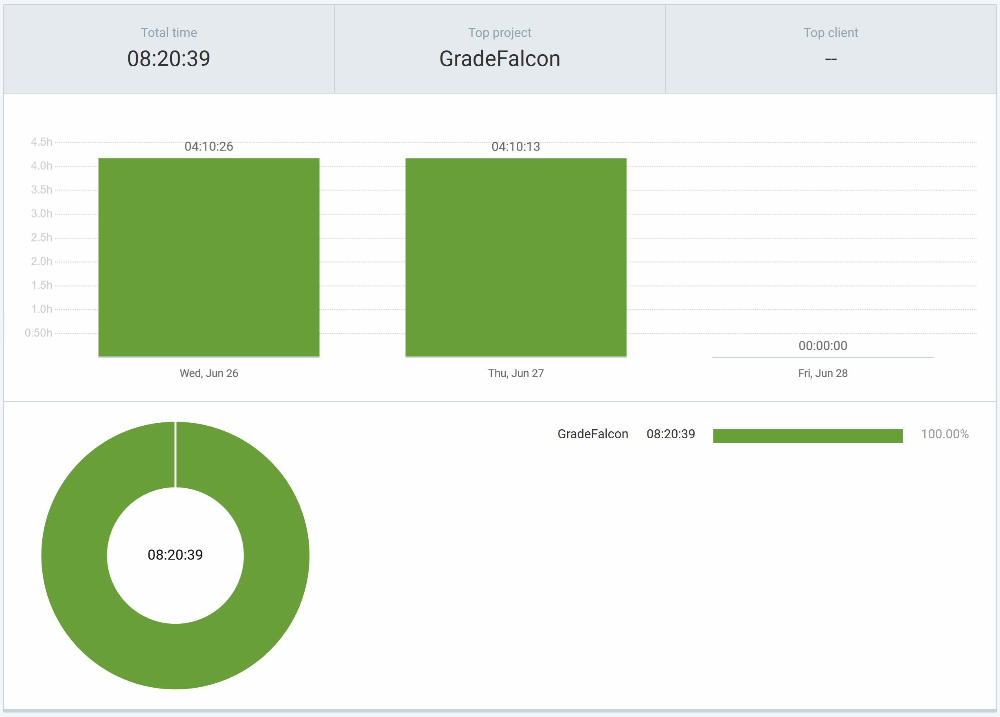

### Current Tasks (Provide sufficient detail)
  * #1: OMR development
  * #2: Annotating sample dataset
  * #1: Training YOLO model

### Progress Update
<table>
    <tr>
        <td><strong>TASK/ISSUE #</strong>
        </td>
        <td><strong>STATUS</strong>
        </td>
    </tr>
    <tr>
        <!-- Task/Issue # -->
        <td>Annotating sample dataset
        </td>
        <!-- Status -->
        <td>Completed
        </td>
    </tr>
    <tr>
        <!-- Task/Issue # -->
        <td>Training YOLO model
        </td>
        <!-- Status -->
        <td>In progress
        </td>
    </tr>
    <tr>
        <!-- Task/Issue # -->
        <td>OMR development
        </td>
        <!-- Status -->
        <td>In progress
        </td>
    </tr>      
</table>

### Cycle Goal Review (Reflection: what went well, what was done, what didn't; Retrospective: how is the process going and why?)
I've started work on the OMR. Myself and Omar found a github repository of an existing OMR machine that has proven to be quite useful. However. a limitation with said omr is that certain precise parameters must be specified for it to correctly detect the bubbles. Though these parameters are pretty straightforward, it is tedious to adjust them for each different scan. To solve this issue, I have discovered YOLOv3's accuracy when it comes to labelling data: by detecting the regions of where the bubbles are on the sheet, we can use this detection to extract the necessary parameters for the existing OMR to work. To that end, this cycle I took several dozen pictures of the current UBC bubble sheet from different angles, annotated the regions of interest on all of them, and ran them through the YOLO model. As I only ran the model for a few epochs, it did not always have 100% accuracy in detecting the region, but I anticipate this will improve over time. 

However, it is still not smooth sailing from here: another issue I've run into is the fact that the OMR only works if there is a border with the page, not if it just a scan of the page itself. Seeing as how when you scan a pdf it is borderless, I have to come up with a way to get the OMR to work without a border. Once that is done, we can move on to Dockerizing the OMR and integrating it into our system.

### Next Cycle Goals (What are you going to accomplish during the next cycle)
  * OMR development

## Wednesday (June 21 - 26)

### Timesheet
Clockify report
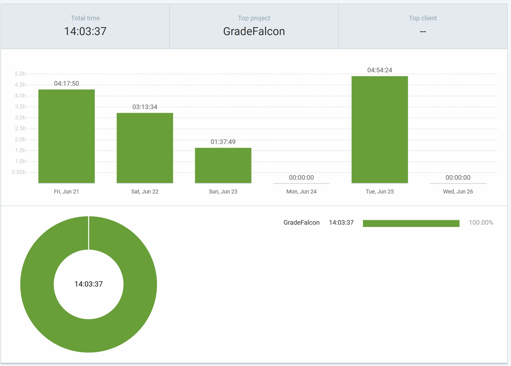

### Current Tasks (Provide sufficient detail)
  * #1: Create and manage exams
  * #2: Display exams on examboard
  * #3: OMR development

### Progress Update
<table>
    <tr>
        <td><strong>TASK/ISSUE #</strong>
        </td>
        <td><strong>STATUS</strong>
        </td>
    </tr>
    <tr>
        <!-- Task/Issue # -->
        <td>Create and manage exams
        </td>
        <!-- Status -->
        <td>Completed
        </td>
    </tr>
    <tr>
        <!-- Task/Issue # -->
        <td>Display exams on examboard
        </td>
        <!-- Status -->
        <td>Completed
        </td>
    </tr>
    <tr>
        <!-- Task/Issue # -->
        <td>OMR development
        </td>
        <!-- Status -->
        <td>In progress
        </td>
    </tr>      
</table>

### Cycle Goal Review (Reflection: what went well, what was done, what didn't; Retrospective: how is the process going and why?)
This cycle, I managed to finish the exam creation section of the project, with the instructor now able to create an exam for a selected course and manually create an exam answer sheet. These answers to the questions are saved to the database, so that when it comes time to grading student exams, the system only needs to look up the answers in the database, and not have to scan them from a marked sheet. Furthermore, the teacher can also view all created exams on the exam board.

Now that all the organizational features of the project are nearing completion, next cycle's focus will be developing the OMR itself. I have spent time in the past familiarizing myself with the various relevant technologies, primarily YOLO and OpenCV, and hope to make good use of them in this upcoming cycle. To accelerate this developmental process, I have discovered several open source repositories of existing OMR models, which I hope form the basis of our own model, fine-tuned to our own needs.

### Next Cycle Goals (What are you going to accomplish during the next cycle)
  * OMR development
## Friday (June 19 - 21)

### Timesheet
Clockify report
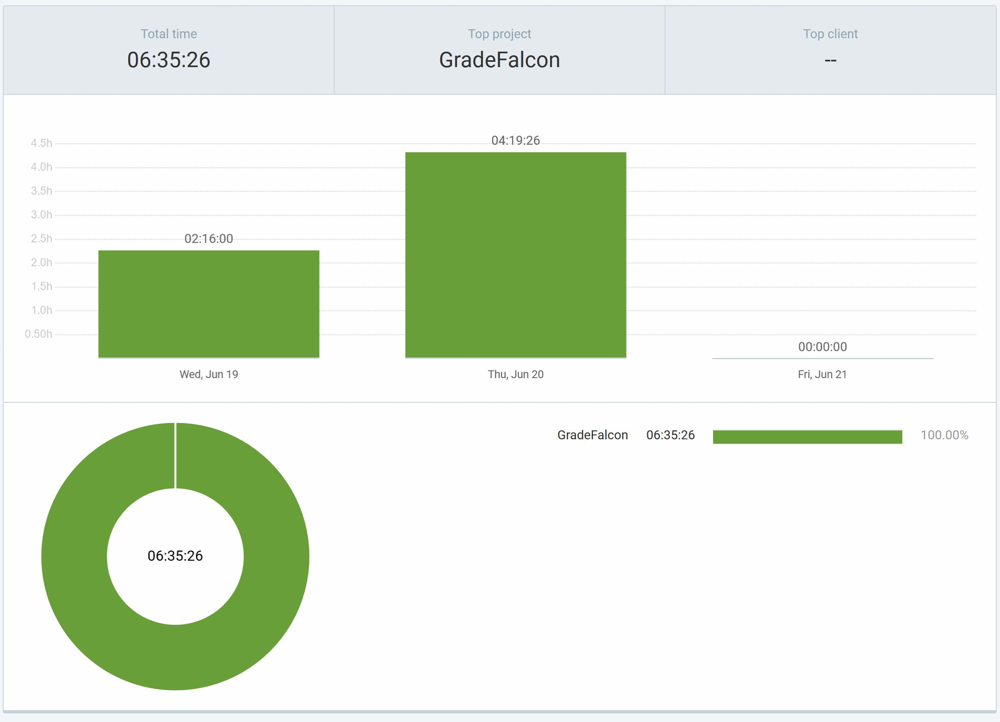

### Current Tasks (Provide sufficient detail)
  * #1: Testing class management system
  * #2: Create and manage exams

### Progress Update
<table>
    <tr>
        <td><strong>TASK/ISSUE #</strong>
        </td>
        <td><strong>STATUS</strong>
        </td>
    </tr>
    <tr>
        <!-- Task/Issue # -->
        <td>Testing Class management
        </td>
        <!-- Status -->
        <td>In Progress
        </td>
    </tr>
    <tr>
        <!-- Task/Issue # -->
        <td>Create and manage exams
        </td>
        <!-- Status -->
        <td>In Progress
        </td>
    </tr>    
</table>

### Cycle Goal Review (Reflection: what went well, what was done, what didn't; Retrospective: how is the process going and why?)
An issue I'm encountering with testing is that whilst I can access the api calls, I am unable to create a connection to the database to so I can run a test query. I suspect this is because I am running Docker and it cannot find the database host but I have yet to find a solution for this. In the meantime, I am making progress towards the exam creation section.

### Next Cycle Goals (What are you going to accomplish during the next cycle)
  * Class system tests
  * Exam creation

## Wednesday (June 14 - 19)

### Timesheet
Clockify report
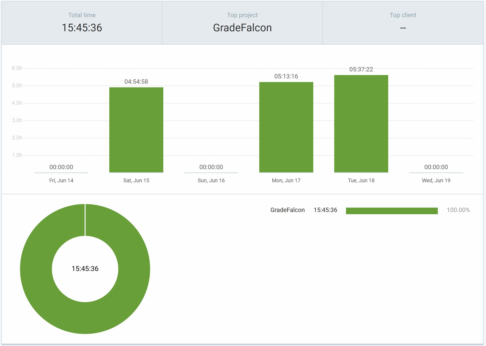

### Current Tasks (Provide sufficient detail)
  * #1: Class management
  * #2: Displaying student results
  * #3: Export results as csv
  * #4: Testing class management system

### Progress Update (since 6/5/2024) 
<table>
    <tr>
        <td><strong>TASK/ISSUE #</strong>
        </td>
        <td><strong>STATUS</strong>
        </td>
    </tr>
    <tr>
        <!-- Task/Issue # -->
        <td>Class management
        </td>
        <!-- Status -->
        <td>Completed
        </td>
    </tr>
    <tr>
        <!-- Task/Issue # -->
        <td>Displaying student results
        </td>
        <!-- Status -->
        <td>Completed
        </td>
    </tr>
    <tr>
        <!-- Task/Issue # -->
        <td>Export results as csv
        </td>
        <!-- Status -->
        <td>Completed
        </td>
    </tr>
    <tr>
        <!-- Task/Issue # -->
        <td>Testing class management system
        </td>
        <!-- Status -->
        <td>In progress
        </td>
    </tr>
    
</table>

### Cycle Goal Review (Reflection: what went well, what was done, what didn't; Retrospective: how is the process going and why?)
This past cycle was spent trying to understand how to pass different data from the backend to the frontend. There were various issues with which specific route to reference in the react fetch function, because it couldn't seem to find that the express methods were posting. Once that was sorted, I had to figure out how to send the data: the best way turned out to be as an object, since that allowed me send the results of multiple postgreSQL queries and unpack them as necessary using React. Then there were issues with unpacking the files, and return them in the DOM element. But once all these were resolved, I finally managed to display the information correctly on the page. 

Now that I am significantly more familiar with how data querying and displaying works, the rest of the process with respect to the core functionality of the application is also much more straightforward. The next user story, exam management, will be more easier and quicker given my newfound knowledge. However, the challenge for the next cycle is figuring out the testing environment, namely how JEST and Supertest work. 

### Next Cycle Goals (What are you going to accomplish during the next cycle)
  * Class system tests
  * Exam creation

## Friday (June 12 - 14)

### Timesheet
Clockify report
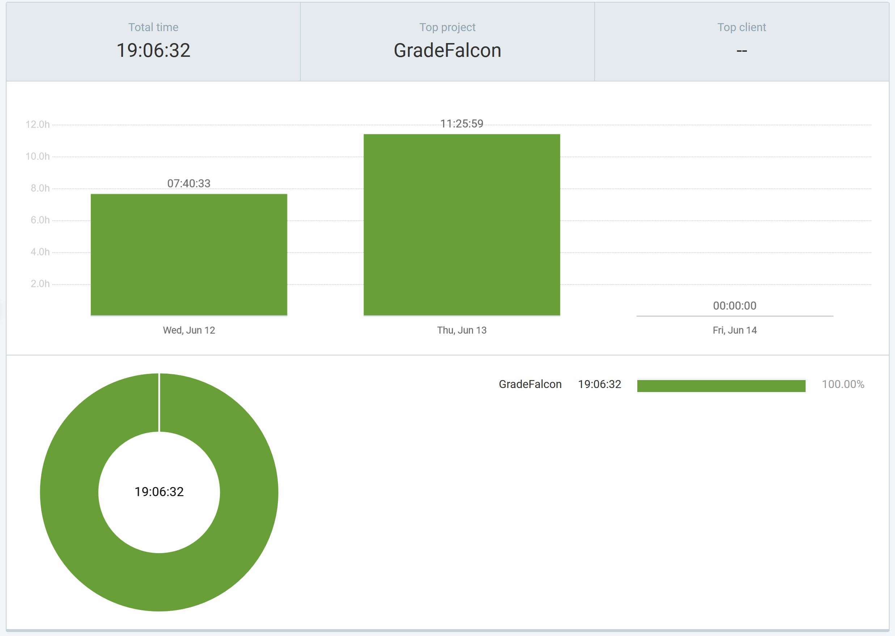

### Current Tasks (Provide sufficient detail)
  * #1: Class creation
  * #2: Backend Express diagnostics
  * #3: Team Log
  * #4: Login page

### Progress Update (since 6/5/2024) 
<table>
    <tr>
        <td><strong>TASK/ISSUE #</strong>
        </td>
        <td><strong>STATUS</strong>
        </td>
    </tr>
    <tr>
        <!-- Task/Issue # -->
        <td>Class creation
        </td>
        <!-- Status -->
        <td>In Progress
        </td>
    </tr>
    <tr>
        <!-- Task/Issue # -->
        <td>Backend fixes
        </td>
        <!-- Status -->
        <td>completed
        </td>
    </tr>
    <tr>
        <!-- Task/Issue # -->
        <td>Organizing the repo
        </td>
        <!-- Status -->
        <td>Completed
        </td>
    </tr>
    <tr>
        <!-- Task/Issue # -->
        <td>Login page
        </td>
        <!-- Status -->
        <td>Completed
        </td>
    </tr>
    
</table>

### Cycle Goal Review (Reflection: what went well, what was done, what didn't; Retrospective: how is the process going and why?)
Though in the last cycle I managed to get the database running in the prebuilt awesome-compose container, it took significantly longer to connect the backend. This is primarily because of how Docker interacts with various frameworks differently as opposed to running those same frameworks natively. Many, many hours of troubleshooting various ports, ip addresses and hostnames I was able to get the backend up and running.

With that out of the way, I worked on the login page and class creation page, porting the HTML and CSS code over to ReactJS and ensuring that ExpressJS is able to read from the database and reflect those changes in our React frontend, all in accordance with the rules of our MVC architecture. In hindsight, we should have begun writing our code in ReactJS, as opposed to first writing it in HTML as a visualization exercise.  
### Next Cycle Goals (What are you going to accomplish during the next cycle)
  * Exam creation
  * Reorganize repo
  * OMR development

## Wednesday (June 7 - 12)

### Timesheet
Clockify report
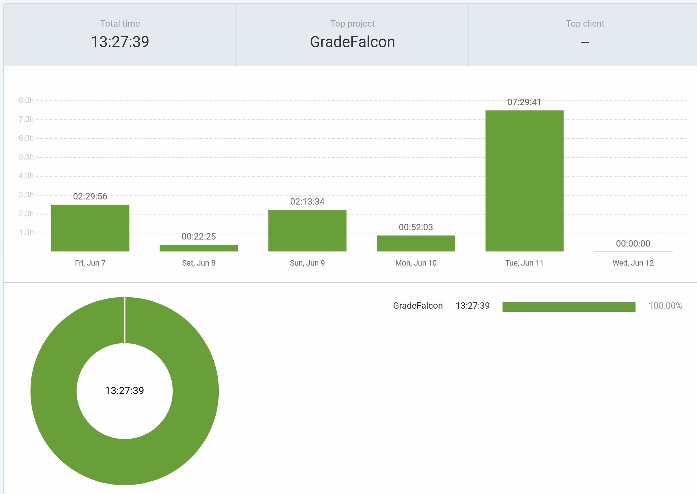

### Current Tasks (Provide sufficient detail)
  * #1: Dockerize database
  * #2: OMR Research
  * #3: Organizing the repo

### Progress Update (since 6/5/2024) 
<table>
    <tr>
        <td><strong>TASK/ISSUE #</strong>
        </td>
        <td><strong>STATUS</strong>
        </td>
    </tr>
    <tr>
        <!-- Task/Issue # -->
        <td>Dockerize database
        </td>
        <!-- Status -->
        <td>Complete
        </td>
    </tr>
    <tr>
        <!-- Task/Issue # -->
        <td>OMR Research
        </td>
        <!-- Status -->
        <td>In Progress
        </td>
    </tr>
    <tr>
        <!-- Task/Issue # -->
        <td>Organizing the repo
        </td>
        <!-- Status -->
        <td>In Progress
        </td>
    </tr>
    
</table>

### Cycle Goal Review (Reflection: what went well, what was done, what didn't; Retrospective: how is the process going and why?)
Dockerizing the database took a while, primarily because the docker-compose format was new to me, and I kept running into niche issues (having to specify the localhost address 127.0.0.1 and converting docker run commands to docker-compose arguments). I've managed to resolve these issues and now need to add them to our pre-made awesome-compose container to migrate the database from maria-db to postgres. 

I've familiarized myself with the YOLO library from *Ultralytics* which we will use for scanning the sheet itself. The tough part here is first finding out what to annotate and manually doing it over a training set of hundreds of sheets and then exporting what YOLO detecting to some format that we can use for marking.

Moreover, as per the new guidelines from Dr. Fazackerley about how our weekly, team reports and repository branches should be structured, we have to some cleaning up to do.  
### Next Cycle Goals (What are you going to accomplish during the next cycle)
  * Continue OMR development
  * Reorganize repo
  * Class creation

## Friday (June 5 - 7)

### Timesheet
Clockify report
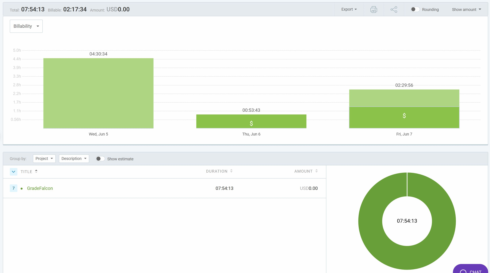

### Current Tasks (Provide sufficient detail)
  * #1: UI Design Feedback
  * #2: Create database via online service provider
  * #3: Editing design video

### Progress Update (since 6/5/2024) 
<table>
    <tr>
        <td><strong>TASK/ISSUE #</strong>
        </td>
        <td><strong>STATUS</strong>
        </td>
    </tr>
    <tr>
        <!-- Task/Issue # -->
        <td>UI Design Feedback
        </td>
        <!-- Status -->
        <td>Complete
        </td>
    </tr>
    <tr>
        <!-- Task/Issue # -->
        <td>Database creation
        </td>
        <!-- Status -->
        <td>Complete
        </td>
    </tr>
    <tr>
        <!-- Task/Issue # -->
        <td>Design video editing
        </td>
        <!-- Status -->
        <td>In Progress
        </td>
    </tr>
</table>

### Cycle Goal Review (Reflection: what went well, what was done, what didn't; Retrospective: how is the process going and why?)
I created the database using an online service provider, but after recent feedback from Dr. Fazackerley, the database must be stored in a Docker container, so that needs amendment. Editing the design video should be fairly straightforward and not take that much time.

### Next Cycle Goals (What are you going to accomplish during the next cycle)
  * Finish design video
  * Dockerize database
  * Start OMR implementation

## May 31 - Jun 05, 2024

### Tasks Worked On
- **Design Document:**
  - Implemented MVC for system design architecture
  - Finalized database design to model all system entities and attributes
  - Developed use case models to demonstrate high level usage scenarios
  - Feedback on user interface design

### Progress Summary
- **Completed:**
  - Database schema
  - Use case models
  - System architecture
  - Design document
- **In Progress:**
  - Development environment setup
  - UI design implementation

### Goals
- **This Cycle's Goals:**
  - Finish system architecture, database schema and use case models
  - Evaluate proposed UI design
  - Finalize design document
- **Next Cycle Plan (2 Days):**
  - Setup database server in postgres
  - Implement frontend with working navigation
  - Design presentation video

## May 27 - 31, 2024

### Tasks Worked On
- **Project Plan:**
  - Drafted the Project Proposal
  - Collaborated on success criteria
  - Developed feature list
  - Came up with constraints and assumptions
  - Edited video for project plan presentation
- **Backlog Management:**
  - Organized and assigned tasks via kanban dashboard
- **Design Document:**
  - Started work on system design architecture to be implemented

### Progress Summary
- **Completed:**
  - Project Plan
  - Project Plan Presentation Video
- **In Progress:**
  - Database schema
  - System architecture
  - Data flow diagram

### Goals
- **This Week's Goals:**
  - Develop feature list and success criteria
  - Finish project plan
  - Reformat project plan into markdown
  - Finish video
- **Next Cycle Plan (5 Days):**
  - Set up the CI/CD pipeline
  - Develop data flow diagrams (DFD)
  - Develop database schema
  - Finalize design document
