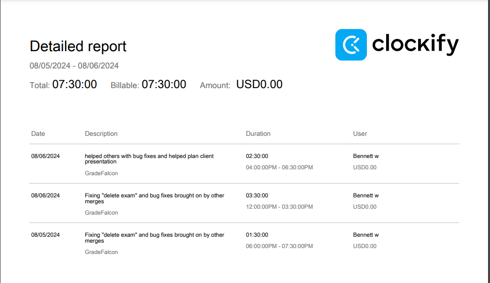

# Personal Log

## Thursday (8/02 - 8/06)

## TimeSheet
Clockify report

### Current Tasks (Provide sufficient detail)
  * #1: Delete Exams
  * #2: General visual/logic bug fixes

### Progress Update (since 6/26/2024) 
<table>
    <tr>
        <td><strong>TASK/ISSUE #</strong>
        </td>
        <td><strong>STATUS</strong>
        </td>
    </tr>
    <tr>
        <!-- Task/Issue # -->
        <td>1
        </td>
        <!-- Status -->
        <td>COMPLETED
        </td>
    </tr>
    <tr>
        <!-- Task/Issue # -->
        <td>2
        </td>
        <!-- Status -->
        <td>In Progress
        </td>
    </tr>
</table>

### Cycle Goal Review (Reflection: what went well, what was done, what didn't; Retrospective: how is the process going and why?)
  * Did not put in as many hours as I typically do, but i got done what my group asked me to get done
### Next Cycle Goals (What are you going to accomplish during the next cycle)
  * Going to fix one more visual bug, wednessday focus on final report, thursday preperation for final presentation, friday after presentation is for any last additions

---------------------------------------------------------------------------------------------------------------------------------------

# Personal Log

## Thursday (7/31 - 8/01)

## TimeSheet
Clockify report

### Current Tasks (Provide sufficient detail)
  * #1: Archive and Delete courses+exams 
  * #2: Restricting access to pages based on user roles

### Progress Update (since 6/26/2024) 
<table>
    <tr>
        <td><strong>TASK/ISSUE #</strong>
        </td>
        <td><strong>STATUS</strong>
        </td>
    </tr>
    <tr>
        <!-- Task/Issue # -->
        <td>1
        </td>
        <!-- Status -->
        <td>COMPLETED
        </td>
    </tr>
    <tr>
        <!-- Task/Issue # -->
        <td>2
        </td>
        <!-- Status -->
        <td>In Progress
        </td>
    </tr>
</table>

### Cycle Goal Review (Reflection: what went well, what was done, what didn't; Retrospective: how is the process going and why?)
  * completed and merged the archive/delete courses and exams feature on the frontend and backend, it was fairly uneventfull and went good, now moving onto restricting acess to pages based on roles
### Next Cycle Goals (What are you going to accomplish during the next cycle)
  * Going to finish restricting acess to pages based on roles, then after fridays testing presentation will quickly sort out any bugs, defects or recommended changes based on feedback, after that a reveiw of feature testing will be carried out (i.e unit testing)
---------------------------------------------------------------------------------------------------------------------------------------

# Personal Log

## Tuesday (7/26 - 7/30)

## TimeSheet
Clockify report

### Current Tasks (Provide sufficient detail)
  * #1: RBAC+API rework with Auth0
  * #2: Archive and Delete courses+exams 

### Progress Update (since 6/26/2024) 
<table>
    <tr>
        <td><strong>TASK/ISSUE #</strong>
        </td>
        <td><strong>STATUS</strong>
        </td>
    </tr>
    <tr>
        <!-- Task/Issue # -->
        <td>1
        </td>
        <!-- Status -->
        <td>COMPLETED
        </td>
    </tr>
    <tr>
        <!-- Task/Issue # -->
        <td>2
        </td>
        <!-- Status -->
        <td>In Progress
        </td>
    </tr>
</table>

### Cycle Goal Review (Reflection: what went well, what was done, what didn't; Retrospective: how is the process going and why?)
  * Completed the pr and merge of auth0 functions into the development branch, ran into many errors that were a result of our old initial features not being as flushed out as we thought, the last 5 days we have worked very hard and put alot of hours into it, if we keep this up till friday we might just get the project done by then
### Next Cycle Goals (What are you going to accomplish during the next cycle)
  * quickly and efficiently create a feature to archive or delete courses or exams (with simple delay/recovery options), and then move on to remaining features

---------------------------------------------------------------------------------------------------------------------------------------

# Personal Log

## Thursday (7/24 - 7/25)

## TimeSheet
Clockify report

### Current Tasks (Provide sufficient detail)
  * #1: RBAC+API rework with Auth0

### Progress Update (since 6/26/2024) 
<table>
    <tr>
        <td><strong>TASK/ISSUE #</strong>
        </td>
        <td><strong>STATUS</strong>
        </td>
    </tr>
    <tr>
        <!-- Task/Issue # -->
        <td>1
        </td>
        <!-- Status -->
        <td>In Progress
        </td>
    </tr>
</table>

### Cycle Goal Review (Reflection: what went well, what was done, what didn't; Retrospective: how is the process going and why?)
  * Just a a few hours before writting this log me and Nelson made had a great sucsess getting a working group of api calls with the dashboard page as our gineau pig where it make a (mostly) sucsessfull api call to the backend, but first verified user permissions as defined on auth0 relative to their role, what is left is mass implimentation (all our pages have the same strucutre so its almost as simple as copy paste) and a PR schedualed for end of friday
### Next Cycle Goals (What are you going to accomplish during the next cycle)
  * Merge an up to date working auth0 implimentation with an up to date dev branch

---------------------------------------------------------------------------------------------------------------------------------------

# Personal Log

## Tuesday (7/19 - 7/23)

## TimeSheet
Clockify report

### Current Tasks (Provide sufficient detail)
  * #1: RBAC+API rework with Auth0

### Progress Update (since 6/26/2024) 
<table>
    <tr>
        <td><strong>TASK/ISSUE #</strong>
        </td>
        <td><strong>STATUS</strong>
        </td>
    </tr>
    <tr>
        <!-- Task/Issue # -->
        <td>1
        </td>
        <!-- Status -->
        <td>In Progress
        </td>
    </tr>
</table>

### Cycle Goal Review (Reflection: what went well, what was done, what didn't; Retrospective: how is the process going and why?)
  * backend integration with auth0 has been a task of attrition but good gains were made, teaming up with nelson we got a custom api linking auth0 and the app in both the frontend and backend, there is rejection of the custom api for certain auth0 services which is the last forseen major hurdle and will ideally be completed before the meeting on wednessday (jul 24)

  
### Next Cycle Goals (What are you going to accomplish during the next cycle)
  * Have Auth0 RBAC working for all existing API calls and it tested in frontend, backend and e2e. (once again, same as last time)

---------------------------------------------------------------------------------------------------------------------------------------

# Personal Log

## Thursday (7/17 - 7/18)

## TimeSheet
Clockify report

### Current Tasks (Provide sufficient detail)
  * #1: RBAC+API rework with Auth0

### Progress Update (since 6/26/2024) 
<table>
    <tr>
        <td><strong>TASK/ISSUE #</strong>
        </td>
        <td><strong>STATUS</strong>
        </td>
    </tr>
    <tr>
        <!-- Task/Issue # -->
        <td>1
        </td>
        <!-- Status -->
        <td>In Progress
        </td>
    </tr>
</table>

### Cycle Goal Review (Reflection: what went well, what was done, what didn't; Retrospective: how is the process going and why?)
  * Progress was made with automatic actions realtive to user actions on the AUTH0 side of things, and and API call protections relative to user permissions was "figured out" but has not been implimented on a large scale, While much information made it sound like AUTH0 would be easy to impliment into our existing app, turns out its best implimented on all stages of development (namely early and durring database connection). While progress is slow, we are being carefull to look ahead as we impliment the AUTH0 so it doesnt hinder the user experience, yet has seamless security within our application, it will turn out very well

  
### Next Cycle Goals (What are you going to accomplish during the next cycle)
  * Have Auth0 RBAC working for all existing API calls and it tested in frontend, backend and e2e. (Same as last time)

---------------------------------------------------------------------------------------------------------------------------------------

# Personal Log

## Tuesday (7/11 - 7/16)

## TimeSheet
Clockify report

### Current Tasks (Provide sufficient detail)
  * #1: RBAC rework with Auth0

### Progress Update (since 6/26/2024) 
<table>
    <tr>
        <td><strong>TASK/ISSUE #</strong>
        </td>
        <td><strong>STATUS</strong>
        </td>
    </tr>
    <tr>
        <!-- Task/Issue # -->
        <td>1
        </td>
        <!-- Status -->
        <td>In Progress
        </td>
    </tr>
</table>

### Cycle Goal Review (Reflection: what went well, what was done, what didn't; Retrospective: how is the process going and why?)
  * While implimenting a secondary service seems foolish at this point in the project, it came to light that our api calls system was quite outdated and vaulnerable to anyone being able to call them even if their permissions got denied, and our role based access was never properly implimented. Learning how to integrate Auth0 has been tricky and inneficient at first, but things are speeding up and our API calls should be entirly invisible and inaccessable to roles that shouldnt have acess, It will also allow for more admin funcationality aswell as overriding controls from the Auth0 dashbaord. 

  
### Next Cycle Goals (What are you going to accomplish during the next cycle)
  * Have Auth0 RBAC working for all existing API calls and it tested in frontend, backend and e2e.

---------------------------------------------------------------------------------------------------------------------------------------

# Personal Log

## Friday (7/05 - 7/09)

## TimeSheet
Clockify report

### Current Tasks (Provide sufficient detail)
  * #1: Additional Frontend testing
  * #2: Additional Backend testing
  * #3: Additional e2e testing

### Progress Update (since 6/26/2024) 
<table>
    <tr>
        <td><strong>TASK/ISSUE #</strong>
        </td>
        <td><strong>STATUS</strong>
        </td>
    </tr>
    <tr>
        <!-- Task/Issue # -->
        <td>1
        </td>
        <!-- Status -->
        <td>In progress
        </td>
    </tr>
    <tr>
        <!-- Task/Issue # -->
        <td>2
        </td>
        <!-- Status -->
        <td>In progress
        </td>
    </tr>
    <tr>
        <!-- Task/Issue # -->
        <td>3
        </td>
        <!-- Status -->
        <td>In progress
        </td>
    </tr>
</table>

### Cycle Goal Review (Reflection: what went well, what was done, what didn't; Retrospective: how is the process going and why?)
  * While writting tests for features i didnt write became difficult when i beleived their code needed refactoring, this is due to the JS language being new to me on this project and my lack of understanding of the code because i didnt write it. Although the refactoring would have been nessesary down the road so the inneficiency allowed other group members to avoid backtracking taking away focus on additonal features.

### Next Cycle Goals (What are you going to accomplish during the next cycle)
  * I MIGHT NOT GET THIS ALL DONE, BUT ITS ALL STUFF I NEED TO GET DONE SOONER THAN LATER
  * getting 85-100% coverage for via creating remaining frontend tests (for currently implimented pages/code)
  * getting 85-100% coverage for via creating remaining backend tests (for currently implimented pages/code)
  * creating more end to end testing files completed

---------------------------------------------------------------------------------------------------------------------------------------

# Personal Log

## Friday (7/09 - 7/11)

## TimeSheet
Clockify report
 
10.5 hours

### Current Tasks (Provide sufficient detail)
  * #1: Additional Frontend testing
  * #2: Additional Backend testing
  * #3: Additional e2e testing

### Progress Update (since 6/26/2024) 
<table>
    <tr>
        <td><strong>TASK/ISSUE #</strong>
        </td>
        <td><strong>STATUS</strong>
        </td>
    </tr>
    <tr>
        <!-- Task/Issue # -->
        <td>1
        </td>
        <!-- Status -->
        <td>Completed
        </td>
    </tr>
    <tr>
        <!-- Task/Issue # -->
        <td>2
        </td>
        <!-- Status -->
        <td>In progress
        </td>
    </tr>
    <tr>
        <!-- Task/Issue # -->
        <td>3
        </td>
        <!-- Status -->
        <td>In progress
        </td>
    </tr>
</table>

### Cycle Goal Review (Reflection: what went well, what was done, what didn't; Retrospective: how is the process going and why?)
  * most initial new frontend tests failing prompted alot of refactoring that increased tollerance for user error, many of these errors actually threw runtime errors so those were good additions, this slowed progress on my actual tasks, but they are things that would absolutly need to be fized at some point before project completion. For example before I changed it, uploading an exam was buged such that it accepted any file and would do real backend calls that would create a new exam with the false data, additonal protections will be needed in the backend as well in case someone uses inspect element on the page.

  * Staring on additional backend testing and refactoring the tests to mocking rather than real database calls, I am going to move the real database calls to the end to end testing , it seemed more appropriate and would allow easier debugging if any issues arose. I added alot of good input verification/validation was added to the authController file and moving the tests to mocking was smooth (many were already using mocking). I researched some additional protections for the backend like brute force protection and limits on log in attempts to protect the database, I added a bit of it as a template but commented out the code.

### Next Cycle Goals (What are you going to accomplish during the next cycle)
  * continue adding additional backend testing and refactor for security where nessesary
  * the new backend tests will be matched up to their frontend pages/tests to impliment some end to end testing.
  * MABEY double back to some frontend testing for others features if they seemed to miss any.

---------------------------------------------------------------------------------------------------------------------------------------

# Personal Log

## Friday (7/05 - 7/09)

## TimeSheet
Clockify report

### Current Tasks (Provide sufficient detail)
  * #1: Additional Frontend testing
  * #2: Additional Backend testing
  * #3: Additional e2e testing

### Progress Update (since 6/26/2024) 
<table>
    <tr>
        <td><strong>TASK/ISSUE #</strong>
        </td>
        <td><strong>STATUS</strong>
        </td>
    </tr>
    <tr>
        <!-- Task/Issue # -->
        <td>1
        </td>
        <!-- Status -->
        <td>In progress
        </td>
    </tr>
    <tr>
        <!-- Task/Issue # -->
        <td>2
        </td>
        <!-- Status -->
        <td>In progress
        </td>
    </tr>
    <tr>
        <!-- Task/Issue # -->
        <td>3
        </td>
        <!-- Status -->
        <td>In progress
        </td>
    </tr>
</table>

### Cycle Goal Review (Reflection: what went well, what was done, what didn't; Retrospective: how is the process going and why?)
  * While writting tests for features i didnt write became difficult when i beleived their code needed refactoring, this is due to the JS language being new to me on this project and my lack of understanding of the code because i didnt write it. Although the refactoring would have been nessesary down the road so the inneficiency allowed other group members to avoid backtracking taking away focus on additonal features.

### Next Cycle Goals (What are you going to accomplish during the next cycle)
  * I MIGHT NOT GET THIS ALL DONE, BUT ITS ALL STUFF I NEED TO GET DONE SOONER THAN LATER
  * getting 85-100% coverage for via creating remaining frontend tests (for currently implimented pages/code)
  * getting 85-100% coverage for via creating remaining backend tests (for currently implimented pages/code)
  * creating more end to end testing files completed

---------------------------------------------------------------------------------------------------------------------------------------

# Personal Log

## Friday (7/03 - 7/05)

## TimeSheet
Clockify report

### Current Tasks (Provide sufficient detail)
  * #1: Fix navigation bar glitch 
  * #2: Impliment logout function with frontend, backend and e2e testing
  * #3: expand on existing testing for frontend and backend for friday MVP

### Progress Update (since 6/26/2024) 
<table>
    <tr>
        <td><strong>TASK/ISSUE #</strong>
        </td>
        <td><strong>STATUS</strong>
        </td>
    </tr>
    <tr>
        <!-- Task/Issue # -->
        <td>1
        </td>
        <!-- Status -->
        <td>Completed
        </td>
    </tr>
    <tr>
        <!-- Task/Issue # -->
        <td>2
        </td>
        <!-- Status -->
        <td>Completed
        </td>
    </tr>
    <tr>
        <!-- Task/Issue # -->
        <td>3
        </td>
        <!-- Status -->
        <td>In progress
        </td>
    </tr>
</table>

### Cycle Goal Review (Reflection: what went well, what was done, what didn't; Retrospective: how is the process going and why?)
  * the navigation bar was a pain to fix because in a series of merges done over the last two weeks the CSS was split into many files(after I spent over a day centralizing it), and plugins that allowed JS files to grab CSS without those CSS files being explicitly imported were added, this caused 3 HTML justifications to cause the navBar glitch like a 3 way OR gate, removed them and gave the non nav bar pages direct CSS centering within the JS/HTML.

  * Logout function had a backend template which was only slightly altered, since anyone who visits the app has a session even if it is null or empty I changed the logout function to explicitly destroy it no matter what, this should only throw an error if the server goes down in the middle of a logout, in such a case the session is destroyed anyway, created frontend testing for navigation, backend to verify possible situations where the logout function could be called making sure the session is reset/destroyed every time, and end to end testing verifying a login->logout->login cycle by using the playwright plugin to create real windows to run through the test data. The admin/student UI were incomplete and under development by team members so i didnt set it up or test those users, but I am 99% sure that the logout is compadible with all user types due to them using the same session system.
  
  * At this time it is thrusday night and I will be expanding the testing a much as possible before the MVP presentiation for tommorow and that will be my focus over the weekend, all new features comming from team members will provide their own testing, aside from special circumstances and code reveiws, no one will generate original testing files for others features.

### Next Cycle Goals (What are you going to accomplish during the next cycle)
  * an immeanse amount of testing and then the account settings feature where a user can alter their account details within reason

---------------------------------------------------------------------------------------------------------------------------------------

# Personal Log

## Wednessday (6/28 - 6/03)

## TimeSheet
Clockify report

### Current Tasks (Provide sufficient detail)
  * #1: Impliment Backend testing
  * #2: Create additional backend testing for new features

### Progress Update (since 6/26/2024) 
<table>
    <tr>
        <td><strong>TASK/ISSUE #</strong>
        </td>
        <td><strong>STATUS</strong>
        </td>
    </tr>
    <tr>
        <!-- Task/Issue # -->
        <td>1
        </td>
        <!-- Status -->
        <td>Completed
        </td>
    </tr>
    <tr>
        <!-- Task/Issue # -->
        <td>2
        </td>
        <!-- Status -->
        <td>In progress
        </td>
    </tr>
</table>

### Cycle Goal Review (Reflection: what went well, what was done, what didn't; Retrospective: how is the process going and why?)
  * The login testing went well and was more straightforward (took too long), it also revealed that more backend verification of input is required for all features and will be something to watch out for in the future. What went really bad was efficiency, in the 34 hours this cycle I should have been able to complete all backend testing for all current features, all things considered thus cycle was a failure in terms of what I should have been able to accomplish. My unfamiliarity with the backend made testing incredible difficult to impliment and errors hard to decypher, the only good news is that all future backend tests should be written much much faster.

### Next Cycle Goals (What are you going to accomplish during the next cycle)
  * By friday I wish for all currently implimented features to have fully flushed out and comprehensive frontend, backend and end to end testing with real database connections where applicable and some mocking where it will not comprimise the quality of the test 

---------------------------------------------------------------------------------------------------------------------------------------

# Personal Log

## Wednessday (6/26 - 6/28)

## TimeSheet
Clockify report

### Current Tasks (Provide sufficient detail)
  * #1: Impliment Backend testing
  * #2: Fix frontend test errors for changes resulting from exam creation implimentation

### Progress Update (since 6/26/2024) 
<table>
    <tr>
        <td><strong>TASK/ISSUE #</strong>
        </td>
        <td><strong>STATUS</strong>
        </td>
    </tr>
    <tr>
        <!-- Task/Issue # -->
        <td>1
        </td>
        <!-- Status -->
        <td>In Progress
        </td>
    </tr>
    <tr>
        <!-- Task/Issue # -->
        <td>2
        </td>
        <!-- Status -->
        <td>Completed
        </td>
    </tr>
</table>

### Cycle Goal Review (Reflection: what went well, what was done, what didn't; Retrospective: how is the process going and why?)
  * Began aditional research on how to run backend testing, diverted attention to fix frontend tests that broke due to implimentation of exam creation, It was nessesary to change focus due so some the branch with the implimention of exam control could be merged.

### Next Cycle Goals (What are you going to accomplish during the next cycle)
  * Divert my focus back to to backend testing, planning on having either all tests for any backend features currently implimented to the dev branch completed.

---------------------------------------------------------------------------------------------------------------------------------------

# Personal Log

## Wednessday (6/21 - 6/26)

## TimeSheet
Clockify report
N/A (explained in previous report) (0 hours)

### Current Tasks (Provide sufficient detail)
  * #1: Impliment Backend testing

### Progress Update (since 6/21/2024) 
<table>
    <tr>
        <td><strong>TASK/ISSUE #</strong>
        </td>
        <td><strong>STATUS</strong>
        </td>
    </tr>
    <tr>
        <!-- Task/Issue # -->
        <td>1
        </td>
        <!-- Status -->
        <td>In Progress
        </td>
    </tr>
</table>

### Cycle Goal Review (Reflection: what went well, what was done, what didn't; Retrospective: how is the process going and why?)
  * I just finished my finals, am beginning the next task now

### Next Cycle Goals (What are you going to accomplish during the next cycle)
  * Team asked me to develop backend tests and any eviroment that requires such

---------------------------------------------------------------------------------------------------------------------------------------

# Personal Log

## Friday (6/19 - 6/21)

## TimeSheet
Clockify report
N/A (explained in appropriate sections) (0 hours)

### Current Tasks (Provide sufficient detail)
  * #1: Objectives suspended until (6/25)

### Progress Update (since 6/07/2024) 
<table>
    <tr>
        <td><strong>TASK/ISSUE #</strong>
        </td>
        <td><strong>STATUS</strong>
        </td>
    </tr>
    <tr>
        <!-- Task/Issue # -->
        <td>N/A
        </td>
        <!-- Status -->
        <td>N/A
        </td>
    </tr>
</table>

### Cycle Goal Review (Reflection: what went well, what was done, what didn't; Retrospective: how is the process going and why?)
preparation for 2 final exams are on (6/24) and (6/25) is suspending my controbutions to the project until they are over
### Next Cycle Goals (What are you going to accomplish during the next cycle)
  * Will check in with team closer to the date of the finals so once the last one is over I can make up for lost time, As I stated in the previous log i informed the team of this and no grudges presented themselves and I garanteed them I would make up for the time missed

---------------------------------------------------------------------------------------------------------------------------------------

# Personal Log

## Wednessday (6/14 - 6/19)

## TimeSheet
Clockify report

* # READ
There is 8.5 hours of overlap in my reports because the Report Function on clockify does not allow for me to segregate by time of day.
### Current Tasks (Provide sufficient detail)
  * #1: Frontend Testing
  * #2: Backend Testing

### Progress Update (since 6/07/2024) 
<table>
    <tr>
        <td><strong>TASK/ISSUE #</strong>
        </td>
        <td><strong>STATUS</strong>
        </td>
    </tr>
    <tr>
        <!-- Task/Issue # -->
        <td>1
        </td>
        <!-- Status -->
        <td>Most major tests done, missed details and tests arising from future edits are what is left
        </td>
    </tr>
    <tr>
        <!-- Task/Issue # -->
        <td>2
        </td>
        <!-- Status -->
        <td>In Progress
        </td>
    </tr>
</table>

### Cycle Goal Review (Reflection: what went well, what was done, what didn't; Retrospective: how is the process going and why?)
task 1: Only a few tests were ready for fridays presentation and jest required imeanse initial configuration in order to handle the project conventions, after the presentation I reworked the jest configuration so outdated dependancies would no longer be used

task 2: Researched how to impliment backend testing on react and how to tie it to pages which has processing nested in frontend pages, (to begin coding on wednessday morning before the meeting and ideally have one good backend test file before the meeting), once an initial good/quality test file is created as an example, test files will be generated for every feature

### Next Cycle Goals (What are you going to accomplish during the next cycle)
  * Create backend testing for all features existing before backend tests are implimented
  * What additional features to work on will be decided after my two finals on (06/24->25), I disclosed this to the group and garanteed that I will more than make up for any missed work.

---------------------------------------------------------------------------------------------------------------------------------------

# Personal Log

## Friday (6/12 - 6/14)

## TimeSheet
Clockify report

### Current Tasks (Provide sufficient detail)
  * #1: Porting HTML/CSS UI into react- "reactifying the UI"
  * #2: Frontend Testing

### Progress Update (since 6/07/2024) 
<table>
    <tr>
        <td><strong>TASK/ISSUE #</strong>
        </td>
        <td><strong>STATUS</strong>
        </td>
    </tr>
    <tr>
        <!-- Task/Issue # -->
        <td>1
        </td>
        <!-- Status -->
        <td>Completed Required Portion for cycle objectives (will need further work)
        </td>
    </tr>
    <tr>
        <!-- Task/Issue # -->
        <td>2
        </td>
        <!-- Status -->
        <td>In Progress
        </td>
    </tr>
</table>

### Cycle Goal Review (Reflection: what went well, what was done, what didn't; Retrospective: how is the process going and why?)
task 1: Reactying HTML/CSS took longer than excpected to adapt due to a lack of familiararity aswell as some previously nested javascript needing to be adapted outside of the HTML. The CSS also messed up visual alignmnents so that had resulted in some nessesary micro adjustments

task 2: Begand researching frontend testing and decided on jest and learned how to do it, discussion and planning about testing friday's 3 features delayed any tests being produced for the frontend

### Next Cycle Goals (What are you going to accomplish during the next cycle)
  * cleaning up remaining visual issues resulting from porting the HTML/CSS ui over to react (which a few pages still need to be adapted to incompadability errors)
  * frontend testing with jest
  * feature unit tests with jest/react testing

  -------------------------------------------------------------------------------------------------------------------------------------------

# Personal Log

## Friday (6/07- 6/12)

### Timesheet
Clockify report

### Current Tasks (Provide sufficient detail)
  * #1: HTML/CSS fixes/updates. UI optimization 
  * #2: Porting HTML/CSS UI into react- "reactifying the UI"
  
### Progress Update (since 6/5/2024) 
<table>
    <tr>
        <td><strong>TASK/ISSUE #</strong>
        </td>
        <td><strong>STATUS</strong>
        </td>
    </tr>
    <tr>
        <!-- Task/Issue # -->
        <td>1
        </td>
        <!-- Status -->
        <td>In Progress
        </td>
    </tr>
    <tr>
        <!-- Task/Issue # -->
        <td>2
        </td>
        <!-- Status -->
        <td>In Progress
        </td>
    </tr>
</table>

### Cycle Goal Review (Reflection: what went well, what was done, what didn't; Retrospective: how is the process going and why?)
Task 1 was carried out and while all desired sub-objectives were achieved, it goes through constant revisions due to tweaking of future features and team desires for changes in the UI, this task will likeley persist on and off until project compleation

Task 2 was begun with some expirimentation with figma plugins to smoothly reactify HTML, Minor progress is being made

### Next Cycle Goals (What are you going to accomplish during the next cycle)
  * Porting HTML/CSS UI into react- "reactifying the UI"
  * Begin creating implimenting features for friday mini-presentation (team objective)
  * impliment HTML/CSS testing

---------------------------------------------------------------------------------------------------------------------------------------------

# Personal Log

## Applicable Date Range
-  Week of 05/06/2024 to 07/06/2024

## Tasks Worked On
- **UI and UX Design:**
  - Began translating figma document into HTML/CSS

## Features and Associated Tasks
- **UI/UX Design:**
  - Valid functioning frontend (zero backend at this time)
  - 
## Progress Summary
- **Completed:**
  - frontend instructor Veiw (will need revisions) (Large)
  - 
- **In Progress:**
  - Translating remaing figma UI mockup into Student veiw (Large)
  - Setting up CI/CD
  - 
## Goals Recap
- **Next Cycle Plan (Friday -> Wednessday):**
  - Translating remaing figma UI mockup into Student veiw (Large)
  - Setting up CI/CD

---------------------------------------------------------------------------------------------------------------------------------------------------

# Personal Log

## Applicable Date Range
-  Week of 31/05/2024 to 05/06/2024

## Tasks Worked On
- **UI and UX Design:**
  - finished UI/UX design/mockup for frontent in figma to contribute to design document.

## Features and Associated Tasks
- **UI/UX Design:**
  - Frontent UI Mockup in figma

## Progress Summary
- **Completed:**
  - Frontent UI Mockup in figma (Large)
- **In Progress:**
  - Translating UI Mockup into clean and reusable HTML/CSS (Large)

## Goals Recap
- **Next Cycle Plan (Wednessday -> Friday):**
  - Translate UI Mockup into clean and reusable HTML/CSS.

---------------------------------------------------------------------------------------------------------------------------------------------------

# Personal Log

## Applicable Date Range
- Week of 27/05/2024

## Tasks Worked On
- **UI and UX Design:**
  - Completed the dashboard page.
  - Began working on remaining pages for the UI/UX design.
- **Project Plan:**
  - Drafted the Project Proposal.
  - Defined the MVP (Minimum Viable Product).
  - Created user stories.

## Features and Associated Tasks
- **Dashboard Page:**
  - Completed design (UI/UX).
  - Associated tasks: Dashboard layout design.
- **UI/UX Design:**
  - Remaining pages in progress.
  - Associated tasks: Page layout designs, user interface adjustments.
- **Project Planning:**
  - Drafted Project Proposal, MVP, user stories.
  - Associated tasks: Proposal drafting.

## Progress Summary
- **Completed:**
  - Dashboard page design (Large).
  - Project Proposal draft (Medium).
  - User stories creation (Medium).
- **In Progress:**
  - Remaining UI/UX pages (Large).

## Goals Recap
- **This Week's Goals:**
  - Complete the dashboard page design.
  - Draft the Project Proposal, and user stories.
- **Next Cycle Plan (3-4 Days):**
  - Finish remaining pages for the UI/UX design.
  - Start contributing to the system design document: specifially UI mockup/Low fidelity prototype via figma and contribute to system arcitecture  design.
  - Set up the CI/CD pipeline.

---------------------------------------------------------------------------------------------------------------------------------------------------