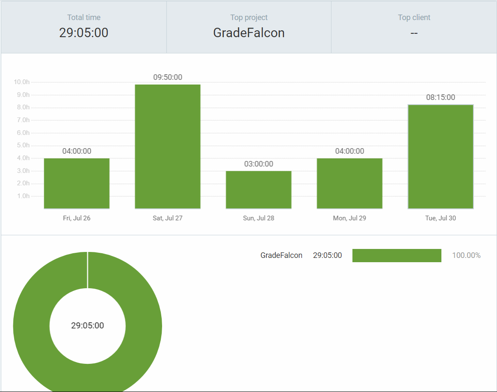
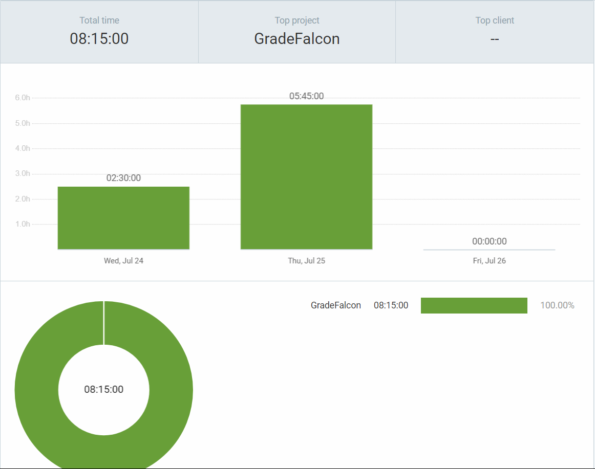
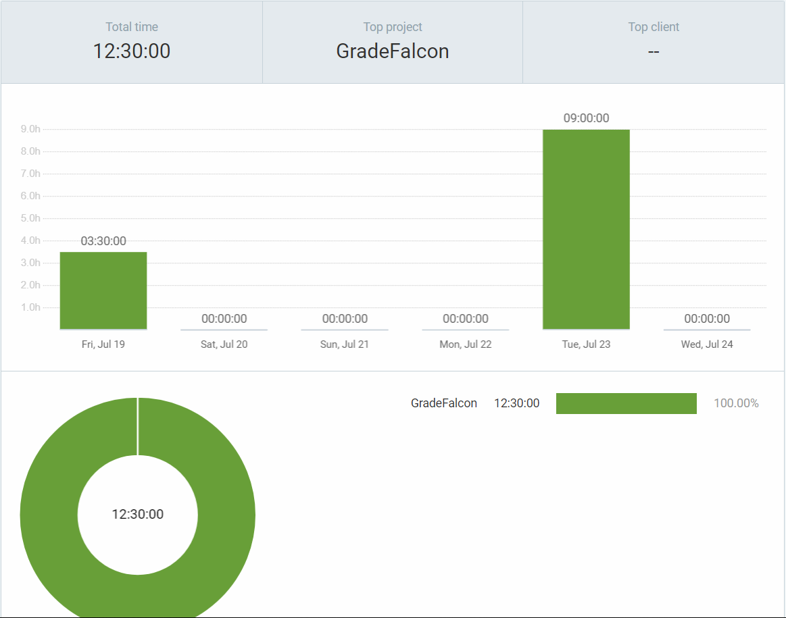
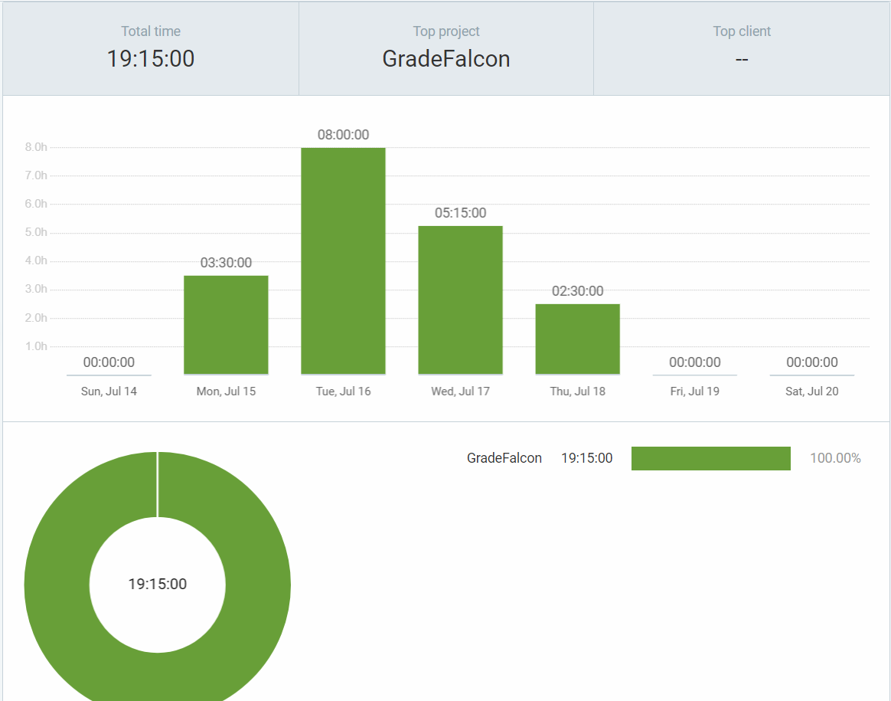
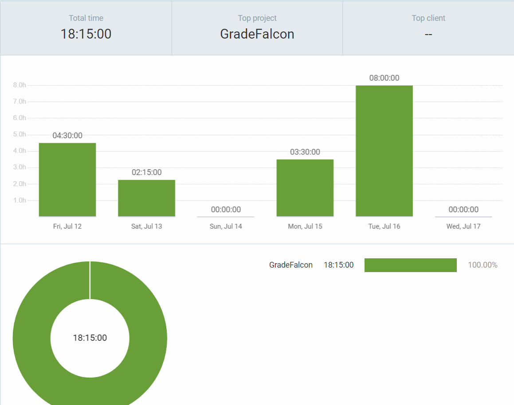
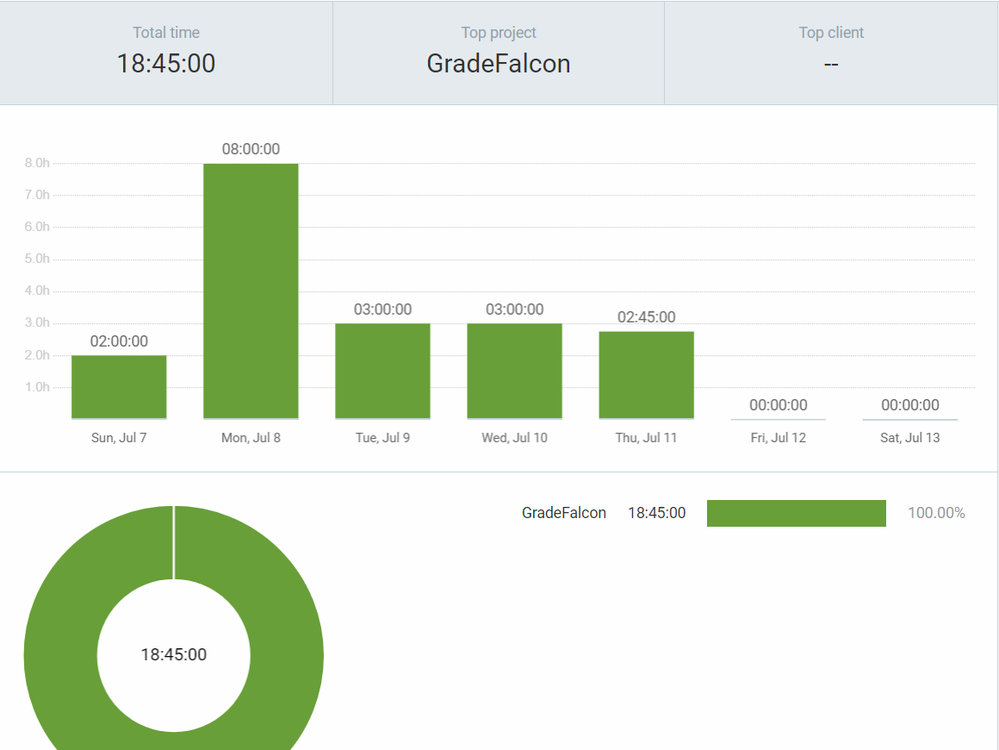
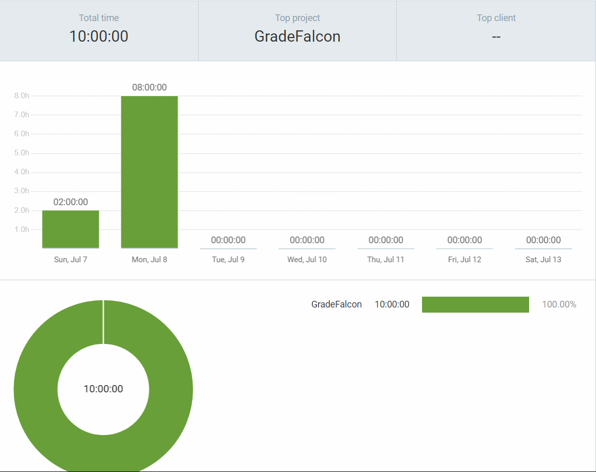
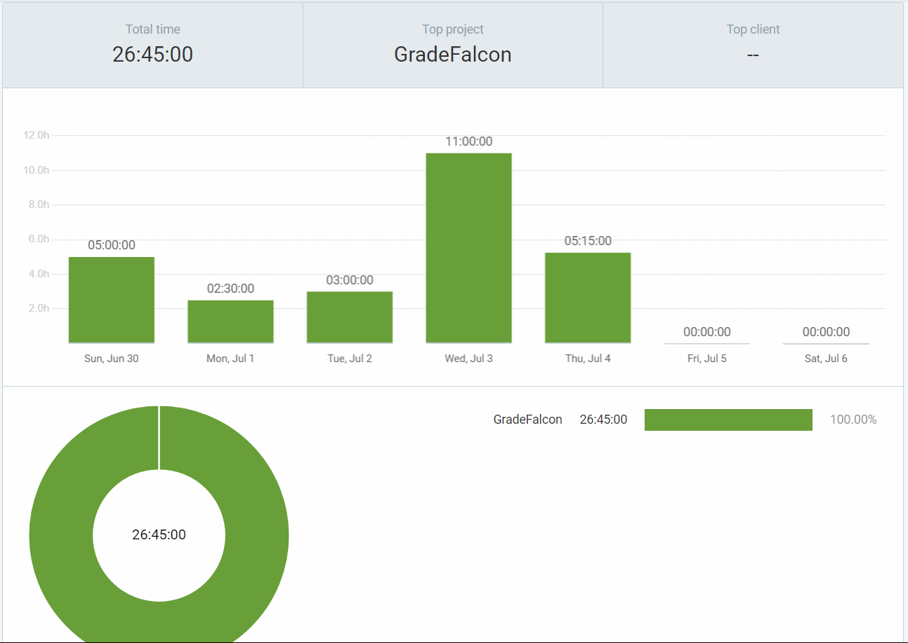
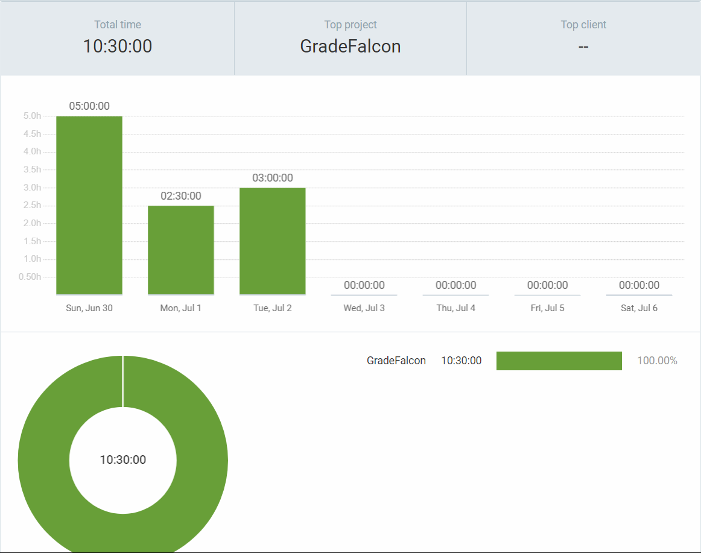

## Wednesday (25/7- 30/7)

### Timesheet
Clockify report

### Current Tasks (Provide sufficient detail)
  * #1: Refactorizing code to integrate auth0
  * #2: Writing Account settings
  * #3: Storing user metadata on token and reading token
    
### Progress Update (since 23/7/2024) 
<table>
    <tr>
        <td><strong>TASK/ISSUE #</strong>
        </td>
        <td><strong>STATUS</strong>
        </td>
    </tr>
 <tr>
        <!-- Task/Issue # -->
        <td>Implementing Auth0 to connect to DB and API calls
        </td>
        <!-- Status -->
        <td>Complete
        </td>
    </tr>
     <tr>
        <!-- Task/Issue # -->
        <td>Writing Account settings
        </td>
        <!-- Status -->
        <td>In progress need to write tests
        </td>
    </tr>
     <tr>
        <!-- Task/Issue # -->
        <td>Storing user metadata on token and reading token
        </td>
        <!-- Status -->
        <td>Complete
        </td>
    </tr>
</table>

### Cycle Goal Review (Reflection: what went well, what was done, what didn't; Retrospective: how is the process going and why?)

### Summary
This week, my primary focus was dedicated to integrating Auth0 into our existing API calls. After achieving a few successful API calls, Bennett and I worked on refactoring all our backend API calls to ensure users are authorized and have the necessary permissions. We also wrote new code to enhance the efficiency of our authorization checks. We made significant progress in refactoring our code and will now focus on refactoring our tests to ensure complete functionality. Additionally, I worked on the account settings feature, storing user metadata on the JWT token, and securely reading from the token. This included implementing functionalities for changing passwords with a reset link, updating email addresses, and other user information on both the database and Auth0.

#### In Progress:
- **Refactoring tests to work with new Auth0 integration**: In Progress
- **Account settings**: In Progress (implemented but need to complete tests)

### Reflections and Lessons Learned:
This cycle emphasized improving our progress and reaching new milestones. The successful integration of Auth0 and the resolution of Docker issues have fortified our project's infrastructure. The personal and academic challenges I encountered highlighted the need for resilience and adaptability. Moving forward, I recognize the importance of better communication and collaboration with my team. I plan to complete the remaining tasks, share progress updates, and commit my work regularly to foster a more collaborative environment.

### Adjustments and Future Plans:
- Complete the tests for the account settings implementation.
- Refactor code and enhance test coverage post-Auth0 integration.
- Implementing logging for grade changes, including storing instructor comments.
- Adding functionality for students to submit review comments and contest marks, with these stored in the database.

## Wednesday (23/7- 25/7)

### Timesheet
Clockify report

### Current Tasks (Provide sufficient detail)
  * #1: Implementing Auth0 to connect to DB and API calls
  * #2: Writing Account settings plus tests
    
### Progress Update (since 23/7/2024) 
<table>
    <tr>
        <td><strong>TASK/ISSUE #</strong>
        </td>
        <td><strong>STATUS</strong>
        </td>
    </tr>
 <tr>
        <!-- Task/Issue # -->
        <td>Implementing Auth0 to connect to DB and API calls
        </td>
        <!-- Status -->
        <td>In Progress
        </td>
    </tr>
     <tr>
        <!-- Task/Issue # -->
        <td>Writing Account settings plus tests
        </td>
        <!-- Status -->
        <td>In progress
        </td>
    </tr>
</table>

### Cycle Goal Review (Reflection: what went well, what was done, what didn't; Retrospective: how is the process going and why?)

### Summary
This cycle saw notable progress, despite being affected by personal and academic challenges. I continued working on the integration of Auth0 with our backend, making successful API calls and developing middleware, controllers, and routes to authenticate these calls and ensure proper user permissions. With Bennett's help, I was able to overcome significant hurdles in making successful calls to the Auth0 API. I also resolved several Docker issues, particularly those related to port conflicts. Although this cycle was an improvement over the last, I still need to improve my communication and time management skills.

#### In Progress:
- **Implementing Auth0 to connect to DB and API calls**: In Progress (Account settings feature put on hold due to potential refactoring needed for Auth0)
- **Writing Account settings plus tests**: On Hold

### Reflections and Lessons Learned:
This cycle was focused on improving our progress and taking it to new levels. The integration of Auth0 and the successful resolution of AWS and Docker issues have strengthened our project's foundation. The personal and academic challenges I faced underscored the importance of resilience and adaptability. Moving forward, I recognize the need for better communication and collaboration with my team. I plan to complete the remaining tasks, share progress updates, and commit my work regularly to foster a more collaborative environment.

### Adjustments and Future Plans:
- Postpone account settings implementation to focus on Auth0 integration.
- Plan to refactor code and enhance test coverage post-Auth0 integration.
- Collaborate with Jusnoor on implementing UI changes using ShadCN.
- Continue improving communication and time management skills to ensure timely completion of tasks.

## Wednesday (19/7- 23/7)

### Timesheet
Clockify report

### Current Tasks (Provide sufficient detail)
  * #1: Implementing Auth0 to connect to DB and API calls
  * #2: Writing Account settings plus tests
    
### Progress Update (since 19/7/2024) 
<table>
    <tr>
        <td><strong>TASK/ISSUE #</strong>
        </td>
        <td><strong>STATUS</strong>
        </td>
    </tr>
 <tr>
        <!-- Task/Issue # -->
        <td>Implementing Auth0 to connect to DB and API calls
        </td>
        <!-- Status -->
        <td>In Progress
        </td>
    </tr>
     <tr>
        <!-- Task/Issue # -->
        <td>Writing Account settings plus tests
        </td>
        <!-- Status -->
        <td>In progress
        </td>
    </tr>
</table>

### Cycle Goal Review (Reflection: what went well, what was done, what didn't; Retrospective: how is the process going and why?)

### Summary
This cycle presented several personal and academic challenges, which limited my project work. Despite losing my phone and dealing with the subsequent complications of blocking it and changing numbers, as well as preparing for two midterms, I made strides in integrating Auth0 with our backend. I focused on developing a custom API to minimize the need for extensive code refactoring, given our time constraints. Although I encountered some bugs, I am confident that I am close to a working solution. Additionally, I plan to collaborate with Jusnoor on UI changes using ShadCN.

#### In Progress:
- **Implementing Auth0 to connect to DB and API calls**: In Progress (Account settings feature put on hold due to potential refactoring needed for Auth0)
- **Writing Account settings plus tests**: On Hold

### Reflections and Lessons Learned:
This cycle was focused on improving our progress and taking it to new levels. The integration of Auth0 and the successful implementation of AWS tests have strengthened our project's foundation. The personal and academic challenges I faced highlighted the importance of resilience and adaptability. Moving forward, I recognize the importance of better communication and collaboration with my team. I plan to complete the remaining tasks, share progress updates, and commit my work regularly to foster a more collaborative environment.

### Adjustments and Future Plans:
- Postpone account settings implementation to focus on Auth0 integration.
- Plan to refactor code and enhance test coverage post-Auth0 integration.
- Collaborate with Jusnoor on implementing UI changes using ShadCN.

## Wednesday (17/7- 19/7)

### Timesheet
Clockify report

### Current Tasks (Provide sufficient detail)
  * #1: Implementing Auth0 to connect to DB and API calls
  * #2: Writing Account seetting plus test
  * #3: Creating ADMIN users for group memebers
    
### Progress Update (since 6/7/2024) 
<table>
    <tr>
        <td><strong>TASK/ISSUE #</strong>
        </td>
        <td><strong>STATUS</strong>
        </td>
    </tr>
 <tr>
        <!-- Task/Issue # -->
        <td>Implementing Auth0 to connect to DB and API calls
        </td>
        <!-- Status -->
        <td>In Progress
        </td>
    </tr>
     <tr>
        <!-- Task/Issue # -->
        <td>Writing Account seetting plus test
        </td>
        <!-- Status -->
        <td>In progress
        </td>
    </tr>
    <tr>
        <!-- Task/Issue # -->
        <td>Creating ADMIN users for group memebers
        </td>
        <!-- Status -->
        <td>Complete
        </td>
    </tr>
</table>

### Cycle Goal Review (Reflection: what went well, what was done, what didn't; Retrospective: how is the process going and why?)

### Summary
This cycle saw significant progress as I focused on implementing and integrating Auth0 with our backend. This included sending and fetching API calls to and from Auth0, creating middleware, and writing all relevant backend code such as controllers and routes to authenticate these calls and ensure proper user permissions. Additionally, I assisted team members in getting accustomed to AWS, which contributed to the overall progress of our project.

#### Completed Tasks:
- **More implementation of AWS File Upload plus tests**: Complete
- **Integrating Ahmad's Flask/OMR code to AWS code to mitigate conflict changes**: Complete

#### In Progress:
- **Implementing Auth0 to connect to DB and API calls**: In Progress (Account settings feature put on hold due to potential refactoring needed for Auth0)
- **Writing Account settings plus tests**: On Hold

### Reflections and Lessons Learned:
This cycle was focused on improving our progress and taking it to new levels. The integration of Auth0 and the successful implementation of AWS tests have strengthened our project's foundation. Moving forward, I recognize the importance of better communication and collaboration with my team. I plan to complete the remaining tasks, share progress updates, and commit my work regularly to foster a more collaborative environment.

### Adjustments and Future Plans:
- Postpone account settings implementation to focus on Auth0 integration.
- AWS setup is now fully functional, with tests successfully implemented.
- Plan to refactor code and enhance test coverage post-Auth0 integration.
- Finish account settings and enable OMR to fetch files and upload images, leveraging the logic from current AWS implementation.

## Wednesday (12/7- 17/7)

### Timesheet
Clockify report

### Current Tasks (Provide sufficient detail)
  * #1: Implementing Auth0 to connect to DB and API calls
  * #2: Writing Account settings plus test
  * #3: More implementation of AWS File Upload plus tests
  * #4: Integrating Ahmads Flask/OMR code to AWS code to mitigate conflict changes

### Progress Update (since 6/7/2024) 
<table>
    <tr>
        <td><strong>TASK/ISSUE #</strong>
        </td>
        <td><strong>STATUS</strong>
        </td>
    </tr>
 <tr>
        <!-- Task/Issue # -->
        <td>Implementing Auth0 to connect to DB and API calls
        </td>
        <!-- Status -->
        <td>In Progress
        </td>
    </tr>
     <tr>
        <!-- Task/Issue # -->
        <td>Writing Account seetting plus test
        </td>
        <!-- Status -->
        <td>In progress
        </td>
    </tr>
    <tr>
        <!-- Task/Issue # -->
        <td>More implementation of AWS File Upload plus tests
        </td>
        <!-- Status -->
        <td>Complete
        </td>
    </tr>
    <tr>
        <!-- Task/Issue # -->
        <td>Integrating Ahmads Flask/OMR code to AWS code to mitigate conflict changes
        </td>
        <!-- Status -->
        <td>Complete
        </td>
    </tr>

</table>

### Cycle Goal Review (Reflection: what went well, what was done, what didn't; Retrospective: how is the process going and why?)

### Summary
This cycle was much better than the last because I was able to solve the problems bugging me personally and the issues with the code I was working on. Despite facing challenges, I focused on ensuring the file upload process is complete and thoroughly tested. I also attempted to develop the account settings feature for the student view and continued working on the admin view, but didn't make as much progress as I had hoped. Additionally, I tried to use role-based authentication to implement passports but didn't make much headway due to the unforeseen challenges. These obstacles initially affected my productivity, but I managed to overcome them and improve my work process.

#### Completed Tasks:
- **More implementation of AWS File Upload plus tests**: Complete
- **Integrating Ahmad's Flask/OMR code to AWS code to mitigate conflict changes**: Complete

#### In Progress:
- **Implementing Auth0 to connect to DB and API calls**: In Progress (Account settings feature put on hold due to potential refactoring needed for Auth0)
- **Writing Account settings plus tests**: On Hold

### Reflections and Lessons Learned:
This experience has underscored the importance of resilience, adaptability, and team support in overcoming obstacles. Moving forward, I recognize the importance of better communication and collaboration with my team. I plan to complete the remaining tasks, share progress updates, and commit my work regularly to foster a more collaborative environment.

### Adjustments and Future Plans:
- Postpone account settings implementation to focus on Auth0 integration.
- AWS setup is now fully functional, with tests successfully implemented.
- Plan to refactor code and enhance test coverage post-Auth0 integration.
- Finish account settings and enable OMR to fetch files and upload images, leveraging the logic from current AWS implementation.

## Wednesday (10/7- 12/7)

### Timesheet
Clockify report

### Current Tasks (Provide sufficient detail)
  * #1: Implementing RBAC Passports
  * #2: Writing Account seetting plus test
  * #3: More implementation of AWS File Upload and Download plus tests

### Progress Update (since 6/7/2024) 
<table>
    <tr>
        <td><strong>TASK/ISSUE #</strong>
        </td>
        <td><strong>STATUS</strong>
        </td>
    </tr>
 <tr>
        <!-- Task/Issue # -->
        <td>Implementing RBAC Passports
        </td>
        <!-- Status -->
        <td>In Progress
        </td>
    </tr>
     <tr>
        <!-- Task/Issue # -->
        <td>Writing Account seetting plus test
        </td>
        <!-- Status -->
        <td>In progress
        </td>
    </tr>
    <tr>
        <!-- Task/Issue # -->
        <td>More implementation of AWS File Upload and Download plus tests
        </td>
        <!-- Status -->
        <td>Complete
        </td>
    </tr>

</table>

### Cycle Goal Review (Reflection: what went well, what was done, what didn't; Retrospective: how is the process going and why?)

This cycle has undoubtedly been the most challenging yet, marked by unforeseen external challenges that significantly impacted my productivity. Despite these difficulties, I focused on ensuring the file upload process is complete and thoroughly tested. I also attempted to develop the account settings feature for the student view and continued working on the admin view, but didn't make as much progress as I had hoped. Additionally, I tried to use role-based authentication to implement passports but didn't make much headway due to the unforeseen challenges. The obstacles I faced made it hard to maintain my usual productivity levels, and I found myself isolating due to these challenges, which is not conducive to effective teamwork. Moving forward, I recognize the importance of better communication and collaboration with my team. I plan to complete the remaining tasks, share progress updates, and commit my work regularly to foster a more collaborative environment. This experience has underscored the importance of resilience, adaptability, and team support in overcoming obstacles.

## Wednesday (6/7- 10/7)

### Timesheet
Clockify report

### Current Tasks (Provide sufficient detail)
  * #1: Implementing RBAC Passports
  * #2: Writing Account seetting plus test
  * #3: More implementation of AWS File Upload and Download plus tests

### Progress Update (since 6/7/2024) 
<table>
    <tr>
        <td><strong>TASK/ISSUE #</strong>
        </td>
        <td><strong>STATUS</strong>
        </td>
    </tr>
 <tr>
        <!-- Task/Issue # -->
        <td>Implementing RBAC Passports
        </td>
        <!-- Status -->
        <td>In Progress
        </td>
    </tr>
     <tr>
        <!-- Task/Issue # -->
        <td>Writing Account seetting plus test
        </td>
        <!-- Status -->
        <td>In Progress
        </td>
    </tr>
    <tr>
        <!-- Task/Issue # -->
        <td>More implementation of AWS File Upload and Download plus tests
        </td>
        <!-- Status -->
        <td>In Progress
        </td>
    </tr>

</table>

### Cycle Goal Review (Reflection: what went well, what was done, what didn't; Retrospective: how is the process going and why?)

This phase of the cycle was productive despite external challenges. I made significant progress on the tasks assigned to me, including implementing RBAC Passports, developing the account settings feature with corresponding tests, and enhancing AWS file upload and download functionality with thorough testing. The motivation from the recent MVP presentation contributed to a high level of productivity and quality of work. However, unforeseen personal circumstances impacted the number of hours I could dedicate to work. Despite this, I managed to maintain focus and continued to push forward with critical tasks. Moving forward, I plan to complete the current tasks, share progress with the team, continue thorough testing and refinement, and ensure comprehensive documentation. Encouraging more collaboration within the team will be essential to handle unexpected challenges effectively.

## Wednesday (3/7- 5/7)

### Timesheet
Clockify report

### Current Tasks (Provide sufficient detail)
  * #1: Finsihed Configuring Drone CI after repo Request approved
  * #2: Create S3 Bucket, Accesss Keys and Policy Permissions
  * #3: Write code frontend and backend code for uploadExam and uploadExamKey

### Progress Update (since 6/18/2024) 
<table>
    <tr>
        <td><strong>TASK/ISSUE #</strong>
        </td>
        <td><strong>STATUS</strong>
        </td>
    </tr>
 <tr>
        <!-- Task/Issue # -->
        <td>Finsihed Configuring Drone CI after repo Request approved
        </td>
        <!-- Status -->
        <td>Complete
        </td>
    </tr>
     <tr>
        <!-- Task/Issue # -->
        <td>Create S3 Bucket, Accesss Keys and Policy Permissions
        </td>
        <!-- Status -->
        <td>Complete
        </td>
    </tr>
    <tr>
        <!-- Task/Issue # -->
        <td>Write code frontend and backend code for uploadExam and uploadExamKey
        </td>
        <!-- Status -->
        <td>Complete
        </td>
    </tr>

</table>

### Cycle Goal Review (Reflection: what went well, what was done, what didn't; Retrospective: how is the process going and why?)
This phase of the cycle felt particularly long. I focused on creating an S3 Bucket on AWS to enable file and image uploads on a separate server. This process involved generating access keys for users, crafting user permission policies, and configuring these keys and policies to align with environment variables. As this was a new and complex task for me, it resulted in a long, sleepless night, but I successfully got everything working and configured.

Additionally, I implemented security measures on the bucket to control access and retrieval of files, akin to role-based authentication, though not fully implemented. Beyond that, I managed to set up Drone CI. My next step is to share this configuration with the team and demonstrate how it works.

## Wednesday (29/6- 3/7)

### Timesheet
Clockify report

### Current Tasks (Provide sufficient detail)
  * #1: Configuring Drone CI on AWS Server
  * #2: Setting up File Storage On AWS server
  * #3: Creating Upload PDF to AWS Server

### Progress Update (since 6/18/2024) 
<table>
    <tr>
        <td><strong>TASK/ISSUE #</strong>
        </td>
        <td><strong>STATUS</strong>
        </td>
    </tr>
 <tr>
        <!-- Task/Issue # -->
        <td>Configuring Drone CI on AWS Server
        </td>
        <!-- Status -->
        <td>Complete
        </td>
    </tr>
     <tr>
        <!-- Task/Issue # -->
        <td>Setting up File Storage On AWS server
        </td>
        <!-- Status -->
        <td>In Progress
        </td>
    </tr>
    <tr>
        <!-- Task/Issue # -->
        <td>Creating Upload PDF to AWS Server
        </td>
        <!-- Status -->
        <td>In Progress
        </td>
    </tr>

</table>

### Cycle Goal Review (Reflection: what went well, what was done, what didn't; Retrospective: how is the process going and why?)

This week, I made significant progress despite initial setbacks. I successfully set up and configured Drone CI on the AWS server, overcoming challenges with TCP, SSH, and other network settings that were blocking access. With these issues resolved, I am now waiting for access to the GitHub repository. Additionally, I began creating storage space on the AWS server for uploading the 200-page PDFs of exams and started writing the necessary code for this functionality. Overall I feel like I have started to pick up the pace again but I would like to do more still.

## Wednesday (26/6- 28/6)

### Timesheet
Clockify report

### Current Tasks (Provide sufficient detail)
  * #1: Setting up and Testing Drone
  * #2: Setting up Remote Server for Drone
  * #3: Researching/Setting up Cloud Provider

### Progress Update (since 6/18/2024) 
<table>
    <tr>
        <td><strong>TASK/ISSUE #</strong>
        </td>
        <td><strong>STATUS</strong>
        </td>
    </tr>
 <tr>
        <!-- Task/Issue # -->
        <td>Setting up and Testing Drone
        </td>
        <!-- Status -->
        <td>In Progress
        </td>
    </tr>
     <tr>
        <!-- Task/Issue # -->
        <td>Setting up Remote Server for Drone
        </td>
        <!-- Status -->
        <td>In Progress
        </td>
    </tr>
    <tr>
        <!-- Task/Issue # -->
        <td>Researching/Setting up Cloud Provider
        </td>
        <!-- Status -->
        <td>In Progress
        </td>
    </tr>

</table>

### Cycle Goal Review (Reflection: what went well, what was done, what didn't; Retrospective: how is the process going and why?)
In this cycle, I was able to regain momentum after a busy start to the week. My primary focus was on setting up Drone CI. Initially, I managed to configure it locally, but upon further consideration of the project's future and after reading feedback from other teams using Drone, I decided to conduct additional research to ensure we are implementing the best solution efficiently. I determined that setting up a remote server on a cloud provider for Drone would be more scalable and beneficial for our project. This aligns with our plan to use a cloud provider for managing exam PDF file storage. I have made significant progress in setting up this remote server during this cycle.

### Next Cycle Goals (What are you going to accomplish during the next cycle)
  * Set Up Remote server
  * Set up Cloud Provider
  * Set up Drone
  * Finish adding functionality for Admin View
  * Research the best more about computer vision and OMR

## Wednesday (22/6- 26/6)

### Timesheet
Clockify report

### Current Tasks (Provide sufficient detail)
  * #1: Start working on setting up CI/CD

### Progress Update (since 6/18/2024) 
<table>
    <tr>
        <td><strong>TASK/ISSUE #</strong>
        </td>
        <td><strong>STATUS</strong>
        </td>
    </tr>
 <tr>
        <!-- Task/Issue # -->
        <td>Start working on setting up CI/CD
        </td>
        <!-- Status -->
        <td>In Progress
        </td>
    </tr>

</table>

### Cycle Goal Review (Reflection: what went well, what was done, what didn't; Retrospective: how is the process going and why?)
This cycle I was a lot more busy than usual I am currently taking other classes in the semester of the summer so I had a final exams to study for. I was busy because my final exam was on Monday. I was still able to do a little bit of work but I intend to increase the pace and effiency of my work now!

### Next Cycle Goals (What are you going to accomplish during the next cycle)
  * Gte CI/CD connected and working.
  * Finishe adding functionality for Admin View
  * Research the best more about computer vision and OMR

## Wednesday (19/6- 21/6)

### Timesheet
Clockify report

### Current Tasks (Provide sufficient detail)
  * #1: Start working on setting up CI/CD
  * #2: Finish adding functionality too AdminViiew
  * #3: Ensure Protected Route works and in secure.

### Progress Update (since 6/18/2024) 
<table>
    <tr>
        <td><strong>TASK/ISSUE #</strong>
        </td>
        <td><strong>STATUS</strong>
        </td>
    </tr>
 <tr>
        <!-- Task/Issue # -->
        <td>Start working on setting up CI/CD
        </td>
        <!-- Status -->
        <td>In Progress
        </td>
    </tr>
 <tr>
        <!-- Task/Issue # -->
        <td>Start working on setting up CI/CD
        </td>
        <!-- Status -->
        <td>In Progress
        </td>
    </tr>
 <tr>
        <!-- Task/Issue # -->
        <td>Ensure Protected Route works and in secure
        </td>
        <!-- Status -->
        <td>In Progress
        </td>
    </tr>
</table>

### Cycle Goal Review (Reflection: what went well, what was done, what didn't; Retrospective: how is the process going and why?)
This cycle I was a little more busy than usual I am currently taking another class in the semester of the summer so I had a final assignment due and final exam revision to start. I was a little bit busy because my final exam is on Monday. I was still able to do a little bit of work but I intend to increase the pace and effiency of my work after this exam!

### Next Cycle Goals (What are you going to accomplish during the next cycle)
  * Gte CI/CD connected and working.
  * Finishe adding functionality for Admin View
  * Research the best more about computer vision and OMR
  * Ensure user permissiona and protected routes secure.

## Wednesday (15/6- 18/6)

### Timesheet
Clockify report

### Current Tasks (Provide sufficient detail)
  * #1: Redesign login/signup Page.
  * #2: Create Admin View frontend (Shell)
  * #3: Create User Management section (Admin View)
  * #4: Start working on setting up CI/CD
  * #5: Finish adding functionality too AdminViiew

### Progress Update (since 6/18/2024) 
<table>
    <tr>
        <td><strong>TASK/ISSUE #</strong>
        </td>
        <td><strong>STATUS</strong>
        </td>
    </tr>
    <tr>
        <!-- Task/Issue # -->
        <td>Redesign login/signup Page.
        </td>
        <!-- Status -->
        <td>Complete
        </td>
    </tr>
    <tr>
        <!-- Task/Issue # -->
        <td>Create Admin View frontend (Shell)
        </td>
        <!-- Status -->
        <td>Complete
        </td>
    </tr>
    <tr>
        <!-- Task/Issue # -->
        <td>Finish adding functionality too AdminViiew
        </td>
        <!-- Status -->
        <td>In Progress
        </td>
    </tr>
 <tr>
        <!-- Task/Issue # -->
        <td>Start working on setting up CI/CD
        </td>
        <!-- Status -->
        <td>In Progress
        </td>
    </tr>
 <tr>
        <!-- Task/Issue # -->
        <td>Start working on setting up CI/CD
        </td>
        <!-- Status -->
        <td>In Progress
        </td>
    </tr>
</table>

### Cycle Goal Review (Reflection: what went well, what was done, what didn't; Retrospective: how is the process going and why?)
This cycle was a litte more challenging than the rest because I had to take care of some personal issues that needed my attention, I likely feel like I was able to handle it very well and was still able to do a little bit of work. The main object was to redesign the signup/login page to allow role based authenication, and to also allow admins to create and add users to the system and maanage users. Now I that it is working I am working on connecting the CI/CD. I also did a little bit of research to increase my knowledge.

### Next Cycle Goals (What are you going to accomplish during the next cycle)
  * Gte CI/CD connected and working.
  * Finishe adding functionality for Admin View
  * Research the best more about computer vision and OMR

## Wednesday (12/6- 14/6)

### Timesheet
Clockify report

### Current Tasks (Provide sufficient detail)
  * #1: Writing fully functional login page
  * #2: Writing fully functional sign up page
  * #3: API routes for database query using express

### Progress Update (since 6/5/2024) 
<table>
    <tr>
        <td><strong>TASK/ISSUE #</strong>
        </td>
        <td><strong>STATUS</strong>
        </td>
    </tr>
    <tr>
        <!-- Task/Issue # -->
        <td>Writing fully functional login page
        </td>
        <!-- Status -->
        <td>Complete
        </td>
    </tr>
    <tr>
        <!-- Task/Issue # -->
        <td>Writing fully functional sign up page
        </td>
        <!-- Status -->
        <td>Complete
        </td>
    </tr>
    <tr>
        <!-- Task/Issue # -->
        <td>API routes for database query's using express
        </td>
        <!-- Status -->
        <td>In Progress
        </td>
    </tr>
</table>

### Cycle Goal Review (Reflection: what went well, what was done, what didn't; Retrospective: how is the process going and why?)
This cycle felt much longer than the rest I faced quite a few challenges with the technologies we were using mainly because I did not understand the technologies as well as I thought. I was struggling quite a bit with docker and express especially when it came to connecting to the database and making queries to and from. I think it was really challenging because of how complex postgre is. Thankyfully my teammates were able to help me out and were patient with me. 

### Next Cycle Goals (What are you going to accomplish during the next cycle)
  * Backend API making sure express is fully functional with the rest of the pages.
  * Create a little demo bubble sheet scanner to demo idea's.
  * Research the best place to store the pdf's either locally or the cloud and create a little demo.

## Wednesday (7/7- 12/7)

### Timesheet
Clockify report

### Current Tasks (Provide sufficient detail)
  * #1: Login frontend
  * #2: Sign up frontend
  * #3: Connecting Database to the frontend
  * #4: Writing frontend validation for database requests

### Progress Update (since 6/5/2024) 
<table>
    <tr>
        <td><strong>TASK/ISSUE #</strong>
        </td>
        <td><strong>STATUS</strong>
        </td>
    </tr>
    <tr>
        <!-- Task/Issue # -->
        <td>Login Frontend
        </td>
        <!-- Status -->
        <td>Complete
        </td>
    </tr>
    <tr>
        <!-- Task/Issue # -->
        <td>Sign Up Frontend
        </td>
        <!-- Status -->
        <td>Complete
        </td>
    </tr>
    <tr>
        <!-- Task/Issue # -->
        <td>Connecting to Database
        </td>
        <!-- Status -->
        <td>In Progress
        </td>
    </tr>
  <tr>
        <!-- Task/Issue # -->
        <td>Frontend Validation for requests
        </td>
        <!-- Status -->
        <td>In Progress
        </td>
    </tr>
</table>

### Cycle Goal Review (Reflection: what went well, what was done, what didn't; Retrospective: how is the process going and why?)
I managed to create the intial mockup for the login and sigup page using html and css for my team to review and now I have completed reformating the code to makee sure it abides by our design architecture guidelines about it being done in react with the use of express for routing. Now I am working to connecting it to the database and writing the frontend validation neccessary for authentication. I would have like to have had all this completed by the beginning to this week but a very hetic weekend has led me to not get us much work done as I wanted. I did quite a lot of knowledge refreshment in the areas of react, express and postgre over the weekend to make use I have the knowledge required to put my ideas into action. I want to be more productive this week and in the weeks to come.

### Next Cycle Goals (What are you going to accomplish during the next cycle)
  * Backend API making sure express is fully functional with the rest of the pages.
  * Create a little demo bubble sheet scanner to demo idea's.
  * Making the frontend fully functional.

### Personal Log
#### Applicable Date Range
**Week of 06/06/2024**

#### Tasks Worked On

- **Design Document:**
  - Finished my part of the design document.
  
- **Database Creation:**
  - Created the main database.
  
- **Frontend Development:**
  - Worked on making the frontend functional.
  
- **System Design Presentation:**
  - Writing my part of the script for the system design presentation.

#### Features and Associated Tasks

- **Database Creation:**
  - Designed and created the main database.
  
- **UI Development:**
  - Made the frontend functional.
  
- **Design Document:**
  - Completed my part of the design document.
  
- **System Design Presentation:**
  - Developed and wrote the script for the presentation.

#### Progress Summary

- **Completed:**
  - My part of the design document.
  - Database design and creation.
  
- **In Progress:**
  - UI Development from Figma mockups to a functional state.
  - Writing the system design presentation script.
  
#### Goals Recap

- **This Week's Goals:**
  - Finalize database design and review with teammates.
  - Create the first version of the frontend.
  
- **Next Cycle Plan (3-4 Days):**
  - Transform Figma UI mockups into a functional UI using HTML/CSS.
  - Finish database construction.
  - Research QR codes and YOLO/OpenCV.
  - Complete the script for the system design presentation.

# Personal Log

## Applicable Date Range
- Week of 04/06/2024

## Tasks Worked On
- **Database Design:**
  - Created database design structure and design models.
- **UI Development:**
  - Provided feedback on Figma UI mockups.
- **System Design Document:**
  - Contributed to the system design document.
- **Backend API Research:**
  - Researched Service Mesh, API Gateways, and Reverse Proxies.

## Features and Associated Tasks
- **Database Design:**
  - Designed database and data desgin diagrams.
- **UI Development:**
  - Reviewed and provided feedback on UI mockups.
- **System Design Document:**
  - Detailed system components and created design diagrams.
- **Backend API Research:**
  - Compared Service Mesh, API Gateways, and Reverse Proxies.

## Progress Summary
- **Completed:**
  - Technical requirement analysis.
  - Initial system design documentation.
  - Backend API research.
  - Design models.
  - Database design.
- **In Progress:**
  - UI Development from Figma mockups.
  - Constructing Database.

## Goals Recap
- **This Week's Goals:**
 - Finalize database design and review with teammates.
 - Investigate and construct the backend API.
 - Create the first version of the frontend.
- **Next Cycle Plan (3-4 Days):**
  - Transform Figma UI mockups into a functional UI using HTML/CSS.
  - Finish Database Constructiom.
  - Research QR codes and Yolo/Here’s your updated personal log for the week of 04/06/2024:

# Personal Log

## Applicable Date Range
- Week of 27/05/2024

## Tasks Worked On
- **System Architecture Design:**
  - Worked on creating the database and DataFlow design models.
- **Project Plan:**
  - Investigated technical requirements for the system.
  - Understood and documented the project's scope.
- **UI Elements:**
  - Worked on various UI elements for the project.

## Features and Associated Tasks
- **System Architecture Design:**
  - Created database and DataFlow design models.
  - Associated tasks: Designing database structure, creating DataFlow diagrams.
- **Project Planning:**
  - Investigated and documented technical requirements and project scope.
  - Associated tasks: Technical requirement analysis, project scope documentation.
- **Creating/Designing Logo:**
  - Designed the project's logo.
  - Associated tasks: Logo design, logo iterations.

## Progress Summary
- **Completed:**
  - Project plan documentation (Medium).
  - Technical requirement analysis (Medium).
  - Logo design (Medium).
- **In Progress:**
  - Database design (Large).
  - DataFlow design models (Large).

## Goals Recap
- **This Week's Goals:**
  - Investigate/start database and DataFlow design models.
  - Investigate and document technical requirements and project scope.
  - Design the project's logo.
- **Next Cycle Plan (3-4 Days):**
  - Finalize database design and review with teammates.
  - Investigate and construct the backend API.
  - Create the first version of the frontend.

