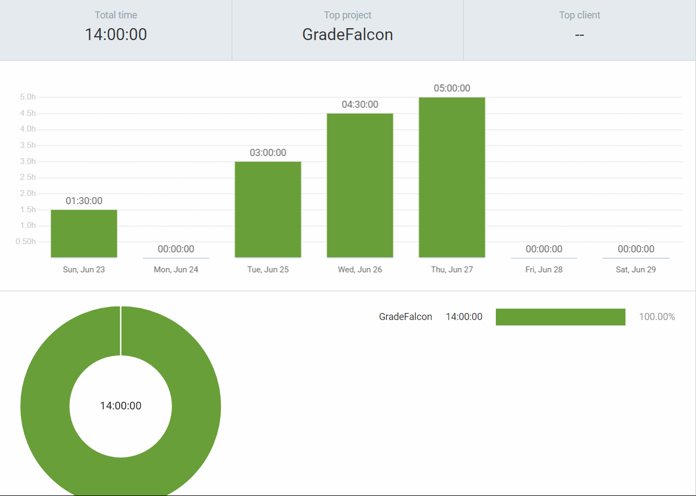
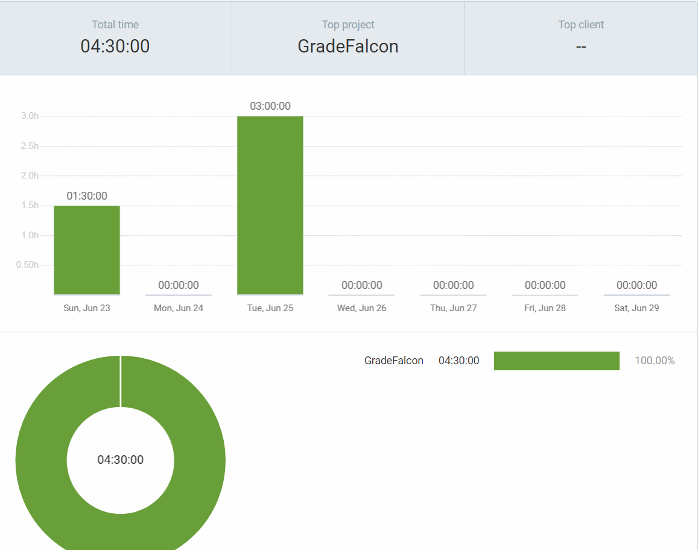
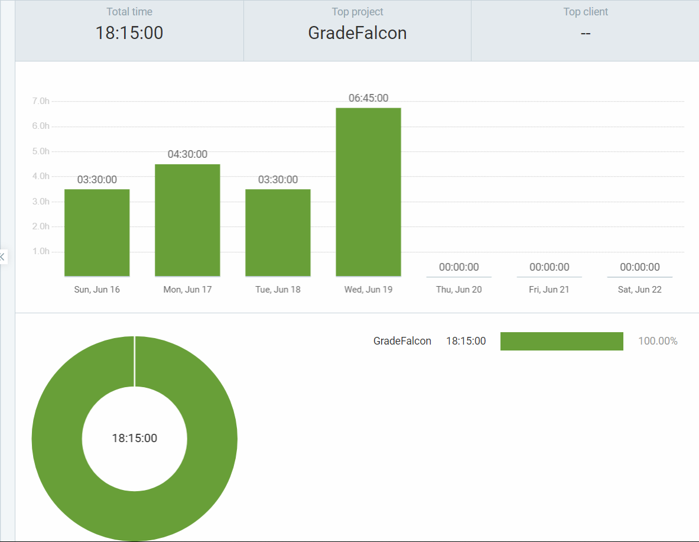
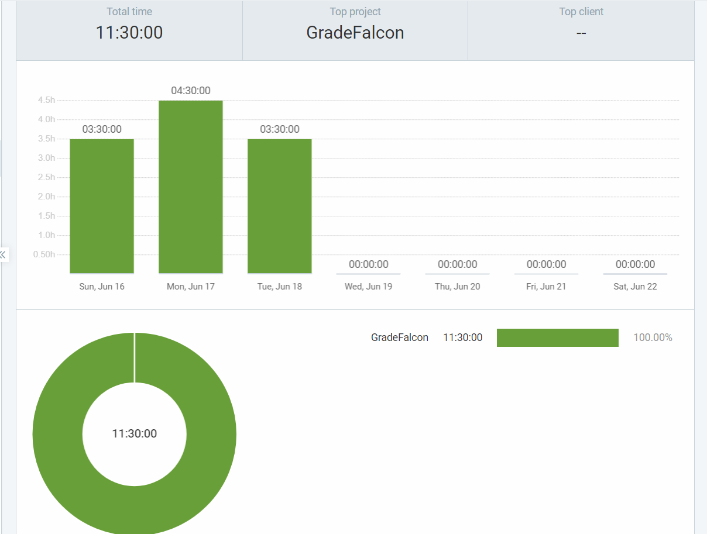
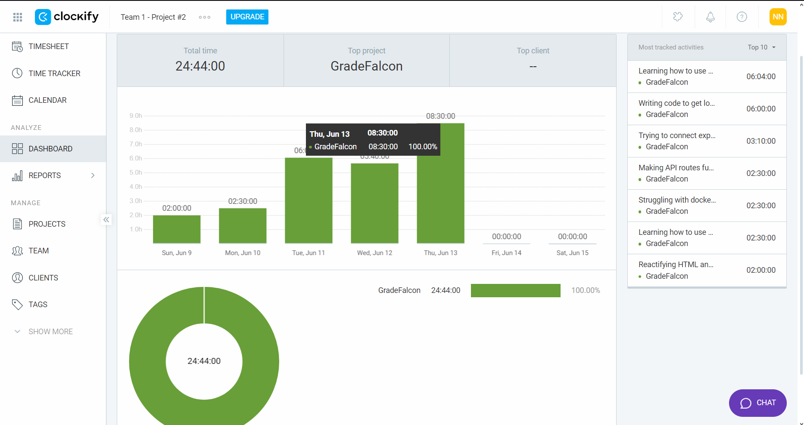
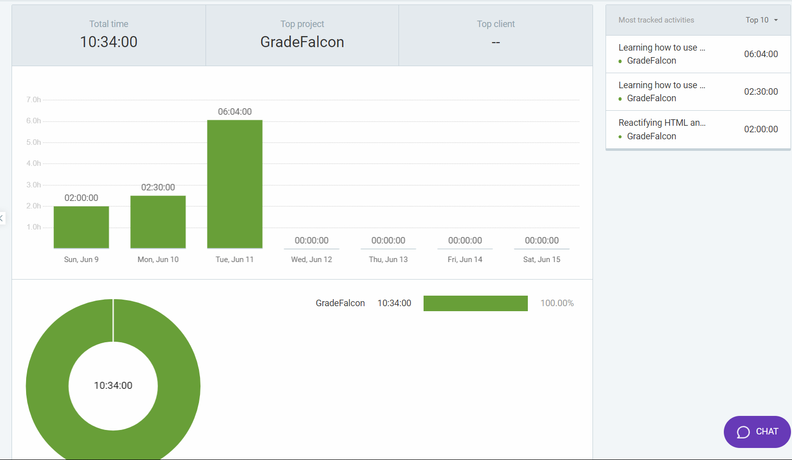

## Wednesday (26/6- 28/6)

### Timesheet
Clockify report

### Current Tasks (Provide sufficient detail)
  * #1: Setting up and Testing Drone
  * #2: Setting up Remote Server for Drone
  * #3: Researching/Setting up Cloud Provider

### Progress Update (since 6/18/2024) 
<table>
    <tr>
        <td><strong>TASK/ISSUE #</strong>
        </td>
        <td><strong>STATUS</strong>
        </td>
    </tr>
 <tr>
        <!-- Task/Issue # -->
        <td>Setting up and Testing Drone
        </td>
        <!-- Status -->
        <td>In Progress
        </td>
    </tr>
     <tr>
        <!-- Task/Issue # -->
        <td>Setting up Remote Server for Drone
        </td>
        <!-- Status -->
        <td>In Progress
        </td>
    </tr>
    <tr>
        <!-- Task/Issue # -->
        <td>Researching/Setting up Cloud Provider
        </td>
        <!-- Status -->
        <td>In Progress
        </td>
    </tr>

</table>

### Cycle Goal Review (Reflection: what went well, what was done, what didn't; Retrospective: how is the process going and why?)
In this cycle, I was able to regain momentum after a busy start to the week. My primary focus was on setting up Drone CI. Initially, I managed to configure it locally, but upon further consideration of the project's future and after reading feedback from other teams using Drone, I decided to conduct additional research to ensure we are implementing the best solution efficiently. I determined that setting up a remote server on a cloud provider for Drone would be more scalable and beneficial for our project. This aligns with our plan to use a cloud provider for managing exam PDF file storage. I have made significant progress in setting up this remote server during this cycle.

### Next Cycle Goals (What are you going to accomplish during the next cycle)
  * Set Up Remote server
  * Set up Cloud Provider
  * Set up Drone
  * Finish adding functionality for Admin View
  * Research the best more about computer vision and OMR

## Wednesday (22/6- 26/6)

### Timesheet
Clockify report

### Current Tasks (Provide sufficient detail)
  * #1: Start working on setting up CI/CD

### Progress Update (since 6/18/2024) 
<table>
    <tr>
        <td><strong>TASK/ISSUE #</strong>
        </td>
        <td><strong>STATUS</strong>
        </td>
    </tr>
 <tr>
        <!-- Task/Issue # -->
        <td>Start working on setting up CI/CD
        </td>
        <!-- Status -->
        <td>In Progress
        </td>
    </tr>

</table>

### Cycle Goal Review (Reflection: what went well, what was done, what didn't; Retrospective: how is the process going and why?)
This cycle I was a lot more busy than usual I am currently taking other classes in the semester of the summer so I had a final exams to study for. I was busy because my final exam was on Monday. I was still able to do a little bit of work but I intend to increase the pace and effiency of my work now!

### Next Cycle Goals (What are you going to accomplish during the next cycle)
  * Gte CI/CD connected and working.
  * Finishe adding functionality for Admin View
  * Research the best more about computer vision and OMR

## Wednesday (19/6- 21/6)

### Timesheet
Clockify report

### Current Tasks (Provide sufficient detail)
  * #1: Start working on setting up CI/CD
  * #2: Finish adding functionality too AdminViiew
  * #3: Ensure Protected Route works and in secure.

### Progress Update (since 6/18/2024) 
<table>
    <tr>
        <td><strong>TASK/ISSUE #</strong>
        </td>
        <td><strong>STATUS</strong>
        </td>
    </tr>
 <tr>
        <!-- Task/Issue # -->
        <td>Start working on setting up CI/CD
        </td>
        <!-- Status -->
        <td>In Progress
        </td>
    </tr>
 <tr>
        <!-- Task/Issue # -->
        <td>Start working on setting up CI/CD
        </td>
        <!-- Status -->
        <td>In Progress
        </td>
    </tr>
 <tr>
        <!-- Task/Issue # -->
        <td>Ensure Protected Route works and in secure
        </td>
        <!-- Status -->
        <td>In Progress
        </td>
    </tr>
</table>

### Cycle Goal Review (Reflection: what went well, what was done, what didn't; Retrospective: how is the process going and why?)
This cycle I was a little more busy than usual I am currently taking another class in the semester of the summer so I had a final assignment due and final exam revision to start. I was a little bit busy because my final exam is on Monday. I was still able to do a little bit of work but I intend to increase the pace and effiency of my work after this exam!

### Next Cycle Goals (What are you going to accomplish during the next cycle)
  * Gte CI/CD connected and working.
  * Finishe adding functionality for Admin View
  * Research the best more about computer vision and OMR
  * Ensure user permissiona and protected routes secure.

## Wednesday (15/6- 18/6)

### Timesheet
Clockify report

### Current Tasks (Provide sufficient detail)
  * #1: Redesign login/signup Page.
  * #2: Create Admin View frontend (Shell)
  * #3: Create User Management section (Admin View)
  * #4: Start working on setting up CI/CD
  * #5: Finish adding functionality too AdminViiew

### Progress Update (since 6/18/2024) 
<table>
    <tr>
        <td><strong>TASK/ISSUE #</strong>
        </td>
        <td><strong>STATUS</strong>
        </td>
    </tr>
    <tr>
        <!-- Task/Issue # -->
        <td>Redesign login/signup Page.
        </td>
        <!-- Status -->
        <td>Complete
        </td>
    </tr>
    <tr>
        <!-- Task/Issue # -->
        <td>Create Admin View frontend (Shell)
        </td>
        <!-- Status -->
        <td>Complete
        </td>
    </tr>
    <tr>
        <!-- Task/Issue # -->
        <td>Finish adding functionality too AdminViiew
        </td>
        <!-- Status -->
        <td>In Progress
        </td>
    </tr>
 <tr>
        <!-- Task/Issue # -->
        <td>Start working on setting up CI/CD
        </td>
        <!-- Status -->
        <td>In Progress
        </td>
    </tr>
 <tr>
        <!-- Task/Issue # -->
        <td>Start working on setting up CI/CD
        </td>
        <!-- Status -->
        <td>In Progress
        </td>
    </tr>
</table>

### Cycle Goal Review (Reflection: what went well, what was done, what didn't; Retrospective: how is the process going and why?)
This cycle was a litte more challenging than the rest because I had to take care of some personal issues that needed my attention, I likely feel like I was able to handle it very well and was still able to do a little bit of work. The main object was to redesign the signup/login page to allow role based authenication, and to also allow admins to create and add users to the system and maanage users. Now I that it is working I am working on connecting the CI/CD. I also did a little bit of research to increase my knowledge.

### Next Cycle Goals (What are you going to accomplish during the next cycle)
  * Gte CI/CD connected and working.
  * Finishe adding functionality for Admin View
  * Research the best more about computer vision and OMR

## Wednesday (12/6- 14/6)

### Timesheet
Clockify report

### Current Tasks (Provide sufficient detail)
  * #1: Writing fully functional login page
  * #2: Writing fully functional sign up page
  * #3: API routes for database query using express

### Progress Update (since 6/5/2024) 
<table>
    <tr>
        <td><strong>TASK/ISSUE #</strong>
        </td>
        <td><strong>STATUS</strong>
        </td>
    </tr>
    <tr>
        <!-- Task/Issue # -->
        <td>Writing fully functional login page
        </td>
        <!-- Status -->
        <td>Complete
        </td>
    </tr>
    <tr>
        <!-- Task/Issue # -->
        <td>Writing fully functional sign up page
        </td>
        <!-- Status -->
        <td>Complete
        </td>
    </tr>
    <tr>
        <!-- Task/Issue # -->
        <td>API routes for database query's using express
        </td>
        <!-- Status -->
        <td>In Progress
        </td>
    </tr>
</table>

### Cycle Goal Review (Reflection: what went well, what was done, what didn't; Retrospective: how is the process going and why?)
This cycle felt much longer than the rest I faced quite a few challenges with the technologies we were using mainly because I did not understand the technologies as well as I thought. I was struggling quite a bit with docker and express especially when it came to connecting to the database and making queries to and from. I think it was really challenging because of how complex postgre is. Thankyfully my teammates were able to help me out and were patient with me. 

### Next Cycle Goals (What are you going to accomplish during the next cycle)
  * Backend API making sure express is fully functional with the rest of the pages.
  * Create a little demo bubble sheet scanner to demo idea's.
  * Research the best place to store the pdf's either locally or the cloud and create a little demo.

## Wednesday (7/7- 12/7)

### Timesheet
Clockify report

### Current Tasks (Provide sufficient detail)
  * #1: Login frontend
  * #2: Sign up frontend
  * #3: Connecting Database to the frontend
  * #4: Writing frontend validation for database requests

### Progress Update (since 6/5/2024) 
<table>
    <tr>
        <td><strong>TASK/ISSUE #</strong>
        </td>
        <td><strong>STATUS</strong>
        </td>
    </tr>
    <tr>
        <!-- Task/Issue # -->
        <td>Login Frontend
        </td>
        <!-- Status -->
        <td>Complete
        </td>
    </tr>
    <tr>
        <!-- Task/Issue # -->
        <td>Sign Up Frontend
        </td>
        <!-- Status -->
        <td>Complete
        </td>
    </tr>
    <tr>
        <!-- Task/Issue # -->
        <td>Connecting to Database
        </td>
        <!-- Status -->
        <td>In Progress
        </td>
    </tr>
  <tr>
        <!-- Task/Issue # -->
        <td>Frontend Validation for requests
        </td>
        <!-- Status -->
        <td>In Progress
        </td>
    </tr>
</table>

### Cycle Goal Review (Reflection: what went well, what was done, what didn't; Retrospective: how is the process going and why?)
I managed to create the intial mockup for the login and sigup page using html and css for my team to review and now I have completed reformating the code to makee sure it abides by our design architecture guidelines about it being done in react with the use of express for routing. Now I am working to connecting it to the database and writing the frontend validation neccessary for authentication. I would have like to have had all this completed by the beginning to this week but a very hetic weekend has led me to not get us much work done as I wanted. I did quite a lot of knowledge refreshment in the areas of react, express and postgre over the weekend to make use I have the knowledge required to put my ideas into action. I want to be more productive this week and in the weeks to come.

### Next Cycle Goals (What are you going to accomplish during the next cycle)
  * Backend API making sure express is fully functional with the rest of the pages.
  * Create a little demo bubble sheet scanner to demo idea's.
  * Making the frontend fully functional.

### Personal Log
#### Applicable Date Range
**Week of 06/06/2024**

#### Tasks Worked On

- **Design Document:**
  - Finished my part of the design document.
  
- **Database Creation:**
  - Created the main database.
  
- **Frontend Development:**
  - Worked on making the frontend functional.
  
- **System Design Presentation:**
  - Writing my part of the script for the system design presentation.

#### Features and Associated Tasks

- **Database Creation:**
  - Designed and created the main database.
  
- **UI Development:**
  - Made the frontend functional.
  
- **Design Document:**
  - Completed my part of the design document.
  
- **System Design Presentation:**
  - Developed and wrote the script for the presentation.

#### Progress Summary

- **Completed:**
  - My part of the design document.
  - Database design and creation.
  
- **In Progress:**
  - UI Development from Figma mockups to a functional state.
  - Writing the system design presentation script.
  
#### Goals Recap

- **This Week's Goals:**
  - Finalize database design and review with teammates.
  - Create the first version of the frontend.
  
- **Next Cycle Plan (3-4 Days):**
  - Transform Figma UI mockups into a functional UI using HTML/CSS.
  - Finish database construction.
  - Research QR codes and YOLO/OpenCV.
  - Complete the script for the system design presentation.

# Personal Log

## Applicable Date Range
- Week of 04/06/2024

## Tasks Worked On
- **Database Design:**
  - Created database design structure and design models.
- **UI Development:**
  - Provided feedback on Figma UI mockups.
- **System Design Document:**
  - Contributed to the system design document.
- **Backend API Research:**
  - Researched Service Mesh, API Gateways, and Reverse Proxies.

## Features and Associated Tasks
- **Database Design:**
  - Designed database and data desgin diagrams.
- **UI Development:**
  - Reviewed and provided feedback on UI mockups.
- **System Design Document:**
  - Detailed system components and created design diagrams.
- **Backend API Research:**
  - Compared Service Mesh, API Gateways, and Reverse Proxies.

## Progress Summary
- **Completed:**
  - Technical requirement analysis.
  - Initial system design documentation.
  - Backend API research.
  - Design models.
  - Database design.
- **In Progress:**
  - UI Development from Figma mockups.
  - Constructing Database.

## Goals Recap
- **This Week's Goals:**
 - Finalize database design and review with teammates.
 - Investigate and construct the backend API.
 - Create the first version of the frontend.
- **Next Cycle Plan (3-4 Days):**
  - Transform Figma UI mockups into a functional UI using HTML/CSS.
  - Finish Database Constructiom.
  - Research QR codes and Yolo/Here’s your updated personal log for the week of 04/06/2024:

# Personal Log

## Applicable Date Range
- Week of 27/05/2024

## Tasks Worked On
- **System Architecture Design:**
  - Worked on creating the database and DataFlow design models.
- **Project Plan:**
  - Investigated technical requirements for the system.
  - Understood and documented the project's scope.
- **UI Elements:**
  - Worked on various UI elements for the project.

## Features and Associated Tasks
- **System Architecture Design:**
  - Created database and DataFlow design models.
  - Associated tasks: Designing database structure, creating DataFlow diagrams.
- **Project Planning:**
  - Investigated and documented technical requirements and project scope.
  - Associated tasks: Technical requirement analysis, project scope documentation.
- **Creating/Designing Logo:**
  - Designed the project's logo.
  - Associated tasks: Logo design, logo iterations.

## Progress Summary
- **Completed:**
  - Project plan documentation (Medium).
  - Technical requirement analysis (Medium).
  - Logo design (Medium).
- **In Progress:**
  - Database design (Large).
  - DataFlow design models (Large).

## Goals Recap
- **This Week's Goals:**
  - Investigate/start database and DataFlow design models.
  - Investigate and document technical requirements and project scope.
  - Design the project's logo.
- **Next Cycle Plan (3-4 Days):**
  - Finalize database design and review with teammates.
  - Investigate and construct the backend API.
  - Create the first version of the frontend.

