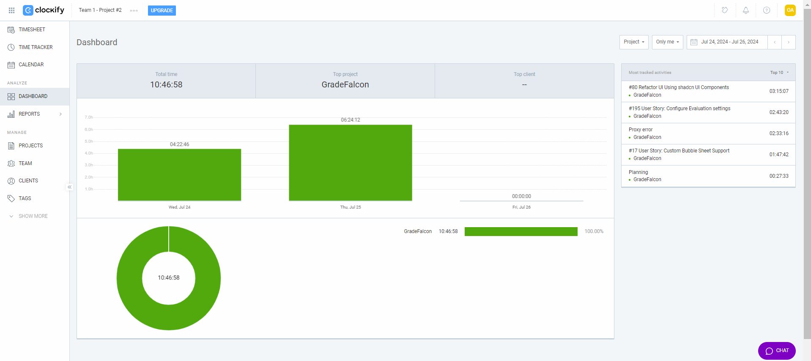
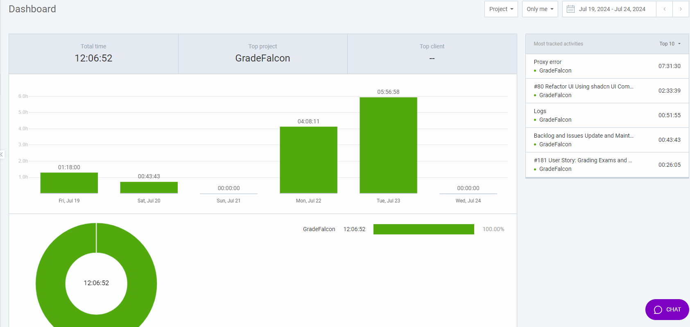

# Personal Log

## Friday (7/23-7/26)

### Timesheet
Clockify report

### Current Tasks (Provide sufficient detail)

1. **Grading Exams and Displaying Results on Frontend**
    1. Disabled modemon from restarting server when input is changed to avoid proxy error.

2. **Refactor UI Using shadcn UI Components**
    1. Merged Upload Exam feature.

3. **Custom Templates Support**
    1. looked into creating custom bubble sheets using latex and reportlab

4. **Configured Evaluation to have a custom marking schema for questions**    

### Progress Update (since 7/16/2024)

<table>
    <tr>
        <td><strong>TASK/ISSUE #</strong>
        </td>
        <td><strong>STATUS</strong>
        <tr>
        <tr>
        <td>#17-User Story: Custom Bubble Sheet Support
        </td>
        <td>In Progress
        </td>
    </tr>
                <tr>
        <td>Configure custom grading schema
        </td>
        <td>In Progress
        </td>
    </tr>
    </tr>
            <tr>
        <td>#80-Refactor UI Using shadcn UI Components
        </td>
        <td>In Review
        </td>
    </tr>
    </tr>
            </td>
        </tr>
        <tr>
        <td> #181-Grading Exams and Displaying Results on Frontend
        </td>
        <td>Completed
        </td>
    </tr>
    </tr>
     <tr>
        <td> #188-Implement Refactored Code and Implement Color-Coded Grading
        </td>
        <td>Completed
        </td>
    <tr>
</table> 

### Cycle Goal Review (Reflection: what went well, what was done, what didn't; Retrospective: how is the process going and why?)

- **What Went Well:**
  - The grading exam demo has been merged and we will no longer have issue with proxies now that we solved the root of the issue we can move forward easier.

- **What Was Done:**
  - Created custom grading schema
  - Fixed Proxy Error.

- **What Didn't Go Well:**
  - The proxy error which I thoguh fixed prior took too much time out of me but thankfully it is no longer an issue.

- **Retrospective:**
  - We are making strides in creating custom bubble sheets and custom grading schemas and have come up with a plan.

  ### Next Cycle Goals (What are you going to accomplish during the next cycle)

1. **Scale solution for multiple students**.

2. **Error detection and flagging**

3. **Work on custom bubble sheets**

## Wednesday (7/19-7/23)

### Timesheet
Clockify report

### Current Tasks (Provide sufficient detail)

1. **Grading Exams and Displaying Results on Frontend**
    1. Fixed Proxy error bug
    2. Tried to integrate Taefik API Gateway initially
    3. Display image of graded exam.

2. **Refactor UI Using shadcn UI Components**
    1. Refactored code to not create new css and only use shadcn root variables.
    2. Optimized the nav bar's look and correct the color to match shadcn theme.

3. **Custom Templates Support**
    1. Started work on custom bubble sheet using the existing OMR in place.

### Progress Update (since 7/16/2024)

<table>
    <tr>
        <td><strong>TASK/ISSUE #</strong>
        </td>
        <td><strong>STATUS</strong>
        <tr>
        <tr>
        <td>#17-User Story: Custom Bubble Sheet Support
        </td>
        <td>In Progress
        </td>
    </tr>
        </td>
        </tr>
        <tr>
        <td> #181-Grading Exams and Displaying Results on Frontend
        </td>
        <td>IN Review
        </td>
    </tr>
    </tr>
            <tr>
        <td>#80-Refactor UI Using shadcn UI Components
        </td>
        <td>In Review
        </td>
    </tr>
    </tr>
     <tr>
        <td> #188-Implement Refactored Code and Implement Color-Coded Grading
        </td>
        <td>Completed
        </td>
    <tr>
</table> 

### Cycle Goal Review (Reflection: what went well, what was done, what didn't; Retrospective: how is the process going and why?)

- **What Went Well:**
  - The grading exam demo finally works without the proxy error, still need to configure some settings.
  - The UI is .

- **What Was Done:**
  - Fixed Grade Exam pipeline functional.
  - Fixed Proxy Error.
  - Modified the NavBar and optimized the UI and restructure some CSS.

- **What Didn't Go Well:**
  - I went down a rabbit hole trying to fix the Proxy Error and looking to implement an API Gateway at the end it wasn't very helpful for our use case and I had to drop it. I sunk about 4 hours into that.

- **Retrospective:**
  -The Proxy error has been finally fixed and I have a better understanding of how to use the Promise function and chaining APIs and putting them in sequence.

  ### Next Cycle Goals (What are you going to accomplish during the next cycle)

1. **Scale solution for multiple students**.

2. **Help finish the UI for Shadcn**

3. **Work on custom bubble sheets**

## Friday (7/16-7/19)

### Timesheet
Clockify report

### Current Tasks (Provide sufficient detail)

1. **Grading Exams and Displaying Results on Frontend**
    1. Worked on sending exam to the omr, sending evaluation.json and getting examKey based on examID to write them to evaluation.json to grade exams.
    2. Create new API calls and modified the UploadExam page to receive examid.
    2. Display graded exam image on the frontend.

2. **Refactor UI Using shadcn UI Components**
    1. Helped fix merge conflicts and implementing the changes made using shadcn to be up to date with development.

3. **Implement Refactored Code and Implement Color-Coded Grading**
    1. Fixed some issues with border preprocessing and added script to delete the content of input after running the flask application.

### Progress Update (since 7/16/2024)

<table>
    <tr>
        <td><strong>TASK/ISSUE #</strong>
        </td>
        <td><strong>STATUS</strong>
        </td>
        </tr>
        <tr>
        <td> #181-Grading Exams and Displaying Results on Frontend
        </td>
        <td>In Progress
        </td>
    </tr>
    </tr>
            <tr>
        <td>#80-Refactor UI Using shadcn UI Components
        </td>
        <td>In Progress
        </td>
    </tr>
        <tr>
        <tr>
        <td>#17-User Story: Custom Bubble Sheet Support
        </td>
        <td>In Progress
        </td>
    </tr>
    </tr>
     <tr>
        <td> #188-Implement Refactored Code and Implement Color-Coded Grading
        </td>
        <td>Completed
        </td>
    <tr>
</table> 

### Cycle Goal Review (Reflection: what went well, what was done, what didn't; Retrospective: how is the process going and why?)

- **What Went Well:**
  - We have a demo for our grade exam features.
  - The new look of the UI is much cleaner with Shadcn.

- **What Was Done:**
  - Made Grade Exam pipeline functional.
  - Create New Uplaod Exam page
  - Added backend logic to get answerkey and write in evaluation.json and send to the omr container.

- **What Didn't Go Well:**
  - Getting the frontend, backend and omr all to work together took for this task took a lot of time and we are still facing proxy errors.

- **Retrospective:**
  - We have a nice demo to display on friday.

  ### Next Cycle Goals (What are you going to accomplish during the next cycle)

1. **Scale solution for multiple students**.

2. **Help finish the UI for Shadcn**

3. **Optimize exam upload pipeline and display status update while exams are being graded**

## Wednesday (7/11-7/116)

### Timesheet
Clockify report

### Current Tasks (Provide sufficient detail)

1. **Implement Refactored Code and Implement Color-Coded Grading**
    1. Worked on implementing a different iteration of our OMR code
    2. Reworked image conversion.
    3. Reworked BorderPreprocessing
    4. Configured Grading with coloured ouput to display graded exam.

2. **Refactor UI Using shadcn UI Components**
    1. Worked on refactoring the dashboard
    2. Implemented cards, modified icons and modified the table.
    3. Removed unwanted css that was causing conflict.

3. **Labeling images to create a YOLO model**
    1. Labeled Images for YOLO model for later use.

4. **Revamp Sign-In and Sign-Up, Logout to Use Auth0**
    1. Setup Auth0, did research on implementation in the frontend, backend and database. The frontend will pass a jwt token to the backend to protect API calls and use Role Based Access to restrict API calls. The Database will be refactored to use a central userID table, the jwt token will contain the userID which would be passed to the Database to query data.
    2. Worked on the implemention of Auth0 and refactoring code to implement authentication, Sign in and Logout on the frotend.
    2. Delegated to Bennett and instructed on how to approach the task.

### Progress Update (since 7/11/2024)

<table>
    <tr>
        <td><strong>TASK/ISSUE #</strong>
        </td>
        <td><strong>STATUS</strong>
        </td>
        </tr>
        <tr>
        <td> #181-Grading Exams and Displaying Results on Frontend
        </td>
        <td>In Progress
        </td>
    </tr>
    </tr>
            <tr>
        <td>#80-Refactor UI Using shadcn UI Components
        </td>
        <td>In Progress
        </td>
    </tr>
        <tr>
        <tr>
        <td>#17-User Story: Custom Bubble Sheet Support
        </td>
        <td>In Progress
        </td>
    </tr>
    </tr>
        <tr>
        <td> #77-Revamp Sign-In and Sign-Up to Use Auth0
        </td>
        <td>In Progress
        </td>
    </tr>
     <tr>
        <td> #188-Implement Refactored Code and Implement Color-Coded Grading
        </td>
        <td>In review
        </td>
    </tr>
        <tr>
        <td>#143 - Parse and Confirm CSV from OMR
        </td>
        <td>Completed
        </td>
    </tr>
    <tr>
        <td> #161- Integrate Flask Service to Trigger OMR Processing on File Upload
        </td>
        <td>Completed
        </td>
    </tr>
    <tr>
</table> 

### Cycle Goal Review (Reflection: what went well, what was done, what didn't; Retrospective: how is the process going and why?)

- **What Went Well:**
  - We have a new Dashboard.
  - Grading with color coding is now functional.
  - Auth0 is finally underway.

- **What Was Done:**
  - New Dashboard
  - Implemented Colored grading of exam page and refactored code with border preprocessing and conversion to images.

- **What Didn't Go Well:**
  - There was a lot of refactoring and debugging to be done. We are revamping features and improving already existing features and we need to make a bit more progress on the rest of the application.

- **Retrospective:**
  - Things are underway and I can see light at the end of the tunnel, things are starting to come together a bit better now.

  ### Next Cycle Goals (What are you going to accomplish during the next cycle)

1. **Finalize: Grading Exams and Displaying Results on Frontend**.

2. **Get at least 3 to 4 more pages refactored using Shadcn**

## Friday (7/09-7/11)

### Timesheet
Clockify report

### Current Tasks (Provide sufficient detail)

1. **Integrate Flask Service to Trigger OMR Processing on File Upload**
    1. Worked on debugging Proxy error due to JSON Copy API call.
    2. used manual command to copy to shared volume isntead, will need to automate the process.
2. **Refactor UI Using shadcn UI Components**
    1. Set up the frontend to use shadcn UI components.
    2. made new installations and added tailwin css.
    3. Installed components.
    4. Fixed cross dependency error in module installation using babel
    5. Set up Babel config file.
    6. Made a demo to work off from for future design revamping.

3. **Labeling images to create a YOLO model**
    1. I plan on creating a YOLO model to automatically generate JSON templates based on the instructors exam sheet.

### Progress Update (since 6/28/2024)
<table>
    <tr>
        <td><strong>TASK/ISSUE #</strong>
        </td>
        <td><strong>STATUS</strong>
        </td>
    </tr>

        <tr>
        <td>#143 - Parse and Confirm CSV from OMR
        </td>
        <td>In Progress
        </td>
    </tr>
    <tr>
        <td> #161- Integrate Flask Service to Trigger OMR Processing on File Upload
        </td>
        <td>In Review
        </td>
    </tr>
    <tr>
        <tr>
        <td>#80-Refactor UI Using shadcn UI Components
        </td>
        <td>In Progress
        </td>
    </tr>
        <tr>
        <tr>
        <td>#17-User Story: Custom Bubble Sheet Support
        </td>
        <td>In Progress
        </td>
    </tr>
</table> 

### Cycle Goal Review (Reflection: what went well, what was done, what didn't; Retrospective: how is the process going and why?)

- **What Went Well:**
  - Shadcn is now properly functional and all dependencies should be present, there should not be problems with installation and the import of jsx to js files shouldn't be a problem thanks to babel

- **What Was Done:**
 - Flask app is functional
  - Shadcn now can be properly integrated, no dependencies or set needed.

- **What Didn't Go Well:**
  - Debugging for both the features I worked on took most of my time, I ran into road blocks and didn't do enough progress.

- **Retrospective:**
  - I am looking forward to revamping the UI.

  ### Next Cycle Goals (What are you going to accomplish during the next cycle)

1. **Parse and Confirm CSV from OMR**
   - Work on creating standard bubble sheet using a UI to create json templates.
   - Work in the confirmexamkey page.
   - Work on parsing file names and storing them.

2. **Handle Big File Uploads:**

3. **Parse Student Information and Link it to the Corresponding Scan**

4. **Refactor UI Using shadcn UI Components**

## Wednesday (7/04-7/09)

### Timesheet
Clockify report

### Current Tasks (Provide sufficient detail)

1. **Parse and Confirm CSV from OMR**
    1. Worked on sending files to shared volume and then sending the output back to a shared volume to which the backend has access
2. **Integrate Flask Service to Trigger OMR Processing on File Upload**
    1. Worked on setting up Flask app and running our OMR script when the shared volume receives the pdf file
    2. Modified the shared volume, added json to be sent alongside pdf.

3. **Refactor UI Using shadcn UI Components**
    1. Set up the frontend to use shadcn UI components.
    2. made new installations and added tailwin css.
### Progress Update (since 6/28/2024)
<table>
    <tr>
        <td><strong>TASK/ISSUE #</strong>
        </td>
        <td><strong>STATUS</strong>
        </td>
    </tr>
    <tr>
        <td>#10 - User Story: Develop Computer Vision Model
        </td>
        <td>Complete
        </td>
    </tr>
        <tr>
        <td>#143 - Parse and Confirm CSV from OMR
        </td>
        <td>In Progress
        </td>
    </tr>
    <tr>
        <td> #161- Integrate Flask Service to Trigger OMR Processing on File Upload
        </td>
        <td>In Review
        </td>
    </tr>
    <tr>
        <tr>
        <td>#80-Refactor UI Using shadcn UI Components
        </td>
        <td>In Progress
        </td>
    </tr>
</table> 

### Cycle Goal Review (Reflection: what went well, what was done, what didn't; Retrospective: how is the process going and why?)

- **What Went Well:**
  - The flask API call works and the shared volume is being accessed by both containers

- **What Was Done:**
 - Flask app is functional
  - Shared volumes are functional
  - Json file send alongside pdf
  - Set up shadcn dependencies and necessary libraries to use components.

- **What Didn't Go Well:**
  - Debugging the shared volumes took too much time.
  - We're having a proxy error on our frontend container which I could not solve.
  - We have to give up on the idea of using AWS.
  - Setting up shadcn dependencies took longer than expected.
- **Retrospective:**
  - The flask app is working properly and as expected withtout the need to restart the container, we found a good solution to our initial problem from last week.

  ### Next Cycle Goals (What are you going to accomplish during the next cycle)

1. **Parse and Confirm CSV from OMR**
   - Work on creating standard bubble sheet using a UI to create json templates.
   - Work in the confirmexamkey page.
   - Work on parsing file names and storing them.

2. **Handle Big File Uploads:**

3. **Parse Student Information and Link it to the Corresponding Scan**

## Friday (7/02-7/04)

### Timesheet
Clockify report

### Current Tasks (Provide sufficient detail)

1. **Parse and Confirm CSV from OMR**
    1. Worked on creating a frontend that interprets the results of the csv from the OMR
    2. Worked on implementing Backend functionality to parse csv from the omr
2. **Develop a script to run OMR container when file has been uploaded**
    1. Started working on developing a script to run the OMR container using RabbitMQ and a worker container
2. **Worked on presentation**
### Progress Update (since 6/28/2024)
<table>
    <tr>
        <td><strong>TASK/ISSUE #</strong>
        </td>
        <td><strong>STATUS</strong>
        </td>
    </tr>
    <tr>
        <td>#10 - User Story: Develop Computer Vision Model
        </td>
        <td>In Progress
        </td>
    </tr>
        <tr>
        <td>#143 - Parse and Confirm CSV from OMR
        </td>
        <td>In Progress
        </td>
    </tr>
    <tr>
        <td> #149 - Develop a script to run OMR container when file has been uploaded
        </td>
        <td>In Progress
        </td>
    </tr>
    <tr>
        <tr>
        <td>#135 - Convert PDF to images
        </td>
        <td>Completed
        </td>
    </tr>
        <td>#126 - Create a docker container for the OMR
        </td>
        <td>Completed
        </td>
    </tr>
    <tr>
        <td>#132 - Add Borders to Image Preprocessing
        </td>
        <td>Completed
        </td>
    </tr>
</table> 

### Cycle Goal Review (Reflection: what went well, what was done, what didn't; Retrospective: how is the process going and why?)

- **What Went Well:**
  - Did some good progress on the implementation of RabbitMQ although it needs to be evaluated.
  - I finished the slides for the presentation.
  - Made some progress on reading csv output from omr and sending it to the backend.

- **What Was Done:**
 - Created worker container and implemented RabbitMQ.
  - Finished the presentation
  - Worked reading csv output from omr and sending it to the backend.
  - Prepared presentation
  - Updated frontend for the uploadexamkey page and added a confirmexamkey page.

- **What Didn't Go Well:**
  - I was very sick and this has affected my productivity this cycle.
  - We had to do a lot of back and forth between team members to agree on the folder structure for AWS and there was a lot of repetition in our discussion about
    our approach to sending files between our backend and omr.
  - Minor issues with dependencies the worker container.
  - Had to spend some time to get familiar RabbitMQ.

- **Retrospective:**
  - This was a difficult cycle as I was sick and I was hoping to get more done for the demo.
  - I look forward to having the confirmExamKey page working.

  ### Next Cycle Goals (What are you going to accomplish during the next cycle)

1. **OMR:**
   - Work on creating standard bubble sheet using a UI to create json templates.
   - Run the OMR container using the worker and RabbitMQ.
   - Integrate AWS into our structure.

3. **Handle Big File Uploads:**

4. **Parse Student Information and Link it to the Corresponding Scan**

## Wednesday (6/28-7/02)

### Timesheet
Clockify report

### Current Tasks (Provide sufficient detail)

1. **Containerization and OMRChecker Integration**
    1. Added Dockerfile and modified docker-compose file.
    2. Integrated OMRChecker as the OMR solution of choice.
    3. Made necessary changes to ensure images without borders are processed correctly.
2. **PDF to Image Conversion**
    1. Implemented conversion from PDFs to images within the OMR module.
    2. Added required dependencies in requirements.txt and Dockerfile.
    3. Modified entry.py to process PDFs to images using pdf2images and handle paths correctly.
3. **Front-End Development**
    1. Created the Upload Exams page.
    2. Made minor CSS changes to the navbar.
    3. Updated ExamRoutes.js and modified ExamBoard to include the Grade Exam page.
4. **Dashboard Updates**
    1. Updated Dashboard.js to read from the database.
    2. Displayed all classes and exams.
    3. Implemented a cycle card color function using a color array.
5. **Model Training and Image Labeling**
    1. Labeled images and trained model using Roboflow.
    2. Determined that OpenCV suffices for detecting question boxes on a page without additional model training.
6. **Data Visualization Backend Functionality**
    1. Assisted in fixing issues related to data visualization backend functionality.

### Progress Update (since 6/28/2024)
<table>
    <tr>
        <td><strong>TASK/ISSUE #</strong>
        </td>
        <td><strong>STATUS</strong>
        </td>
    </tr>
    <tr>
        <td>#10 - User Story: Develop Computer Vision Model
        </td>
        <td>In Progress
        </td>
    </tr>
    <tr>
        <tr>
        <td>#135 - Convert PDF to images
        </td>
        <td>In Review
        </td>
    </tr>
        <td>#126 - Create a docker container for the OMR
        </td>
        <td>Completed
        </td>
    </tr>
    <tr>
        <td>#132 - Add Borders to Image Preprocessing
        </td>
        <td>Completed
        </td>
    </tr>
    <tr>
        <td>#125 - Instructor Dashboard: Display classes
        </td>
        <td>Completed
        </td>
    </tr>
    <tr>
        <td>#124 - Instructor Dashboard: Display exams
        </td>
        <td>Completed
        </td>
    </tr>
</table> 

### Cycle Goal Review (Reflection: what went well, what was done, what didn't; Retrospective: how is the process going and why?)

- **What Went Well:**
  - Successful integration of OMRChecker and containerization.
  - Implemented Border integrategration within the OMR's preprocessing stage
  - Efficient implementation of PDF to image conversion.
  - Smooth updates to the Dashboard with accurate data display.

- **What Was Done:**
  - Added Dockerfile and modified docker-compose file.
  - Integrated OMRChecker.
  - Implemented PDF to image conversion.
  - Implemented Image Preprocessing for Border implementation.
  - Created Upload Exams page and updated relevant front-end components.
  - Updated Dashboard to display classes and exams from the database.
  - Labeled images and confirmed using Roboflow and YOLO for detecting question boxes (ended up not using it).

- **What Didn't Go Well:**
  - Minor issues with template schema adjustments and alignment.
  - Initial errors with path handling in entry.py which required debugging.
  - Minor issues with dependencies for the pdf to image conversion.
  - Had to spend some time to get familiar with the open source code base for the OMR we're using.

- **Retrospective:**
  - This was probably one of my most productive weeks and I feel pretty accomplished to be honest I got a bunch of features to get over the line and me and Ahmed are making some good progress on the OMR.
  - I am excited about the progress that was made this cycle and I look forward to implementing the OMR with the Backend and Frontend.
  - Moving forward, we need to figure out :
      - how to test the OMR, 
      - connect the OMR to our backend
      - handle big file uploads (we've been in discussion about that).
      - use QR code for pages perhaps
      - assign pages to corresponding students

  ### Next Cycle Goals (What are you going to accomplish during the next cycle)

1. **OMR:**
   - Work on creating standard bubble sheet using a UI to create json templates.

2. **Connect OMR to Backend**

3. **Handle Big File Uploads:**

4. **Parse Student Information and Link it to the Corresponding Scan**

5. **Get a Demo Working for the OMR with it integrated to the Backend and Frontend**

## Friday (6/26-6/28)

### Timesheet
Clockify report

### Current Tasks (Provide sufficient detail)

1. **Auth0 Integration**

    1. **Worked on backend API calls, setting up user roles using Auth0 extensions**
    2. **Modified API calls to use JWT tokens from Auth0 instead of express sessions**
    3. **Started looking into setting up sign-up functionality with Auth0**

2. **Computer Vision Model for OMR**

    1. **Continued research on existing frameworks using OpenCV**
    2. **Implementation of YOLO for object detection**
    3. **Worked on image labeling using RoboFlow**

### Progress Update (since 6/26/2024)
<table>
    <tr>
        <td><strong>TASK/ISSUE #</strong>
        </td>
        <td><strong>STATUS</strong>
        </td>
    </tr>
    <tr>
        <td>#61 - Create User Roles and Permissions, Auth0
        </td>
        <td>In Progress
        </td>
    </tr>
    <tr>
        <td>#10 - User Story: Develop Computer Vision Model
        </td>
        <td>In Progress
        </td>
    </tr>
</table> 

### Cycle Goal Review (Reflection: what went well, what was done, what didn't; Retrospective: how is the process going and why?)

- **What Went Well:**
  - Made significant progress on Auth0 backend integration
  - Enhanced API security by switching to JWT tokens
  - Continued advancement on the computer vision model and image labeling

- **What Was Done:**
  - Worked on Auth0 backend API calls and user roles
  - Started setting up sign-up functionality with Auth0
  - Researched and started implementing YOLO with OpenCV for the OMR project
  - Worked on image labeling using RoboFlow

- **What Didn't Go Well:**
  - Auth0 has proven to be quite complicated with a lot of documentation and a lot of code restructuring required
  - More progress needed on Auth0 draft
  - Still need to advance further on the computer vision model

- **Retrospective:**
  - Backend implementation for Auth0 is progressing well
  - Continued efforts on OMR with promising advancements

  ### Next Cycle Goals (What are you going to accomplish during the next cycle)

1. **OMR:**
   - Work on implementing features for exam creation and Optical Mark Recognition (OMR).

2. **Correct some features on the instructor Dashboard:**
   - Implement role-based authentication to manage different user types.

## Wednesday (6/20- 6/26)

### Timesheet
Clockify report

### Current Tasks (Provide sufficient detail)

1. **Continued work on Auth0 Draft**

    1. **Updated Account Settings and Account modification features to implement Auth0**

    2. **Started implementation on the backend**

      
 2. **Finalized Refactored File Structure and code for Maintainability on both the Frontend and Backend notably implementing the new exam functionality**

      1. **Folder Structure Creation**:
        - Established a clear and organized folder structure for the backend, with a focus on the exams functionality:
          - `controllers/`: For business logic related to exams.
          - `middleware/`: For middleware functions related to exams.
          - `routes/`: For route handlers related to exams.
          - `utils/`: For utility functions used by the exams functionality.

      2. **Controllers**:
        - Created `controllers/examController.js` to handle all exam-related business logic:
          - **`saveQuestions`**: Saves solution questions and answers to the database.
          - **`newExam`**: Handles the creation of a new exam record for a student.
          - **`examBoard`**: Retrieves and displays classes and their associated exams for an instructor.

      3. **Routes**:
        - Created `routes/examRoutes.js` to define all endpoints related to exams:
          - **`POST /saveQuestions`**: Endpoint to save questions and answers.
          - **`POST /NewExam/:class_id`**: Endpoint to create a new exam for a class.
          - **`POST /ExamBoard`**: Endpoint to display classes and their exams for an instructor.

      4. **Middleware**:
        - Updated `middleware/paramMiddleware.js` to handle class-related parameters, ensuring that `class_id` is correctly saved in the session.

      5. **Database Utility**:
        - Utilized `utils/db.js` for database connection pooling, ensuring efficient and reliable database interactions for exam-related queries.

  3. **Researched and build new container for OMR**

### Progress Update (since 20/6/2024)
<table>
    <tr>
        <td><strong>TASK/ISSUE #</strong>
        </td>
        <td><strong>STATUS</strong>
        </td>
    </tr>
    <tr>
        <td>#98 - Refactor Frontend Structure for Improved Maintainability 
        </td>
        <td>Complete
        </td>
    </tr>
    <tr>
        <td>#97 - Refactor Backend Structure for Improved Maintainability 
        </td>
        <td>Complete
        </td>
    </tr>
    </tr>
        <tr>
        <td>#61 - Create User Roles and Permissions, Auth0
        </td>
        <td>In Progress
        </td>
    </tr>
        </tr>
        <tr>
        <td>#10 - User Story: Develop Computer Vision Model
         </td>
        <td>In Progress
        </td>
    </tr>

</table>

### Cycle Goal Review (Reflection: what went well, what was done, what didn't; Retrospective: how is the process going and why?)
- **What Went Well:**
  - Implemented new features within refactored code
  - Implement Account modification using Auth0, refined draft
  - Advanced on OMR and worked on containerizing code

- **What Was Done:**
  - Finalized Directory refactoring
  - Fixed Bug with testing 
  - Progressed on Auth0 draft
  - Research on OMR implementaiton

- **What Didn't Go Well:**
  - Took a bunch of time to implement new features from a different branch into the new directory structure
  - Still need to advance more on the Auth0 draft
  - Still need to do more work on the OMR.
  - I feel like I have too many things to juggle.

- **Retrospective:**
  - Started looking into the backend implementation for Auth0.
  - Finalized Directory restructure.
  - Advancing on OMR.

### Next Cycle Goals (What are you going to accomplish during the next cycle)

1. **OMR:**
   - Work on implementing features for exam creation and Optical Mark Recognition (OMR).

2. **Role-Based Authentication:**
   - Implement role-based authentication to manage different user types and work on implementation of Auth0 for session management and for the Backend.

## Friday (6/18- 6/20)

### Timesheet
Clockify report

### Current Tasks (Provide sufficient detail)

1. **Implement Class Creation Functionality**
   - Made some final changes to this feature: Verify on the backend if the class and student exist in the database. If not, create them and update the relevant tables, particularly the enrollment table, as per the ER diagram. The enrollment table uses unique instructor_id and course_id to allow instructors to have multiple courses with the same name. If the class exists, use the existing class_id.
   - I most notably added a feature to notify the user on the front-end if the class already exists. Display a toast message confirming the class creation and then navigate the user to the class-management tab.

2. **Integrate Auth0 for Authentication and Authorization**

    1. **Install Auth0 SDK**:
      - Installed Auth0 React SDK using `npm install @auth0/auth0-react`.

    2. **Configure Auth0Provider in `App.js`**:
      - Wrapped the application with `Auth0Provider` to enable Auth0 across the app.
      - Configured the Auth0 provider with the domain and client ID.

    3. **Update `ProtectedRoute` Component**:
      - Modified the `ProtectedRoute` component to use Auth0's authentication status.
      - Ensured only authenticated users can access protected routes.

    4. **Update `Login` Component**:
      - Replaced manual login handling with Auth0's `loginWithRedirect` method.
      - Simplified the login process by leveraging Auth0's authentication.

    5. **Add `LogoutButton` Component**:
      - Created a `LogoutButton` component using Auth0's `logout` method.
      - Configured the button to redirect users to the Auth0 logout endpoint and then back to the application.

    6. **Add `Profile` Component**:
      - Created a `Profile` component to display user information such as name and profile picture using Auth0.
      - Used the `useAuth0` hook to fetch and display user profile details.

    7. **Update `NavBar` Component**:
      - Integrated `Profile` and `LogoutButton` components into the `NavBar`.
      - Ensured the `NavBar` displays user information and includes a logout option.

    8. **Configure Auth0 Application Settings**:
      - Set the following URLs in the Auth0 application settings:
        - **Allowed Callback URLs**: `http://localhost:3000`
        - **Allowed Logout URLs**: `http://localhost:3000`
        - **Allowed Web Origins**: `http://localhost:3000`
      - Prepared similar configurations for the production environment with the appropriate domain.
      
  3. **Refactored File Structure and code for Maintainability on both the Frontend and Backend**

  3. **Started work on Computer Vision model**

### Progress Update (since 18/6/2024)
<table>
    <tr>
        <td><strong>TASK/ISSUE #</strong>
        </td>
        <td><strong>STATUS</strong>
        </td>
    </tr>
    <tr>
        <td>#82 - Implement Class Creation Functionality
        </td>
        <td>Complete
        </td>
    </tr>
    <tr>
        <td>#54 - User Story: Import Class as a CSV file
        </td>
        <td>Complete
        </td>
    </tr>
    <tr>
        <td>#21 - User Story: Create and Manage Classes
        </td>
        <td>Complete
        </td>
    </tr>
    <tr>
        <td>#97 - Refactor Backend Structure for Improved Maintainability
        </td>
        <td>In Progress
        </td>
    </tr>
        <tr>
        <td>#98 - Refactor Frontend Structure for Improved Maintainability
        </td>
        <td>In Progress
        </td>
    </tr>
        <tr>
        <td>#61 - Create User Roles and Permissions, Auth0
        </td>
        <td>In Progress
        </td>
    </tr>
        </tr>
        <tr>
        <td>#10 - User Story: Develop Computer Vision Model
         </td>
        <td>In Progress
        </td>
    </tr>

</table>

### Cycle Goal Review (Reflection: what went well, what was done, what didn't; Retrospective: how is the process going and why?)
- **What Went Well:**
  - Refactored code successfully
  - Got a draft for the Auth0 running

- **What Was Done:**
  -  added a feature to notify the user on the front-end if the class already exists. Display a toast message confirming the class creation and then navigate the user to the class-management tab.
  - Refactored login and sign up with Auth0
  - Refactor Backend and Frontend

- **What Didn't Go Well:**
  - Before trying Auth0 I tried a different 3rd party service authentication Logto but had dependencies issues half way through my setup so I had to ditch it and essently lost about 5h of work. 
  - Refactoring the code in include Auth0 is proving to be a daunting task and I don't know if it's worth it
  - Had to do a bunch of code review on big PRs.

- **Retrospective:**
  - Got a draft running for Auth0.
  - Reorganized file structure.
  - Got started on Computer Vision model.

### Next Cycle Goals (What are you going to accomplish during the next cycle)

1. **OMR:**
   - Work on implementing features for exam creation and Optical Mark Recognition (OMR).

2. **Role-Based Authentication:**
   - Implement role-based authentication to manage different user types.

4. **Documentation and Backend Testing:**
   - Document the new features and improvements.
   - Write unit tests for the new functionalities to ensure reliability.

5. **Possibly revisit UI:**

## Wednesday (6/14- 6/18)

### Timesheet
Clockify report

### Current Tasks (Provide sufficient detail)

1. **Implement Class Creation Functionality**
   - Add functionality to create classes, including adding the Instructor ID and Class ID to the database.

2. **User Story: Import Class as a CSV file**
   - Develop the functionality to import classes with student data from CSV files.
   - Ensure that each class is associated with an instructor and has a unique combination of instructor ID and course ID.
   - Validate student data before inserting it into the database.

3. **User Story: Create and Manage Classes**
   - Enable class creation and management, ensuring proper association with instructors.
   - Implement features to manage class details and enrollments.

### Progress Update (since 14/6/2024)
<table>
    <tr>
        <td><strong>TASK/ISSUE #</strong>
        </td>
        <td><strong>STATUS</strong>
        </td>
    </tr>
    <tr>
        <td>#82 - Implement Class Creation Functionality
        </td>
        <td>In Progress
        </td>
    </tr>
    <tr>
        <td>#54 - User Story: Import Class as a CSV file
        </td>
        <td>In Progress
        </td>
    </tr>
    <tr>
        <td>#21 - User Story: Create and Manage Classes
        </td>
        <td>In Progress
        </td>
    </tr>
    <tr>
        <td>Student Data Validation
        </td>
        <td>Complete
        </td>
    </tr>
    <tr>
        <td>Implement Route Protection
        </td>
        <td>Complete
        </td>
    </tr>
</table>

### Cycle Goal Review (Reflection: what went well, what was done, what didn't; Retrospective: how is the process going and why?)
- **What Went Well:**
  - Successfully implemented create new class feature.
  - Improved validation for student data during import.

- **What Was Done:**
  - Developed server-side logic to handle class and student data import.
  - Enhanced client-side code to fetch session info and validate student data before sending it to the server.

- **What Didn't Go Well:**
  - Initial issues with session cookie storage were resolved by adjusting session middleware settings.
  - Debugging and parsing the csv file properly took longer than expected,  sending the file over to the backend as well was a hassle.

- **Retrospective:**
  - Some good progress was done in regard to the create class feature.
  - Need to assign tasks to team members stragically.
  - need to reevaluate some UI design choices and some of the code logic in our server.js file to take into account, RBAC, authentication, route protection and encryption.

### Next Cycle Goals (What are you going to accomplish during the next cycle)
1. **Exam Creation and OMR:**
   - Work on implementing features for exam creation and Optical Mark Recognition (OMR).

2. **Role-Based Authentication:**
   - Implement role-based authentication to manage different user types.

3. **Server.js Adjustments:**
   - Adjust the server.js code to handle all user types effectively.

4. **Documentation and Backend Testing:**
   - Document the new features and improvements.
   - Write unit tests for the new functionalities to ensure reliability.

5. **CSV Import Feature Refinement:**
   - Enhance the CSV import feature to handle edge cases and improve error handling.
   - Implement feedback messages for successful and failed imports.

## Friday (6/12- 6/14)

### Timesheet
Clockify report

### Current Tasks (Provide sufficient detail)
1. **Session Management Implementation**
   - Implemented session management to replace JWT authentication.
   - Stored session information in cookies.
   - User ID now stored in cookies for session tracking.

2. **Login Feature Development**
   - Created a mock login page.
   - Set up navigation to the dashboard page post-login.
   - Added route protection to authenticate access to certain pages.

3. **Database Integration**
   - Set up Express application with PostgreSQL integration.
   - Ensured the database connection works using Express.js.
   - Installed necessary packages: pg, jsonwebtoken, and body-parser.
   - Removed bcrypt after initial setup.

### Progress Update (since 6/5/2024)
<table>
    <tr>
        <td><strong>TASK/ISSUE #</strong>
        </td>
        <td><strong>STATUS</strong>
        </td>
    </tr>
    <tr>
        <!-- Task/Issue # -->
        <td>#12 Setup Express Application with PostgreSQL Integration
        </td>
        <td>Complete
        </td>
    </tr>
    <tr>
        <!-- Task/Issue # -->
        <td>#55 Implement Session Management and Creation
        </td>
        <td>Complete
        </td>
    </tr>
    <tr>
        <!-- Task/Issue # -->
        <td>#62 Instructor Login and Authentication
        </td>
        <td>Complete
        </td>
    </tr>
    <tr>
        <!-- Task/Issue # -->
        <td>Implement Route Protection
        </td>
        <td>Complete
        </td>
    </tr>
</table>

### Cycle Goal Review (Reflection: what went well, what was done, what didn't; Retrospective: how is the process going and why?)
- **What Went Well:**
  - Successfully replaced JWT authentication with session management.
  - Login feature development was completed, adding essential navigation functionalities.
  - Route protection was successfully implemented.

- **What Was Done:**
  - Implemented session management and stored session data in cookies.
  - Developed and tested the login feature, including navigation to the dashboard with authentication.
  - Set up and verified the connection between Express and PostgreSQL.
  - Fixed backend root issue in the backend connection.
  - Set up sessions in the database.

- **What Didn't Go Well:**
  - There was a lot of debugging involved in adjusting the ports, fixing the backend connection to the database, and configuring the Docker Compose, Dockerfile, and server.js file.
  - Encountered significant issues with configuration and integration, which took a considerable amount of time to resolve.

- **Retrospective:**
  - The process of integrating session management was challenging, with many obstacles to overcome.
  - The overall workflow is progressing, although it has required considerable effort and debugging to ensure tasks are completed.

### Next Cycle Goals (What are you going to accomplish during the next cycle)
1. **Exam Creation and OMR:**
   - Work on implementing features for exam creation and Optical Mark Recognition (OMR).

2. **Role-Based Authentication:**
   - Implement role-based authentication to manage different user types.

3. **Server.js Adjustments:**
   - Adjust the server.js code to handle all user types effectively.

4. **CSV Import Feature:**
   - Implement the import CSV feature to facilitate data import.

5. **Documentation and Testing:**
   - Document the new features and improvements.
   - Write unit tests for the new functionalities to ensure reliability.

   
## Friday (6/5- 6/7)

### Timesheet
Clockify report

### Current Tasks (Provide sufficient detail)
  * #1: Database Setup
  * #2: Configure the Backend to include our Postgres DB
  * #3: Set Up Routing

### Progress Update (since 6/5/2024) 
<table>
    <tr>
        <td><strong>TASK/ISSUE #</strong>
        </td>
        <td><strong>STATUS</strong>
        </td>
    </tr>
    <tr>
        <!-- Task/Issue # -->
        <td>#29: Database Setup
        </td>
        <!-- Status -->
        <td>Complete
        </td>
    </tr>
    <tr>
        <!-- Task/Issue # -->
        <td>#49: Configure the Backend to include our Postgres DB
        </td>
        <!-- Status -->
        <td>In Progress
        </td>
    </tr>
    <tr>
        <!-- Task/Issue # -->
        <td>#48: Set Up Routing
        </td>
        <!-- Status -->
        <td>In Progress
        </td>
    </tr>
    <tr>
        <!-- Task/Issue # -->
        <td>#10: Develop Computer Vision Model
        </td>
        <!-- Status -->
        <td>In Progress
        </td>
    </tr>
</table>

### Cycle Goal Review (Reflection: what went well, what was done, what didn't; Retrospective: how is the process going and why?)
I completed the Database Setup as planned, but configuring the backend to include our Postgres DB and I am setting up routing is taking longer than expected due to the time I had to spend to integrate the db into the backend, I also ran into some bugs with my github desktop app.

### Next Cycle Goals (What are you going to accomplish during the next cycle)
  * Integrate more pages into our app
  * Have 2-3 features working properly
  * Work on the presentation due on Friday
  * Optimize the UI if time permits

---

## Applicable Date Range
- Week of 27/05/2024

## Tasks Worked On
- **UI and UX Design:**
  - Completed the dashboard page.
  - Began working on remaining pages for the UI/UX design.
- **Project Plan:**
  - Drafted the Project Proposal.
  - Defined the MVP (Minimum Viable Product).
  - Created user stories.
- **Backlog Management:**
  - Started organizing the backlog and populating it.

## Features and Associated Tasks
- **Dashboard Page:**
  - Completed design (UI/UX).
  - Associated tasks: Dashboard layout design.
- **UI/UX Design:**
  - Remaining pages in progress.
  - Associated tasks: Page layout designs, user interface adjustments.
- **Project Planning:**
  - Drafted Project Proposal, MVP, user stories.
  - Associated tasks: Proposal drafting, user story creation.
- **Backlog Management:**
  - Organizing and populating the backlog.
  - Associated tasks: Backlog categorization, task prioritization.

## Progress Summary
- **Completed:**
  - Dashboard page design (Large).
  - Project Proposal draft (Medium).
  - MVP definition (Medium).
  - User stories creation (Medium).
- **In Progress:**
  - Remaining UI/UX pages (Large).

## Goals Recap
- **This Week's Goals:**
  - Complete the dashboard page design.
  - Draft the Project Proposal, MVP, and user stories.
  - Organize and populate the backlog.
- **Next Cycle Plan (3-4 Days):**
  - Finish remaining pages for the UI/UX design.
  - Start contributing to the system design document.
  - Set up the CI/CD pipeline.

# Personal Log

## Applicable Date Range
- Week of 31/05/2024 to 05/06/2024

## Tasks Worked On
- **UI and UX Design:**
  - Finished the Figma UI design.
  - Spent significant time refining and optimizing the UI.
- **System Architecture:**
  - Worked extensively on system architecture.
  - Read up on possible solutions.
  - Created diagrams using MVC and RBAC.
  - Described the architecture choices.
- **Use Case Design:**
  - Created use case diagrams.
  - Developed use case scenarios and journey lines.
- **Database Design:**
  - Consulted on database design.
- **Automation:**
  - Created a Python script to automate dashboard creation.
- **Kanban Board Management:**
  - Populated the Kanban Board with user stories and tasks.
  - Added Milestones and labeled everything.
  - Linked with project issues and added tasks to be activated in the future.
- **Meetings:**
  - Attended team meeting.
  - Met with Professor Lawrence.

## Features and Associated Tasks
- **UI Refinements:**
  - Associated tasks: Dashboard layout design, UI refinements, and optimizations.
- **System Architecture:**
  - Created and described system architecture diagrams.
  - Associated tasks: Diagram creation, architecture description, research on possible solutions.
- **Use Case Design:**
  - Developed use case diagrams and scenarios.
  - Associated tasks: Use case diagram creation, scenario and journey line development.
- **Database Design:**
  - Provided consultation.
  - Associated tasks: Database schema discussion.
- **Automation:**
  - Developed Python script for dashboard automation.
  - Associated tasks: Script writing and testing.
- **Kanban Board Management:**
  - Populated with user stories and tasks.
  - Added Milestones and labels, linked with project issues.
  - Associated tasks: Kanban Board organization, task linking.
- **Meetings:**
  - Team meeting.
  - Meeting with Professor Lawrence.

## Progress Summary
- **Completed:**
  - Figma UI design (Large).
  - System architecture diagrams and description (Large).
  - Use case diagrams and scenarios (Large).
  - Python script for dashboard automation (Medium).
  - Kanban Board population and management (Small/Medium).
- **In Progress:**
  - Remaining UI/UX pages (Small).

## Goals Recap
- **This Week's Goals:**
  - Refine and optimize the UI.
  - Complete Figma UI design.
  - Work on system architecture and create related diagrams.
  - Develop use case diagrams and scenarios.
  - Consult on database design.
  - Create a Python script for dashboard automation.
  - Populate and manage the Kanban Board.
  - Attend team meetings and meet with Professor Lawrence.
- **Next Cycle Plan (3-4 Days):**
  - Work on the video for system architecture.
  - Set up Docker.
  - Start looking into the OCM.
  

## Applicable Date Range
- Week of 05/06/2024 to 07/06/2024

## Tasks Worked On
- **UI and UX Design:**
  - Finalized the UI mockups.
  - Added the input exam and answer key pages.
  - Linked the new pages to the existing design.
- **Slide Deck:**
  - Worked on the slide deck for the system design video.
  - Refined and optimized the look of the slide deck.
- **User Flow Diagram:**
  - Worked on creating the user flow diagram.
- **Docker Setup:**
  - Set up Docker.
  - Got the awesome compose file up and running.

## Progress Summary
- **Completed:**
  - Finalized UI mockups (Medium).
  - Added input exam and answer key pages (Small).
  - Slide deck for system design video (Small).
  - User flow diagram (Medium).
  - Docker setup and compose file (Medium).

## Goals Recap
- **This Week's Goals:**
  - Finalize UI mockups.
  - Add input exam and answer key pages.
  - Work on the slide deck for the system design video.
  - Create the user flow diagram.
  - Set up Docker and compose file.
- **Next Cycle Plan (3-4 Days):**
  - Start CI/CD set up
  - Review the front end design developed by my teammmates.
  - Continue refining Docker setup.
  - Start looking into the OCM.
